# 03_公众号智能视觉排版工具_核心业务流程设计

> 文档版本：V1.0  
> 编制日期：2026年7月29日  
> 项目阶段：核心业务流程设计  
> 上游依据：  
> - `00_公众号智能视觉排版工具_项目需求说明书.md`  
> - `01_公众号智能视觉排版工具_竞品分析与产品差异化设计.md`  
> - `02_公众号智能视觉排版工具_信息架构与页面清单.md`  
> 文档用途：用于指导系统交互、状态机、接口设计、异常处理、自动保存、版本回退和后续开发任务拆分。

---

# 一、流程设计目标

本系统所有业务流程必须遵循以下原则：

1. 用户能够快速进入排版，不被冗余步骤阻挡；
2. 系统自动处理可确定的问题，把需要判断的事项留给用户确认；
3. 所有自动处理都应可撤销、可查看变化、可恢复；
4. 原文内容默认受到保护，系统不擅自改写；
5. 所有设计结果必须经过微信兼容检查；
6. SVG互动必须提供低门槛流程和静态降级；
7. 多公众号切换不能破坏文章正文；
8. 更新、同步、复制和版本操作都必须有记录；
9. 异常发生时优先保留用户数据；
10. 核心流程在网络不稳定情况下应具备恢复能力。

---

# 二、核心业务对象

系统核心业务对象包括：

| 对象 | 说明 |
|---|---|
| 用户 | 第一阶段为单一Owner用户 |
| 公众号 | 独立品牌空间和发布目标 |
| 文章项目 | 一篇待排版或已排版文章 |
| 原始文稿 | Word、WPS、网页或粘贴导入的原始内容 |
| 文章结构 | 标题、正文、引用、图片、法条等语义区块 |
| 排版版本 | 某次排版后的完整快照 |
| 主题 | 一套完整视觉设计规则 |
| 组件 | 可复用静态区块 |
| SVG互动 | 可配置的交互组件 |
| 品牌配置 | 公众号对应的颜色、Logo、二维码、文末等 |
| 兼容报告 | 微信发布风险检测结果 |
| 复制记录 | 一键复制操作日志 |
| 同步记录 | 微信草稿同步日志 |
| 素材版本 | 主题、组件或SVG的发布版本 |
| 自动保存记录 | 编辑中的增量保存数据 |
| 备份 | 系统级或文章级备份数据 |

---

# 三、文章生命周期状态机

## 3.1 主状态

文章项目采用以下主状态：

```text
待导入
→ 待识别
→ 待排版
→ 排版中
→ 待检查
→ 已复制
→ 已同步
→ 已发布
→ 已归档
```

异常状态：

```text
导入失败
识别失败
保存异常
兼容异常
复制异常
同步失败
```

删除状态：

```text
正常
→ 回收站
→ 永久删除
```

## 3.2 状态转换规则

| 当前状态 | 触发动作 | 目标状态 |
|---|---|---|
| 待导入 | 成功导入内容 | 待识别 |
| 待识别 | 完成结构确认 | 待排版 |
| 待排版 | 应用主题或进入编辑器 | 排版中 |
| 排版中 | 完成编辑并执行检查 | 待检查 |
| 待检查 | 完成兼容检查 | 排版中或已复制 |
| 排版中 | 一键复制成功 | 已复制 |
| 已复制 | 再次编辑 | 排版中 |
| 已复制 | 草稿同步成功 | 已同步 |
| 已同步 | 再次编辑 | 排版中 |
| 已同步 | 用户标记发布 | 已发布 |
| 已发布 | 归档 | 已归档 |
| 任意正常状态 | 删除 | 回收站 |
| 回收站 | 恢复 | 删除前状态 |
| 回收站 | 永久删除 | 永久删除 |

## 3.3 状态设计原则

- 状态由系统自动判断为主；
- 用户可手动标记“已发布”；
- 复制或同步后再次修改，状态自动回到“排版中”；
- 每次状态变化记录时间和操作来源；
- 自动保存不改变文章主状态；
- 兼容检查未通过不禁止保存，但应阻止“无提示直接复制”。

---

# 四、主业务总流程

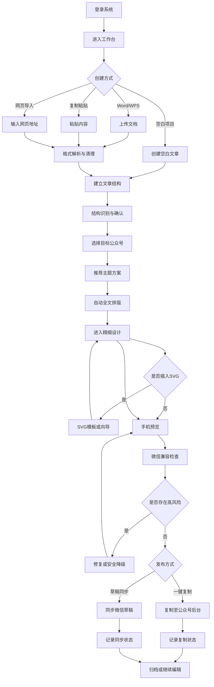

---

# 五、登录与工作台流程

# 5.1 登录流程

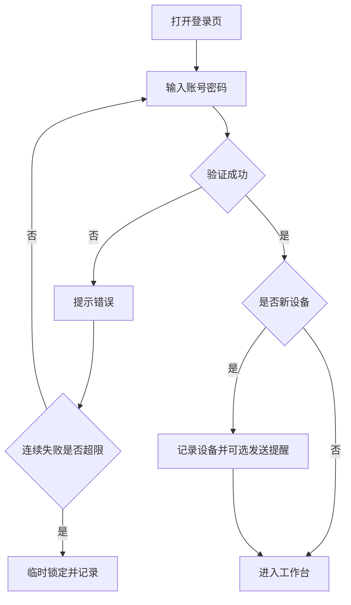

## 5.1.1 登录成功后系统动作

- 读取用户偏好；
- 读取最近公众号；
- 读取最近文章；
- 检查未完成自动保存；
- 检查系统及素材更新；
- 检查上次异常退出；
- 恢复工作台状态。

## 5.1.2 异常退出恢复

若检测到上次编辑未正常退出：

1. 显示恢复提示；
2. 展示最后自动保存时间；
3. 提供“恢复编辑”“打开已保存版本”“放弃恢复”；
4. 默认推荐恢复自动保存版本；
5. 不覆盖正式版本，先生成恢复副本。

---

# 六、新建文章流程

# 6.1 新建入口

用户可从以下位置创建：

- 工作台快速开始；
- 文章列表“新建”；
- 全局命令面板；
- 主题详情“从此主题新建”；
- 历史文章“复制为新文章”。

# 6.2 创建方式选择

系统提供：

1. 导入Word/WPS；
2. 复制粘贴；
3. 导入网页；
4. 空白排版；
5. 复制历史文章。

用户选择后进入相应流程。

# 6.3 基础信息

创建时最少需要：

- 临时文章名称；
- 目标公众号；
- 导入方式。

可稍后补充：

- 标签；
- 文件夹；
- 内容类型；
- 发布状态。

---

# 七、Word/WPS导入流程

# 7.1 标准流程

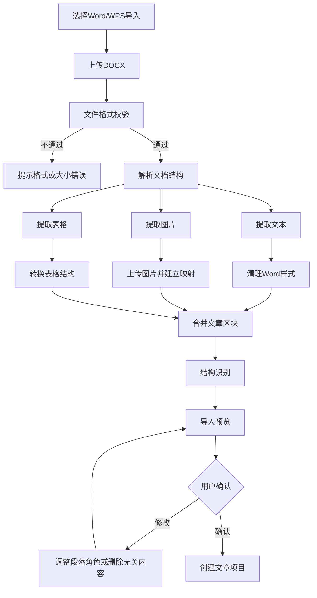

# 7.2 文件校验

第一版支持：

- `.docx`；
- 单文件上传；
- 建议文件大小不超过50MB；
- 图片数量建议不超过100张。

不直接支持：

- `.doc`；
- 加密文档；
- 宏文档；
- WPS私有格式；
- 内嵌可执行对象。

对于`.doc`文件，提示用户另存为`.docx`。

# 7.3 解析原则

## 保留

- 文字内容；
- 标题层级；
- 段落顺序；
- 加粗语义；
- 列表语义；
- 图片位置；
- 表格内容；
- 引用关系；
- 图注。

## 清理

- 字体名称；
- Word字号；
- 页边距；
- 分节符；
- 页眉页脚；
- 复杂缩进；
- 文本框；
- 浮动定位；
- 不兼容背景；
- Office专属样式；
- 隐藏字符。

# 7.4 导入异常处理

| 异常 | 处理方式 |
|---|---|
| 文件损坏 | 提示重新保存或重新上传 |
| 图片提取失败 | 保留占位符并列出失败图片 |
| 表格过宽 | 转换为横向滑动或图片建议 |
| 复杂文本框 | 提取文字并提示布局丢失 |
| 标题识别错误 | 在结构确认页手动修正 |
| 超大文件 | 提示压缩图片后重新上传 |
| 解析中断 | 保存已解析内容并允许重试 |
| 网络中断 | 断点续传或本地等待重试 |

---

# 八、复制粘贴流程

# 8.1 标准流程

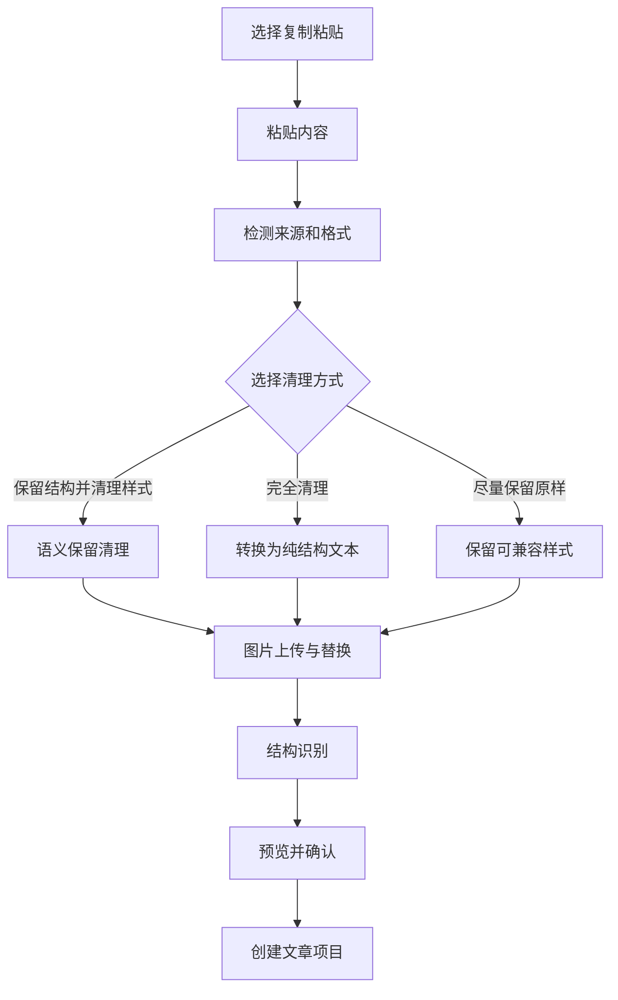

# 8.2 来源检测

系统尽量识别来源：

- Word；
- WPS；
- ChatGPT；
- Claude；
- 网页；
- 微信公众号后台；
- Markdown；
- 纯文本。

不同来源使用不同清理规则。

# 8.3 粘贴后反馈

系统显示：

- 检测来源；
- 字数；
- 图片数；
- 标题数；
- 清理的样式数；
- 可能存在的问题；
- 是否检测到表格；
- 是否检测到隐藏链接。

# 8.4 图片处理

粘贴图片时：

1. 尝试读取本地剪贴板图片；
2. 上传至系统私有对象存储；
3. 将外部图片URL替换为系统URL；
4. 记录原始来源；
5. 检查图片是否可用；
6. 提供失败占位符。

---

# 九、网页文章导入流程

# 9.1 标准流程

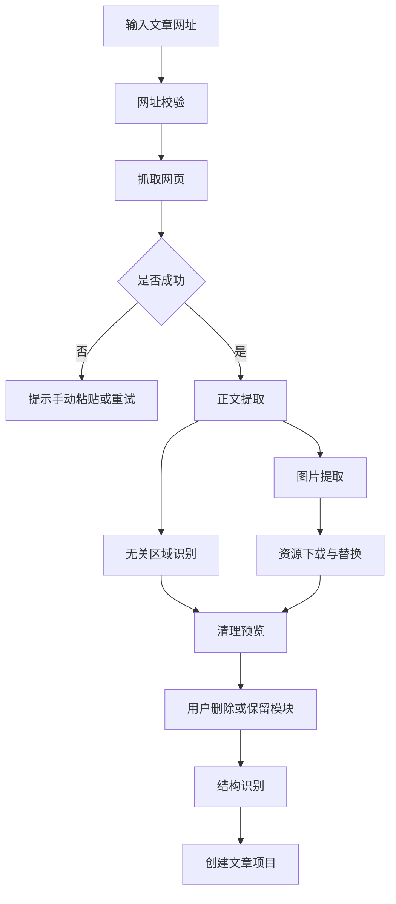

# 9.2 网页导入原则

优先提取：

- 主标题；
- 正文；
- 图片；
- 图注；
- 引用；
- 作者；
- 来源。

默认排除：

- 导航；
- 广告；
- 评论；
- 推荐阅读；
- 页脚；
- 侧栏；
- 悬浮按钮；
- 登录提示。

# 9.3 微信公众号文章导入

若网页为已发布公众号文章：

- 尽量保留文章结构；
- 下载图片并重新托管；
- 识别原有组件；
- 提示部分SVG可能无法完整反向解析；
- 原文章仅作为内容来源，不直接复制第三方商业模板；
- 提供“仅保留内容结构”选项。

---

# 十、结构识别流程

# 10.1 识别目标

识别以下段落角色：

- 主标题；
- 副标题；
- 导语；
- 一级标题；
- 二级标题；
- 三级标题；
- 正文；
- 引用；
- 法律条文；
- 案例；
- 数据；
- 提示；
- 图片；
- 图注；
- 表格；
- 结语；
- 作者；
- 来源；
- 文末。

# 10.2 识别顺序

```text
文档原始样式
→ 编号规则
→ 文本长度
→ 字重和位置
→ 上下文结构
→ 行业关键词
→ AI辅助判断
→ 用户确认
```

# 10.3 规则优先

规则示例：

- “一、”“二、”优先识别为一级标题；
- “（一）”“（二）”优先识别为二级标题；
- “1.”“2.”根据上下文识别为三级标题或列表；
- 以“《》”包裹且独立成段的内容可能为制度或文件名称；
- “法律依据”“裁判观点”等可识别为法律专业模块；
- “巡察发现”“整改要求”等可识别为党政专业模块；
- 连续短段落和数字可能识别为数据卡片候选。

# 10.4 用户确认

结构确认页面支持：

- 点击段落修改类型；
- 多选批量修改；
- 合并段落；
- 拆分段落；
- 标记为不参与排版；
- 调整标题级别；
- 恢复自动识别结果。

# 10.5 原文保护

结构调整只改变区块类型，不改变文字。

若用户执行合并或拆分：

- 保留文字顺序；
- 记录操作；
- 可撤销；
- 锁定原文时需要二次确认。

---

# 十一、目标公众号选择流程

# 11.1 选择时机

用户可在以下阶段选择公众号：

- 新建文章时；
- 导入完成后；
- 主题推荐前；
- 编辑过程中；
- 复制或同步前。

# 11.2 默认逻辑

系统默认选择：

1. 最近使用公众号；
2. 文章复制来源对应公众号；
3. 当前工作台选中的公众号；
4. 用户设置的默认公众号。

# 11.3 切换结果

自动应用：

- 品牌主色；
- 辅助色；
- Logo；
- 二维码；
- 作者；
- 版权声明；
- 默认主题；
- 文末；
- 封面风格；
- 图片样式。

不改变：

- 文字内容；
- 图片内容；
- 段落顺序；
- 用户锁定的组件；
- 已明确设置为“跨公众号共用”的样式。

# 11.4 冲突处理

切换公众号时若存在冲突：

- 当前主题不支持目标品牌色；
- 当前文末已手工修改；
- SVG包含旧公众号二维码；
- 封面使用旧公众号Logo；

系统显示变化清单，由用户选择：

1. 全部应用新公众号品牌；
2. 仅替换Logo和二维码；
3. 保留当前视觉；
4. 生成副本后切换。

默认推荐生成副本，避免破坏已完成版本。

---

# 十二、主题推荐流程

# 12.1 推荐输入

系统根据：

- 内容类型；
- 标题数量；
- 图片数量；
- 文字长度；
- 数据段落；
- 法律或党政语义；
- 当前公众号品牌；
- 用户历史选择；
- 排版强度；
- 是否需要SVG。

# 12.2 推荐输出

显示3至6套完整主题。

每套主题展示：

- 首屏预览；
- 一段正文预览；
- 标题样式；
- 图片样式；
- 文末；
- 配色；
- 兼容等级；
- 适用说明。

# 12.3 试穿流程

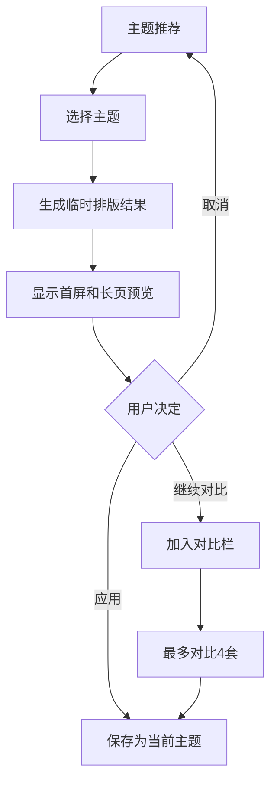

# 12.4 主题应用原则

- 应用主题生成一个新排版版本；
- 原稿版本不被覆盖；
- 用户可撤销整个主题应用；
- 用户手工锁定区块不自动更换；
- 公众号品牌Token优先于主题默认Token；
- 不支持的组件自动降级到主题基础组件。

---

# 十三、快速排版流程

# 13.1 标准流程

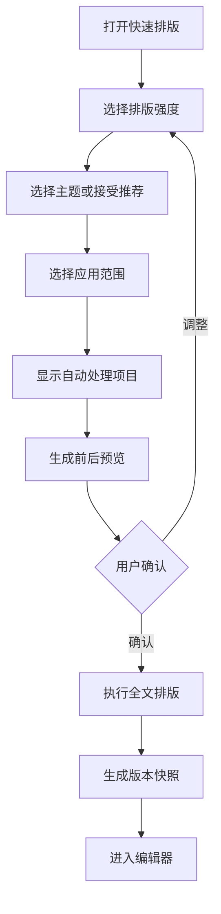

# 13.2 自动处理项目

- 标题；
- 正文；
- 引用；
- 图片；
- 图注；
- 分割线；
- 数据；
- 卡片；
- 首屏；
- 文末；
- 二维码；
- SVG建议。

# 13.3 应用范围

- 全文；
- 当前章节；
- 选中区块；
- 仅图片；
- 仅标题；
- 仅文末。

# 13.4 变更记录

执行后显示：

- 应用主题；
- 更换组件数量；
- 调整段落数量；
- 调整图片数量；
- 新增分割线数量；
- 新增SVG建议数量；
- 原文字数变化：应为0。

# 13.5 撤销机制

支持：

- 撤销单步；
- 撤销本次快速排版全部变化；
- 恢复排版前版本；
- 另存为新副本。

---

# 十四、精细设计流程

# 14.1 基本流程

```text
选中区块
→ 查看上下文属性
→ 修改样式或替换组件
→ 实时预览
→ 自动保存
→ 继续下一处
```

# 14.2 组件替换流程

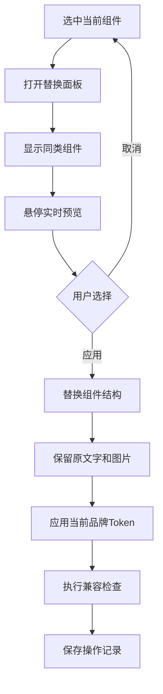

# 14.3 拖动排序

- 仅允许区块级拖动；
- 不允许文字在任意坐标放置；
- 标题拖动时可连同章节移动；
- 锁定区块不可拖动；
- SVG移动后重新检查前后间距；
- 拖动操作可撤销。

# 14.4 混搭检查

用户从不同主题混搭组件时，系统检查：

- 颜色冲突；
- 圆角不一致；
- 边框风格冲突；
- 阴影强度冲突；
- 字体风格冲突；
- 装饰过多；
- 正式程度不一致。

系统只提示，不强制禁止。

---

# 十五、图片处理流程

# 15.1 图片上传流程

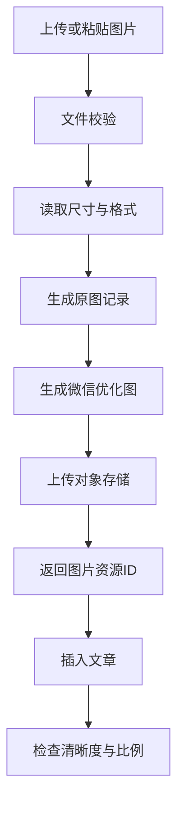

# 15.2 图片处理选项

- 保留原图；
- 自动压缩；
- 裁剪；
- 调整比例；
- 圆角；
- 边框；
- 阴影；
- 水印；
- 图注；
- 图片编号；
- 多图布局。

# 15.3 多图布局流程

1. 选择多张图片；
2. 系统根据数量推荐布局；
3. 用户选择静态或互动布局；
4. 设置图片顺序；
5. 设置比例；
6. 预览；
7. 插入文章；
8. 兼容检查。

# 15.4 图片异常

- 分辨率过低：警告；
- 文件过大：自动压缩；
- 外链不可访问：下载并重新托管；
- 格式不兼容：转换为PNG或JPEG；
- 动图过大：提示压缩或转视频；
- 图片比例极端：推荐长图展开SVG。

---

# 十六、SVG互动插入流程

# 16.1 三种入口

1. 编辑器左侧SVG面板；
2. SVG互动中心；
3. 选中内容后“转换为互动”。

# 16.2 快速模板流程

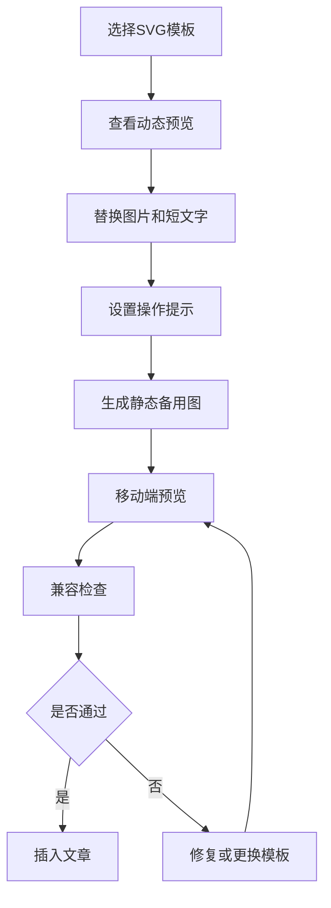

# 16.3 向导流程

```text
选择内容用途
→ 选择互动形式
→ 填写状态数量
→ 上传素材
→ 设置触发方式
→ 设置动画
→ 设置提示
→ 生成降级图
→ 预览
→ 插入文章
```

# 16.4 专业编辑流程

```text
打开专业编辑器
→ 管理图层
→ 设置状态
→ 设置触发区域
→ 设置动画时间轴
→ 配置资源
→ 配置响应式行为
→ 设置降级内容
→ 多设备测试
→ 保存SVG组件
→ 插入文章
```

# 16.5 SVG发布前检查

必须检查：

- 点击区域；
- 滑动方向；
- 提示文字；
- 循环行为；
- 图片加载；
- 字体；
- 移动端尺寸；
- 安卓兼容；
- iPhone兼容；
- 静态备用图；
- 外链资源；
- 跳转链接。

# 16.6 SVG失败降级

若SVG无法运行：

- 默认显示静态备用图；
- 重要文字必须在静态图或正文中保留；
- 不允许关键事实只存在于隐藏状态；
- 兼容报告明确提示降级结果。

---

# 十七、预览流程

# 17.1 预览入口

- 顶部工具栏；
- 快捷键；
- 一键复制前；
- SVG编辑完成后；
- 文章详情页。

# 17.2 预览步骤

1. 选择设备；
2. 加载当前保存版本；
3. 加载图片和SVG；
4. 模拟微信正文宽度；
5. 显示滚动阅读；
6. 允许测试互动；
7. 显示兼容提示；
8. 可生成二维码预览。

# 17.3 设备预览

- iPhone小屏；
- iPhone大屏；
- Android常规屏；
- Android大屏；
- 微信正文宽度；
- 桌面长页。

# 17.4 二维码预览

第一版可采用系统临时预览页：

- 生成短期有效链接；
- 链接需要登录或一次性Token；
- 不允许搜索引擎索引；
- 可设置有效期；
- 预览页不提供公开分享。

---

# 十八、兼容检查流程

# 18.1 检查时机

- 用户主动执行；
- 一键复制前自动执行；
- 草稿同步前自动执行；
- SVG插入后局部执行；
- 主题切换后局部执行；
- 微信规则更新后重新执行。

# 18.2 检查流程

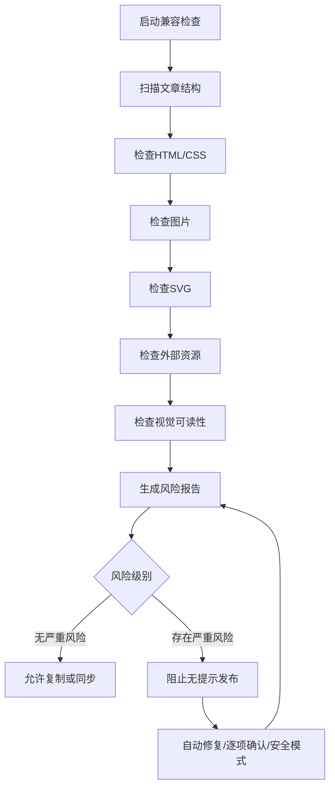

# 18.3 风险等级

## 严重

- 组件无法显示；
- SVG核心功能不可用；
- 图片失效；
- 外部脚本；
- 不安全资源；
- 文字被遮挡；
- 布局严重溢出。

## 警告

- 字体可能替换；
- 间距可能变化；
- 图片过大；
- 阴影可能降级；
- 部分Android表现不一致。

## 建议

- 段落过长；
- 颜色对比不足；
- 组件风格冲突；
- 互动过多；
- 图片过密；
- 正文字号偏小。

# 18.4 修复模式

- 自动修复安全项；
- 逐项确认；
- 微信安全模式；
- 生成修复副本；
- 忽略并继续。

严重风险允许用户继续时，必须二次确认并记录。

---

# 十九、一键复制流程

# 19.1 标准流程

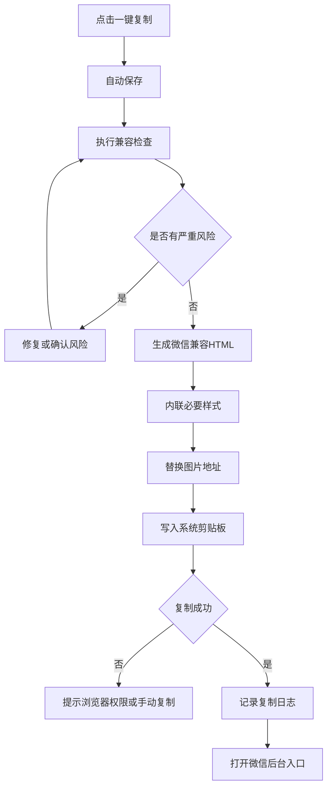

# 19.2 复制内容

包括：

- 正文HTML；
- 内联样式；
- 图片；
- SVG；
- 文末；
- 二维码。

不包括：

- 文章标题字段；
- 封面字段；
- 摘要字段；
- 作者字段。

第一阶段这些信息可以在复制弹窗中显示，便于用户手动填写。

# 19.3 复制成功反馈

显示：

- 复制时间；
- 当前公众号；
- 兼容评分；
- 使用版本；
- “打开微信公众号后台”；
- “查看粘贴说明”；
- “标记已发布”。

# 19.4 复制失败

可能原因：

- 浏览器禁止剪贴板；
- 内容过大；
- SVG序列化失败；
- 图片未上传；
- 网络中断。

处理：

- 提供手动复制区域；
- 自动保存当前版本；
- 保留兼容结果；
- 可重试；
- 提供纯静态安全副本。

---

# 二十、微信公众号草稿同步流程

> 本流程属于第二阶段，但第一版架构必须预留。

# 20.1 首次授权

```text
进入公众号设置
→ 发起微信授权
→ 用户确认授权
→ 系统获取可用权限
→ 保存授权状态
→ 执行权限检测
```

# 20.2 同步流程

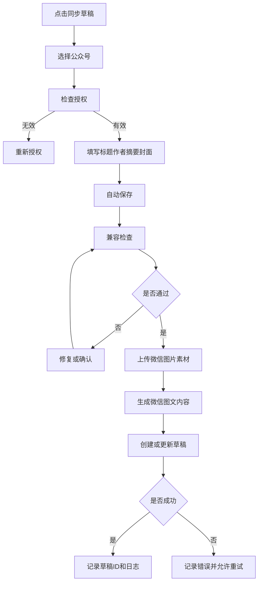

# 20.3 同步策略

- 创建新草稿；
- 更新已有草稿；
- 复制为新草稿；
- 覆盖前二次确认；
- 同步后不自动群发；
- 发布仍由用户在微信后台完成。

# 20.4 同步失败处理

- 授权失效：重新授权；
- 图片上传失败：单独重试；
- 封面不合规：提示裁剪；
- 接口权限不足：降级为一键复制；
- 内容超限：提示拆分；
- 微信接口异常：保存请求并稍后重试。

---

# 二十一、多公众号切换流程

# 21.1 编辑中切换

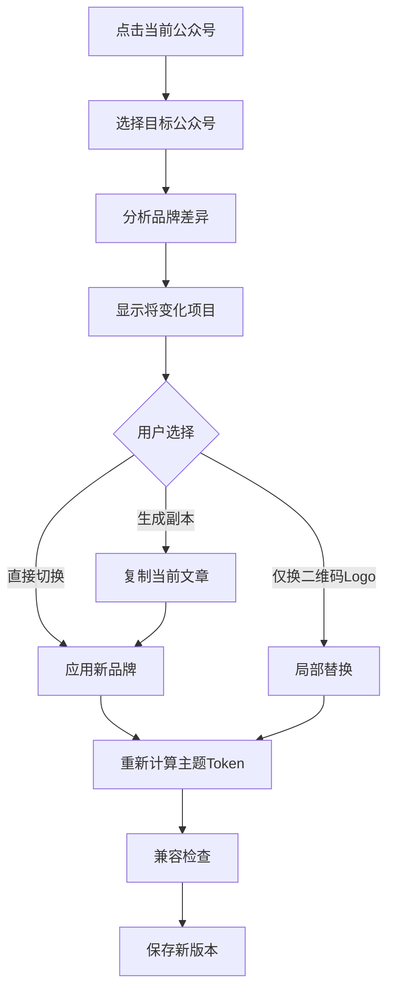

# 21.2 切换保护

以下情况默认建议生成副本：

- 文章已经复制；
- 文章已经同步；
- 文章已经发布；
- 存在大量手工样式；
- SVG包含公众号专属内容；
- 封面已完成设计。

# 21.3 品牌变化清单

切换前显示：

- 主色变化；
- Logo变化；
- 二维码变化；
- 文末变化；
- 作者变化；
- 版权声明变化；
- 封面变化；
- 默认主题变化；
- 不兼容组件变化。

---

# 二十二、主题与组件更新流程

# 22.1 更新检测

系统定时检查：

- 新主题；
- 主题新版本；
- 新组件；
- SVG更新；
- 微信兼容补丁；
- 节日专题；
- 行业专题。

# 22.2 安装流程

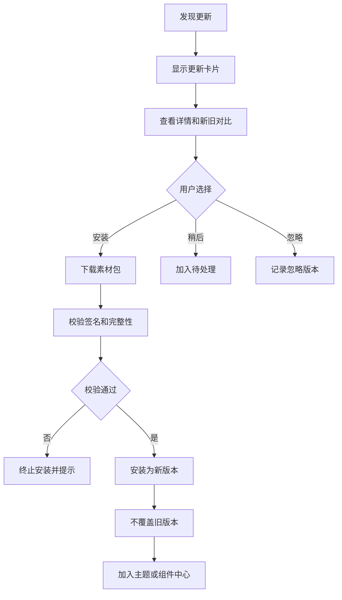

# 22.3 更新影响

- 新版本不自动替换历史文章；
- 用户可在文章中主动升级；
- 升级前显示差异；
- 升级后生成新版本快照；
- 可回退旧版本；
- 微信兼容补丁可提示批量重新检查文章。

---

# 二十三、自动保存流程

# 23.1 保存策略

采用：

- 本地即时草稿；
- 服务端增量保存；
- 定期完整快照；
- 关键操作强制快照。

# 23.2 自动保存时机

- 停止输入2至5秒；
- 区块移动后；
- 主题切换后；
- SVG编辑完成后；
- 图片处理完成后；
- 公众号切换后；
- 复制或同步前；
- 关闭页面前。

# 23.3 保存流程

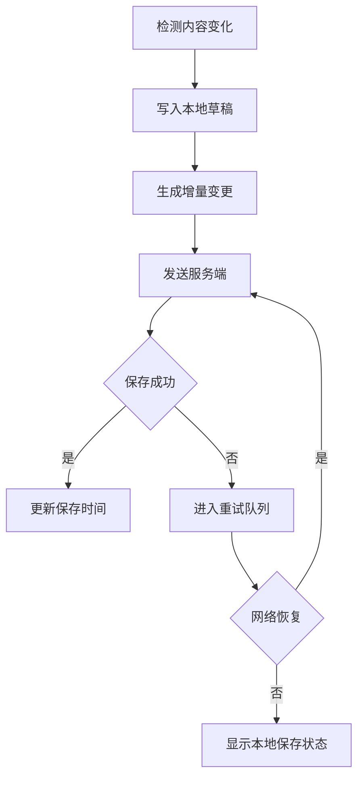

# 23.4 冲突处理

第一版为单用户，但仍考虑多标签页冲突。

若同一文章在两个标签页编辑：

- 检测版本号；
- 后保存版本发现冲突时停止覆盖；
- 显示差异；
- 提供保留当前、保留远端、生成副本；
- 默认生成副本。

---

# 二十四、历史版本流程

# 24.1 自动生成快照的操作

- 导入完成；
- 结构确认；
- 应用主题；
- 快速排版；
- 公众号切换；
- SVG完成；
- 兼容修复；
- 复制前；
- 同步前；
- 手动保存版本。

# 24.2 版本查看

显示：

- 版本时间；
- 操作类型；
- 公众号；
- 主题；
- 字数；
- 组件数；
- SVG数；
- 操作备注；
- 兼容评分。

# 24.3 恢复流程

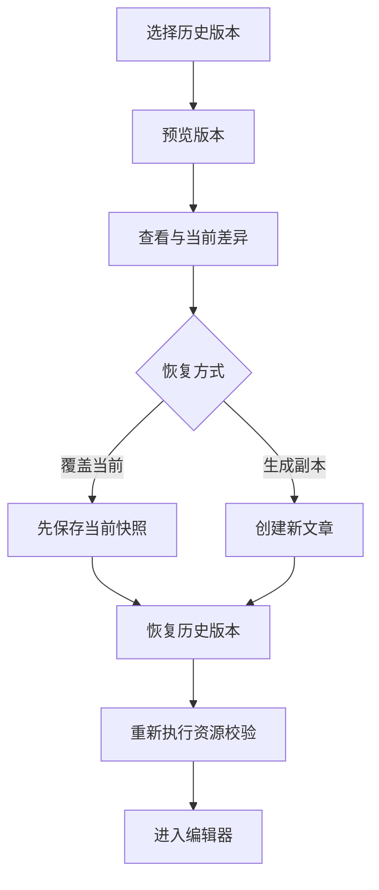

---

# 二十五、删除与回收站流程

# 25.1 删除文章

- 删除后进入回收站；
- 默认保留30天；
- 可恢复；
- 不立即删除图片资源；
- 已同步或已发布文章需二次确认。

# 25.2 永久删除

永久删除前提示：

- 文章；
- 历史版本；
- 专属图片；
- 草稿同步记录；
- 自定义组件引用。

公共素材和公众号配置不随文章删除。

# 25.3 资源回收

图片资源只有在：

- 无任何文章引用；
- 无历史版本引用；
- 无组件引用；
- 超过安全保留期；

才进入物理删除队列。

---

# 二十六、备份与恢复流程

# 26.1 自动备份

建议：

- 数据库每日备份；
- 图片对象存储定期快照；
- 每周完整备份；
- 保留最近30天每日备份；
- 保留最近12个月月度备份。

# 26.2 手动备份

用户可导出：

- 全部文章；
- 主题；
- 组件；
- SVG；
- 公众号配置；
- 图片资源索引；
- 系统偏好。

# 26.3 恢复流程

```text
选择备份
→ 校验备份版本
→ 查看恢复范围
→ 创建当前系统安全快照
→ 执行恢复
→ 数据一致性检查
→ 显示恢复报告
```

---

# 二十七、异常与回滚机制

# 27.1 核心原则

任何失败操作不得破坏上一个可用版本。

# 27.2 操作级回滚

以下操作必须事务化：

- 主题应用；
- 公众号切换；
- SVG插入；
- 兼容自动修复；
- 素材版本升级；
- 草稿覆盖；
- 历史版本恢复。

# 27.3 异常提示结构

每个错误提示必须包括：

1. 发生了什么；
2. 是否影响已保存内容；
3. 系统已经做了什么保护；
4. 用户下一步可以怎么做；
5. 是否可以重试；
6. 是否可以查看错误详情。

# 27.4 禁止提示

禁止只显示：

- “系统错误”；
- “操作失败”；
- “未知异常”；
- 单纯错误码。

---

# 二十八、用户操作确认规则

## 无需确认

- 普通样式调整；
- 自动保存；
- 组件收藏；
- 预览；
- 搜索；
- 折叠面板。

## 一次确认

- 应用完整主题；
- 替换公众号品牌；
- 插入SVG；
- 自动兼容修复；
- 删除文章；
- 安装素材更新。

## 二次确认

- 永久删除；
- 覆盖微信草稿；
- 忽略严重兼容风险；
- 删除公众号；
- 恢复旧备份覆盖当前数据；
- 关闭原文锁定后批量修改文字。

---

# 二十九、后台定时任务

系统后台需要以下定时任务：

| 任务 | 建议频率 |
|---|---|
| 素材更新检查 | 每日 |
| 微信兼容规则检查 | 每日 |
| 数据库备份 | 每日 |
| 对象存储完整性检查 | 每周 |
| 无引用资源清理 | 每周 |
| 回收站清理 | 每日 |
| 临时预览链接清理 | 每小时 |
| 失效微信授权检查 | 每日 |
| 图片外链状态检查 | 每周 |
| 旧自动保存草稿清理 | 每周 |
| 系统日志归档 | 每月 |

---

# 三十、业务流程优先级

# 30.1 V0.1优先流程

1. 登录；
2. 粘贴导入；
3. 结构识别；
4. 主题应用；
5. 基础编辑；
6. 自动保存；
7. 预览；
8. 兼容检查；
9. 一键复制。

# 30.2 V0.5优先流程

增加：

1. Word/WPS导入；
2. 网页导入；
3. 多公众号切换；
4. 图片处理；
5. SVG模板；
6. SVG向导；
7. 历史版本；
8. 素材更新；
9. 回收站；
10. 备份。

# 30.3 V1.0优先流程

增加：

1. SVG专业编辑；
2. 公众号草稿同步；
3. 主题版本升级；
4. 组件个人化；
5. 二维码预览；
6. 批量兼容检查；
7. 高级品牌切换；
8. 完整备份恢复。

---

# 三十一、关键流程验收标准

# 31.1 导入流程

- Word文档可正常导入；
- 文字和图片顺序基本正确；
- 外部脏格式被清理；
- 导入失败不丢失已上传内容；
- 结构识别结果可手动修正。

# 31.2 排版流程

- 一键排版可生成完整视觉结果；
- 原文字数不发生非授权变化；
- 所有自动操作可撤销；
- 主题切换不破坏正文；
- 局部组件替换保留原文字和图片。

# 31.3 SVG流程

- 模板可快速替换素材；
- 向导可完成互动配置；
- 动态预览可用；
- 兼容检查可识别风险；
- 静态降级内容有效。

# 31.4 多公众号流程

- 同一文章可切换公众号；
- Logo、二维码和配色正确替换；
- 用户锁定样式不被覆盖；
- 已发布文章切换时建议生成副本。

# 31.5 复制流程

- 复制前自动保存；
- 复制前自动检查兼容；
- 复制到微信后台后主要样式保持；
- 复制日志可追溯；
- 失败时可手动复制或生成安全版。

# 31.6 版本流程

- 关键操作自动生成快照；
- 历史版本可预览；
- 恢复前保存当前版本；
- 恢复失败不影响当前版本；
- 多标签页冲突不直接覆盖。

---

# 三十二、核心业务流程冻结结论

本文件正式确认以下业务规则：

1. 所有文章必须经过导入、结构识别、排版、预览和兼容检查；
2. 原文默认锁定，智能能力仅修改视觉呈现；
3. 一键排版必须先生成预览，再由用户确认；
4. 精细设计采用区块级操作，不采用无限自由坐标；
5. SVG必须支持模板、向导和专业编辑三层路径；
6. SVG必须具有静态降级内容；
7. 多公众号切换优先保护已完成排版，必要时生成副本；
8. 一键复制前必须自动保存并执行兼容检查；
9. 草稿同步失败时降级为一键复制；
10. 主题、公众号切换、兼容修复等关键操作必须生成版本快照；
11. 自动保存采用本地草稿、服务端增量和关键快照组合；
12. 任何异常不得覆盖最后一个可用版本；
13. 素材更新不覆盖旧版本；
14. 删除采用回收站和延迟物理清理；
15. 所有后续接口、数据表和前端交互均以本流程为依据。

---

# 三十三、下一份开发文件

下一步进入：

> `04_公众号智能视觉排版工具_编辑器与区块模型设计.md`

该文件应重点明确：

- 编辑器底层采用何种区块模型；
- 文章结构如何存储；
- 文本、图片、静态组件和SVG如何统一；
- 主题Token如何作用于区块；
- 原文锁定如何实现；
- 拖动、复制、撤销和版本差异如何实现；
- 微信HTML如何从区块模型生成；
- 编辑器普通模式和专业模式如何区分；
- 插件和新组件如何扩展。
