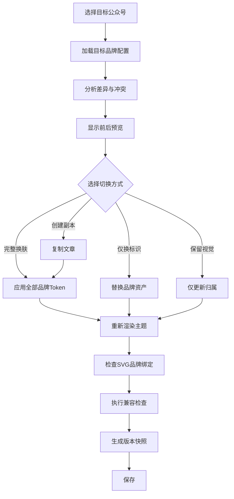

# 07_公众号智能视觉排版工具_多公众号品牌系统设计

> 文档版本：V1.0  
> 编制日期：2026年7月29日  
> 项目阶段：多公众号与品牌系统设计  
> 上游依据：  
> - `00_公众号智能视觉排版工具_项目需求说明书.md`  
> - `01_公众号智能视觉排版工具_竞品分析与产品差异化设计.md`  
> - `02_公众号智能视觉排版工具_信息架构与页面清单.md`  
> - `03_公众号智能视觉排版工具_核心业务流程设计.md`  
> - `04_公众号智能视觉排版工具_编辑器与区块模型设计.md`  
> - `05_公众号智能视觉排版工具_主题系统与组件规范.md`  
> - `06_公众号智能视觉排版工具_SVG互动组件技术规范.md`  
> 文档用途：统一多个公众号的品牌档案、视觉Token、素材资产、默认排版、文章换肤、授权发布、版本管理、删除迁移及异常处理。

---

# 一、系统目标

本项目中的“多公众号”不是简单保存多个账号名称，也不是仅解决微信后台登录切换，而是建立多个相互独立的公众号品牌空间。

每个公众号应拥有自己的：

- 名称；
- 头像；
- Logo；
- 主色和辅助色；
- 二维码；
- 作者信息；
- 版权说明；
- 默认主题；
- 默认首屏；
- 默认封面；
- 默认标题；
- 默认图片样式；
- 默认文末；
- 常用组件；
- 常用SVG；
- 微信授权；
- 草稿同步配置；
- 文章历史；
- 品牌资产版本。

系统要实现：

> 同一篇定稿文章，在不改变文字和图片内容的前提下，可快速切换为不同公众号的完整视觉版本。

---

# 二、核心设计原则

# 2.1 公众号即品牌空间

一个公众号不仅是发布目标，还代表：

- 一套品牌识别；
- 一组排版偏好；
- 一套固定资产；
- 一条发布链路；
- 一组文章和历史记录。

# 2.2 内容与品牌分离

文章内容层保存：

- 原文；
- 图片；
- 结构；
- 语义；
- SVG互动逻辑。

公众号品牌层保存：

- 色彩；
- Logo；
- 二维码；
- 作者；
- 文末；
- 默认主题和组件。

切换公众号时，不直接重写正文。

# 2.3 主题与品牌分离

主题回答：

> 这篇文章采用什么视觉语言？

品牌回答：

> 这篇文章属于哪个公众号？

例如：

```text
主题：巡察纪实
品牌：贵州联合集团公众号
```

与：

```text
主题：巡察纪实
品牌：个人媒体公众号
```

可以使用相同结构，但拥有不同色彩、Logo、二维码和文末。

# 2.4 品牌切换可预览、可撤销

品牌切换属于大型视觉操作，必须：

- 先分析变化；
- 显示预览；
- 用户确认；
- 生成版本快照；
- 支持撤销；
- 必要时生成文章副本。

# 2.5 授权信息与品牌信息隔离

公众号视觉配置和微信接口凭据必须分开存储。

原因：

- 品牌资料可长期存在；
- 微信授权可能过期；
- 一个公众号可以先作为品牌空间使用，后续再授权；
- 删除授权不应删除文章和视觉资产。

# 2.6 权限能力动态检测

系统不得假设所有公众号都具备完全相同的接口权限。

连接公众号后应动态记录：

- 账号类型；
- 认证状态；
- 已授权权限集；
- 草稿接口可用性；
- 素材接口可用性；
- 发布相关能力；
- 最近一次验证时间。

系统只显示当前账号真实可用的操作。

---

# 三、公众号对象模型

# 3.1 核心数据结构

```json
{
  "accountId": "acc_01JXYZ",
  "name": "示例公众号",
  "shortName": "示例",
  "description": "公众号品牌说明",
  "accountType": "unknown",
  "verificationStatus": "unknown",
  "status": "active",
  "brandProfileId": "brand_001",
  "publishingProfileId": "publish_001",
  "defaultThemeId": "theme_001",
  "defaultPaletteId": "palette_001",
  "createdAt": "2026-07-29T15:00:00+08:00",
  "updatedAt": "2026-07-29T15:00:00+08:00"
}
```

# 3.2 公众号状态

```text
draft
active
disabled
archived
pending_deletion
deleted
```

说明：

- `draft`：品牌资料未完成；
- `active`：正常使用；
- `disabled`：暂时停用，不参与推荐；
- `archived`：保留历史文章，不再作为默认发布目标；
- `pending_deletion`：等待删除确认；
- `deleted`：逻辑删除。

# 3.3 微信连接状态

单独保存：

```text
unconnected
pending_authorization
connected
permission_limited
expired
revoked
error
```

品牌状态与连接状态互不影响。

---

# 四、品牌档案结构

品牌档案分为八个部分：

1. 基础信息；
2. 色彩系统；
3. 标志资产；
4. 文字身份；
5. 默认排版；
6. 文末与二维码；
7. 封面与首屏；
8. 品牌版本。

---

# 五、基础信息

字段包括：

- 公众号全称；
- 公众号简称；
- 品牌说明；
- 内容定位；
- 主要内容类型；
- 默认作者；
- 默认来源；
- 默认版权说明；
- 联系方式；
- 运营主体；
- 备注。

# 5.1 内容类型

可多选：

- 党政纪检；
- 巡察；
- 国企新闻；
- 法律；
- AI科技；
- 产品评测；
- 个人随笔；
- 摄影旅行；
- 咖啡生活；
- 活动宣传；
- 其他。

该字段用于：

- 推荐主题；
- 推荐组件；
- 推荐SVG；
- 选择默认排版强度；
- 素材更新推荐。

---

# 六、品牌色彩系统

# 6.1 品牌色字段

```json
{
  "colors": {
    "primary": "#9E1B1B",
    "secondary": "#1F3A5F",
    "accent": "#C8A45D",
    "textPrimary": "#1F2937",
    "textSecondary": "#667085",
    "background": "#FFFFFF",
    "surface": "#F7F7F5",
    "border": "#E5E7EB"
  }
}
```

# 6.2 品牌色验证

保存时检查：

- 色值合法；
- 正文与背景可读；
- 主色与辅助色是否冲突；
- 强调色是否过多；
- 深色主题是否具备浅色正文区；
- 红绿是否只作为唯一信息区分；
- 是否适合当前公众号内容定位。

# 6.3 自动生成衍生色

用户只设置：

- 主色；
- 辅助色；
- 强调色。

系统自动生成：

- 浅色背景；
- 深色强调；
- 边框色；
- 悬浮色；
- 数据卡背景；
- 提示色。

衍生色必须可手动调整。

# 6.4 品牌色模式

## 完整品牌模式

主题主色全部映射到公众号主色。

适合：

- 律所；
- 企业品牌；
- 个人媒体。

## 柔和品牌模式

主题保持原设计，只在标题、分割线、文末和二维码区域注入品牌色。

适合：

- 党政；
- 巡察；
- 正式报告。

## 标识模式

仅替换Logo、头像、二维码、署名和文末。

适合：

- 杂志风；
- 节日专题；
- 强视觉主题。

---

# 七、品牌资产管理

# 7.1 资产类型

每个公众号独立管理：

- 头像；
- 横版Logo；
- 竖版Logo；
- 单色Logo；
- 反白Logo；
- 二维码；
- 公众号名片；
- 水印；
- 品牌背景纹理；
- 默认作者头像；
- 默认封面底图；
- 文末关注图；
- 版权标识。

# 7.2 资产数据模型

```json
{
  "assetId": "asset_001",
  "accountId": "acc_001",
  "assetType": "logo_primary",
  "resourceId": "res_001",
  "version": "1.0.0",
  "status": "active",
  "width": 1200,
  "height": 400,
  "mimeType": "image/png",
  "backgroundMode": "transparent",
  "createdAt": "2026-07-29T15:00:00+08:00"
}
```

# 7.3 Logo变体

至少支持：

- 主Logo；
- 单色深色；
- 单色浅色；
- 正方形标识；
- 横向组合；
- 仅文字；
- 仅图形。

系统根据背景自动推荐适合变体。

# 7.4 二维码管理

二维码字段：

- 原始二维码图片；
- 显示名称；
- 说明文字；
- 默认尺寸；
- 背景模式；
- 边框；
- 有效状态；
- 最近检测时间。

二维码必须支持：

- 清晰度检测；
- 可扫描性提醒；
- 白边检查；
- 背景对比；
- 多设备预览；
- 公众号切换自动替换。

# 7.5 水印

支持：

- Logo水印；
- 文字水印；
- 右下角；
- 左下角；
- 居中浅水印；
- 全文图片批量应用；
- 单张图片关闭。

水印设置属于公众号品牌默认值，但文章中可覆盖。

---

# 八、文字身份系统

# 8.1 默认作者

每个公众号可保存多个作者档案。

字段：

- 作者名称；
- 作者头像；
- 职务；
- 简介；
- 联系方式；
- 默认署名方式；
- 是否公开；
- 是否默认作者。

# 8.2 作者档案用途

- 文章作者字段；
- 文末作者卡；
- 人物介绍组件；
- 公众号草稿同步字段；
- 品牌首屏；
- 版权信息。

# 8.3 来源信息

支持预设：

- 本公众号原创；
- 单位供稿；
- 部门供稿；
- 转载来源；
- 编辑整理；
- 摄影来源。

# 8.4 版权模板

每个公众号可保存多个模板：

- 允许转载；
- 需授权转载；
- 禁止转载；
- 法律免责声明；
- 图片版权说明；
- 信息来源说明。

版权模板可：

- 自动插入文末；
- 按文章类型切换；
- 冻结在文章版本中；
- 随品牌更新。

---

# 九、默认排版配置

# 9.1 默认主题

每个公众号保存：

- 默认主题；
- 备用主题；
- 默认配色；
- 默认排版强度；
- 默认正文样式；
- 默认标题层级；
- 默认图片样式；
- 默认文末。

# 9.2 按内容类型设置默认主题

示例：

```json
{
  "contentThemeRules": [
    {
      "contentType": "inspection",
      "themeId": "theme_inspection_documentary"
    },
    {
      "contentType": "legal",
      "themeId": "theme_law_blue_gray"
    },
    {
      "contentType": "technology",
      "themeId": "theme_product_review"
    }
  ]
}
```

# 9.3 默认排版强度

可设置：

- 极简；
- 标准；
- 设计感；
- 强视觉。

党政纪检公众号建议默认：

```text
标准
```

法律公众号建议：

```text
极简或标准
```

个人媒体或活动公众号可：

```text
设计感
```

# 9.4 默认图片风格

字段：

- 圆角；
- 边框；
- 阴影；
- 图注；
- 水印；
- 默认宽度；
- 图片间距；
- 多图布局偏好。

---

# 十、默认首屏与封面

# 10.1 首屏配置

每个公众号可指定：

- 默认首屏模板；
- 是否显示Logo；
- 是否显示公众号名称；
- 是否显示日期；
- 是否显示栏目；
- 是否显示作者；
- 默认标题对齐；
- 默认背景方式。

# 10.2 封面配置

支持：

- 横版封面默认模板；
- 方形分享图模板；
- 安全裁切区域；
- Logo位置；
- 标题最大行数；
- 副标题；
- 品牌色；
- 图片处理风格。

# 10.3 封面不自动生成文章标题

本项目不提供写作功能。

封面设计器只使用：

- 用户已有标题；
- 用户已有副标题；
- 用户已有图片；
- 公众号品牌信息。

---

# 十一、文末系统

# 11.1 文末组成

文末可由以下区块组合：

```text
作者信息
→ 来源
→ 版权声明
→ 公众号简介
→ 二维码
→ 关注引导
→ 联系方式
→ 相关阅读
```

# 11.2 文末模板

每个公众号可保存：

- 正式文末；
- 极简文末；
- 品牌文末；
- 法律文末；
- 活动文末；
- 无二维码文末。

# 11.3 绑定方式

## Linked

文章中的文末引用公众号最新配置。

适合：

- 未发布草稿；
- 需要长期统一更新的内容。

## Frozen

保存当前品牌文末快照。

适合：

- 已复制；
- 已同步；
- 已发布；
- 归档文章。

# 11.4 自动冻结规则

文章进入以下状态时，系统建议冻结：

- 已复制；
- 已同步；
- 已发布。

冻结后公众号品牌更新不影响该版本。

---

# 十二、公众号品牌Token

# 12.1 完整模型

```json
{
  "brandVersion": "1.0.0",
  "accountId": "acc_001",
  "colors": {},
  "typography": {
    "bodySize": 16,
    "bodyLineHeight": 1.8,
    "headingWeightPreference": "bold",
    "captionSize": 13
  },
  "shape": {
    "radiusPreference": "medium",
    "borderPreference": "thin",
    "shadowPreference": "soft"
  },
  "image": {
    "defaultStyleRef": "image.brand.default",
    "watermarkAssetId": "asset_watermark_001"
  },
  "assets": {},
  "defaults": {
    "themeId": "theme_001",
    "paletteId": "palette_001",
    "heroComponentId": "cmp_hero_001",
    "footerComponentId": "cmp_footer_001",
    "coverTemplateId": "cover_001"
  }
}
```

# 12.2 Token作用范围

品牌Token可作用于：

- 主题配色；
- 标题；
- 分割线；
- 数据卡；
- 重点提示；
- 图片边框；
- 首屏；
- 封面；
- 文末；
- SVG提示和按钮。

# 12.3 不允许品牌Token改变

- 原文；
- 段落顺序；
- 法条；
- 文章结构；
- SVG业务状态；
- 图片主体；
- 用户锁定组件。

---

# 十三、品牌版本管理

# 13.1 为什么需要版本

公众号可能发生：

- Logo更新；
- 主色调整；
- 二维码更换；
- 公众号名称变化；
- 文末改版；
- 版权说明变化；
- 默认主题变化。

若不保存版本，历史文章将无法复现。

# 13.2 版本对象

```json
{
  "brandVersionId": "brand_ver_001",
  "accountId": "acc_001",
  "version": "1.2.0",
  "brandProfileSnapshot": {},
  "assetManifest": [],
  "changeSummary": "更新二维码和文末",
  "createdAt": "2026-07-29T15:00:00+08:00"
}
```

# 13.3 版本规则

- 小修订：二维码替换、文字修正；
- 次版本：文末、首屏或默认主题变化；
- 主版本：整体Logo和品牌系统改版。

# 13.4 历史文章

文章版本记录：

- 使用哪个品牌版本；
- 是否Linked；
- 是否Frozen；
- 是否已升级；
- 是否存在资产失效。

---

# 十四、同一文章切换公众号

# 14.1 切换入口

- 编辑器顶部公众号下拉；
- 文章详情；
- 一键复制前；
- 复制文章时；
- 主题推荐页。

# 14.2 切换分析

系统在切换前分析：

- 品牌色差异；
- 当前主题适配度；
- 当前Logo；
- 当前二维码；
- 当前作者；
- 当前文末；
- 当前封面；
- SVG中的品牌内容；
- 用户手工锁定样式；
- 已复制或同步状态。

# 14.3 切换方案

用户可选择：

## 完整换肤

替换：

- 品牌色；
- Logo；
- 二维码；
- 作者；
- 文末；
- 封面；
- 默认组件；
- SVG品牌元素。

## 仅换标识

只替换：

- Logo；
- 二维码；
- 作者；
- 版权；
- 文末。

保留当前主题色。

## 保留当前视觉

仅改变文章归属和发布目标。

## 创建品牌副本

复制当前文章，生成目标公众号版本。

# 14.4 默认推荐规则

若文章状态为：

- 待排版；
- 排版中；

默认推荐完整换肤。

若状态为：

- 已复制；
- 已同步；
- 已发布；

默认推荐创建品牌副本。

# 14.5 切换流程



---

# 十五、品牌冲突处理

# 15.1 颜色冲突

情况：

- 主题深红，目标公众号主色为蓝色；
- 组件内使用手工固定色；
- SVG图片中包含旧品牌色。

处理：

- 自动Token可直接替换；
- 手工固定色显示冲突；
- 图片中的颜色不自动修改；
- 用户可保留或手工替换图片；
- SVG可重新生成品牌版本。

# 15.2 Logo冲突

情况：

- 首屏嵌入旧Logo；
- 图片本身带旧Logo；
- SVG资源中带旧Logo。

处理：

- 系统节点自动替换；
- 图片中不可编辑的Logo提示用户；
- 提供替换图片或裁剪建议；
- 不进行不可控的图像内容篡改。

# 15.3 二维码冲突

所有二维码节点必须标记：

- `account_bound`；
- `article_fixed`；
- `manual_asset`。

切换时：

- `account_bound`自动替换；
- `article_fixed`保留并警告；
- `manual_asset`询问用户。

# 15.4 文末冲突

若用户手工修改文末：

- 显示差异；
- 可保留当前；
- 可应用目标公众号文末；
- 可只替换二维码；
- 可生成副本。

# 15.5 主题不适配

如果目标公众号默认主题不支持当前内容或品牌色：

- 保留当前主题；
- 推荐同类可适配主题；
- 显示换肤预览；
- 不强制自动更换主题。

---

# 十六、文章归属模型

# 16.1 单一主归属

每篇文章项目有一个当前主公众号：

```text
primaryAccountId
```

# 16.2 品牌派生版本

同一内容可产生多个品牌版本：

```text
contentGroupId
├── article_A_for_account_1
├── article_B_for_account_2
└── article_C_for_account_3
```

# 16.3 为什么不让一篇文章同时绑定多个公众号

因为不同公众号版本可能：

- 主题不同；
- 封面不同；
- 二维码不同；
- 文末不同；
- 发布状态不同；
- 微信草稿ID不同；
- 修改时间不同。

因此，正式排版后应使用独立文章版本，而不是一个文章对象维护多个动态出口。

# 16.4 内容组

通过`contentGroupId`关联同源文章。

支持：

- 查看所有品牌版本；
- 比较差异；
- 从主版本同步内容；
- 独立发布；
- 独立归档。

---

# 十七、内容同步策略

同源品牌版本之间支持三种同步。

# 17.1 不同步

各版本完全独立。

适合：

- 已完成排版；
- 已发布文章；
- 不同公众号改动较大。

# 17.2 仅同步原文

主版本文字发生修改时，可同步到其他版本。

同步前：

- 显示文字差异；
- 保留品牌排版；
- 检查区块映射；
- 生成版本快照。

# 17.3 同步结构与内容

同步：

- 文字；
- 图片；
- 段落；
- 章节；
- SVG业务数据。

不覆盖：

- 品牌色；
- Logo；
- 二维码；
- 文末；
- 封面；
- 品牌组件。

---

# 十八、微信授权模型

# 18.1 授权设计原则

公众号接入采用可替换的连接器模型。

支持两类路径：

## 公众号自身开发配置

适合：

- 少量公众号；
- 私有部署；
- 用户可自行配置开发信息。

## 微信开放平台第三方平台授权

适合：

- 多公众号；
- 后续公开SaaS；
- 用户通过管理员扫码授权；
- 不向系统直接提供公众号密码。

第一版可以先完成品牌档案和一键复制，草稿同步模块使用统一连接器接口预留。

# 18.2 授权连接器接口

```typescript
interface WechatOfficialAccountConnector {
  authorize(accountId: string): Promise<AuthorizationResult>
  revoke(accountId: string): Promise<void>
  refreshCredentials(accountId: string): Promise<void>
  getCapabilities(accountId: string): Promise<AccountCapabilities>
  uploadImage(accountId: string, resourceId: string): Promise<WechatMediaResult>
  createDraft(accountId: string, payload: DraftPayload): Promise<DraftResult>
  updateDraft(accountId: string, draftId: string, payload: DraftPayload): Promise<DraftResult>
}
```

具体能力以当前微信官方接口和账号权限检测结果为准。

# 18.3 授权数据

必须保存：

- 连接方式；
- 授权主体；
- 公众号标识；
- 权限集合；
- 凭据密文；
- 凭据到期时间；
- 刷新状态；
- 最近验证时间；
- 撤销时间；
- 错误状态。

# 18.4 密钥安全

- 只保存在服务端；
- 加密存储；
- 不进入前端；
- 不进入日志；
- 不进入备份明文；
- 定期轮换；
- 最小权限；
- 撤销后立即失效。

---

# 十九、能力检测

# 19.1 能力对象

```json
{
  "accountId": "acc_001",
  "checkedAt": "2026-07-29T15:00:00+08:00",
  "capabilities": {
    "draftCreate": true,
    "draftUpdate": true,
    "imageUpload": true,
    "materialUpload": false,
    "publishSubmit": false,
    "publishStatusQuery": false
  },
  "permissionSource": "wechat_api",
  "warnings": []
}
```

# 19.2 UI呈现

若能力不可用：

- 隐藏或禁用对应按钮；
- 说明不可用原因；
- 提供“一键复制”降级；
- 提供重新检测；
- 不向用户承诺当前账号不具备的能力。

# 19.3 检测时机

- 初次授权；
- 凭据刷新后；
- 同步前；
- 授权异常后；
- 每日后台检测；
- 微信规则更新后。

---

# 二十、草稿同步配置

# 20.1 公众号级默认值

每个公众号保存：

- 默认作者；
- 默认摘要策略；
- 默认封面；
- 默认原文链接；
- 默认是否显示封面；
- 默认是否允许评论等平台字段占位；
- 默认同步方式；
- 默认覆盖策略。

具体字段以当前微信接口可用能力为准。

# 20.2 同步映射

```text
文章标题 → 微信草稿标题
作者档案 → 微信作者
封面资源 → 微信封面素材
正文HTML → 微信图文正文
摘要字段 → 微信摘要
原文链接 → 微信原文链接
```

# 20.3 图片上传

同步前：

1. 收集文章图片；
2. 检查公众号对应微信资源映射；
3. 已上传且有效则复用；
4. 未上传则上传；
5. 将正文图片地址替换为微信可用地址；
6. 记录公众号级资源映射。

同一系统图片对不同公众号的微信素材映射可能不同，不能跨公众号直接复用微信侧标识。

---

# 二十一、发布记录

# 21.1 记录内容

```json
{
  "publishRecordId": "pub_001",
  "articleId": "article_001",
  "accountId": "acc_001",
  "action": "draft_create",
  "status": "success",
  "wechatDraftId": "draft_xxx",
  "brandVersion": "1.2.0",
  "themeVersion": "1.0.0",
  "documentSnapshotId": "snap_001",
  "createdAt": "2026-07-29T15:00:00+08:00"
}
```

# 21.2 操作类型

- 复制；
- 创建草稿；
- 更新草稿；
- 查询草稿；
- 标记发布；
- 同步失败；
- 授权失效；
- 删除微信映射。

# 21.3 文章与微信草稿关系

支持：

- 一个文章对应一个当前草稿；
- 同一文章创建多个草稿版本；
- 更新前二次确认；
- 记录最近草稿；
- 不自动覆盖未知来源草稿。

---

# 二十二、公众号创建流程

```text
填写公众号名称
→ 选择内容定位
→ 上传头像和Logo
→ 设置品牌色
→ 上传二维码
→ 设置作者和版权
→ 选择默认主题
→ 选择首屏、封面和文末
→ 预览品牌样稿
→ 保存品牌版本
→ 可选连接微信
```

# 22.1 快速创建

只需：

- 名称；
- 主色；
- 二维码；
- 默认主题。

其他字段后续补充。

# 22.2 完整创建

进入品牌向导，完成全部配置。

# 22.3 样稿预览

创建完成前，用统一测试文章预览：

- 首屏；
- 标题；
- 正文；
- 图片；
- 数据卡；
- SVG提示；
- 文末。

---

# 二十三、公众号复制

支持复制一个公众号品牌空间，用于：

- 同一机构不同账号；
- 新账号继承旧品牌；
- 测试环境；
- 品牌改版试验。

复制可选择：

- 基础资料；
- 色彩；
- Logo；
- 默认主题；
- 文末；
- 作者；
- 组件偏好；
- 不复制微信授权；
- 不复制发布记录；
- 不复制文章。

授权凭据永远不随复制操作复制。

---

# 二十四、公众号停用与归档

# 24.1 停用

停用后：

- 不出现在默认切换列表；
- 不能创建新同步任务；
- 历史文章可访问；
- 品牌资产保留；
- 可重新启用。

# 24.2 归档

适合不再运营的公众号。

归档后：

- 历史文章只读；
- 品牌版本冻结；
- 微信授权建议撤销；
- 不参与主题推荐；
- 可导出完整品牌包。

---

# 二十五、公众号删除

# 25.1 删除前检查

必须检查：

- 文章数量；
- 未归档文章；
- 已同步草稿；
- 品牌资产；
- 作者档案；
- 自定义主题；
- 自定义组件；
- 微信授权；
- 资源引用。

# 25.2 删除选项

## 仅删除微信连接

保留品牌和文章。

## 归档公众号

推荐方式。

## 删除品牌空间

文章需迁移或转为无公众号文章。

## 永久删除

需二次确认，并在安全保留期后执行。

# 25.3 默认禁止

有未迁移文章时，不允许直接永久删除公众号。

---

# 二十六、公众号迁移

# 26.1 迁移内容

可导出品牌包：

```text
brand-manifest.json
brand-tokens.json
assets/
authors.json
footer-templates.json
cover-templates.json
theme-preferences.json
component-preferences.json
```

# 26.2 不迁移

默认不包含：

- 微信密钥；
- 微信授权Token；
- 登录凭据；
- 发布访问密钥；
- 系统审计日志。

# 26.3 导入

导入品牌包时：

- 校验版本；
- 校验资产；
- 重新生成内部ID；
- 检查主题是否已安装；
- 检查组件版本；
- 创建新品牌版本；
- 微信授权需重新完成。

---

# 二十七、品牌预览

# 27.1 预览入口

- 公众号详情；
- 品牌编辑；
- 文章切换公众号；
- 主题试穿；
- 封面设计；
- 文末编辑。

# 27.2 预览内容

- 品牌名片；
- 首屏；
- 一级标题；
- 二级标题；
- 正文；
- 数据卡；
- 图片；
- SVG操作提示；
- 文末；
- 封面；
- 方形分享图。

# 27.3 品牌对比

支持同时对比：

- 当前品牌版本；
- 新品牌版本；
- 不同公众号；
- 不同品牌模式；
- 不同主题组合。

---

# 二十八、品牌一致性检查

检查：

- 文章中是否存在旧Logo；
- 是否存在旧二维码；
- 是否存在旧公众号名称；
- 是否存在冲突主色；
- 是否存在不匹配文末；
- 是否存在旧版权声明；
- 是否存在未替换SVG品牌资源；
- 是否存在封面与正文品牌不一致。

# 28.1 检查结果

- 无问题；
- 提醒；
- 警告；
- 严重冲突。

# 28.2 一键修复

可自动修复：

- 系统Logo节点；
- 公众号二维码节点；
- Linked文末；
- Token颜色；
- SVG系统提示色；
- 作者默认值。

不可自动修复：

- 图片内嵌Logo；
- 已栅格化文字；
- 第三方图片品牌；
- 手工设计复杂封面。

---

# 二十九、使用偏好学习

每个公众号独立记录：

- 常用主题；
- 常用配色；
- 常用标题；
- 常用文末；
- 常用图片布局；
- 常用SVG；
- 平均排版强度；
- 常用作者；
- 常用版权模板。

推荐时优先考虑：

```text
文章内容
+ 公众号品牌
+ 历史偏好
+ 当前视觉趋势
+ 微信兼容等级
```

偏好仅用于推荐，不自动覆盖用户当前选择。

---

# 三十、数据表建议

后续数据库至少包含：

- `official_accounts`；
- `account_brand_profiles`；
- `account_brand_versions`；
- `account_assets`；
- `account_authors`；
- `account_copyright_templates`；
- `account_footer_templates`；
- `account_cover_templates`；
- `account_theme_rules`；
- `account_component_preferences`；
- `account_svg_preferences`；
- `wechat_connections`；
- `wechat_capabilities`；
- `wechat_credentials`；
- `wechat_media_mappings`；
- `wechat_draft_mappings`；
- `publish_records`；
- `content_groups`；
- `article_brand_relations`。

---

# 三十一、接口建议

# 31.1 公众号接口

```text
POST   /api/accounts
GET    /api/accounts
GET    /api/accounts/:id
PATCH  /api/accounts/:id
POST   /api/accounts/:id/archive
POST   /api/accounts/:id/duplicate
DELETE /api/accounts/:id
```

# 31.2 品牌接口

```text
GET    /api/accounts/:id/brand
PUT    /api/accounts/:id/brand
GET    /api/accounts/:id/brand/versions
POST   /api/accounts/:id/brand/versions
POST   /api/accounts/:id/brand/preview
POST   /api/accounts/:id/brand/export
POST   /api/accounts/brand/import
```

# 31.3 文章换肤接口

```text
POST /api/articles/:id/switch-account/preview
POST /api/articles/:id/switch-account/apply
POST /api/articles/:id/create-brand-copy
GET  /api/content-groups/:id/articles
```

# 31.4 微信连接接口

```text
POST /api/accounts/:id/wechat/connect
POST /api/accounts/:id/wechat/callback
POST /api/accounts/:id/wechat/refresh
POST /api/accounts/:id/wechat/revoke
GET  /api/accounts/:id/wechat/capabilities
POST /api/accounts/:id/wechat/drafts
PUT  /api/accounts/:id/wechat/drafts/:draftId
```

---

# 三十二、权限与审计

虽然第一版是单用户，也必须记录：

- 谁创建公众号；
- 谁修改品牌；
- 谁替换二维码；
- 谁修改版权；
- 谁连接微信；
- 谁撤销授权；
- 谁同步草稿；
- 谁删除公众号；
- 谁恢复品牌版本。

未来角色：

- Owner：全部权限；
- Brand Editor：品牌资料和资产；
- Content Editor：文章与排版；
- Publisher：复制和同步；
- Viewer：只读。

---

# 三十三、安全要求

# 33.1 微信凭据

- 服务端保存；
- 使用加密密钥管理；
- 不向前端返回明文；
- 日志脱敏；
- 错误信息不暴露；
- 备份加密；
- 撤销即时处理。

# 33.2 品牌资产

- 私有对象存储；
- 上传文件类型验证；
- SVG按静态资源清洗；
- 二维码访问受控；
- 临时预览链接有有效期；
- 删除采用延迟清理。

# 33.3 授权回调

- 校验来源；
- 校验状态参数；
- 防重放；
- 限制有效期；
- 验证账号归属；
- 记录完整审计事件。

# 33.4 前后端边界

前端不得持有：

- AppSecret；
- 长期Access Token；
- 第三方平台密钥；
- 解密密钥；
- 可直接调用微信敏感接口的凭据。

---

# 三十四、异常处理

# 34.1 品牌资产缺失

- 使用主题默认值；
- 显示缺失提示；
- 不阻止文章编辑；
- 复制前提醒补充。

# 34.2 二维码失效

- 标记风险；
- 文末暂时隐藏或保留旧版；
- 要求用户确认；
- 不自动生成未知二维码。

# 34.3 微信授权失效

- 禁用同步按钮；
- 保留一键复制；
- 提示重新授权；
- 不影响品牌空间和文章。

# 34.4 品牌版本损坏

- 回退上一版本；
- 使用安全默认Token；
- 保留文章当前Frozen版本；
- 记录异常。

# 34.5 主题被下架

- 已有文章继续使用旧版本；
- 新文章推荐替代主题；
- 品牌默认主题提示重新设置。

---

# 三十五、首版页面与交互

# 35.1 公众号列表

卡片显示：

- 头像；
- 名称；
- 主色；
- 默认主题；
- 文章数；
- 最近编辑；
- 微信连接状态。

# 35.2 公众号创建向导

共六步：

1. 基础信息；
2. 品牌资产；
3. 品牌色；
4. 默认排版；
5. 文末和二维码；
6. 预览与保存。

微信连接作为保存后的可选步骤，不阻塞创建。

# 35.3 公众号详情

标签：

- 概览；
- 品牌视觉；
- 资产；
- 作者与版权；
- 默认排版；
- 微信连接；
- 文章；
- 版本；
- 导出与归档。

# 35.4 编辑器切换弹窗

必须展示：

- 当前公众号；
- 目标公众号；
- 颜色变化；
- Logo变化；
- 二维码变化；
- 文末变化；
- 封面变化；
- 冲突数量；
- 切换方案。

---

# 三十六、首版开发顺序

# 36.1 第一阶段：品牌档案

1. 公众号对象；
2. 基础资料；
3. 色彩；
4. Logo；
5. 二维码；
6. 作者；
7. 文末；
8. 默认主题。

# 36.2 第二阶段：编辑器接入

1. 文章绑定公众号；
2. 品牌Token注入；
3. 公众号切换预览；
4. 完整换肤；
5. 仅换标识；
6. 创建品牌副本；
7. 品牌一致性检查。

# 36.3 第三阶段：版本与迁移

1. 品牌版本；
2. Frozen和Linked；
3. 品牌包导出；
4. 品牌包导入；
5. 公众号归档；
6. 内容组。

# 36.4 第四阶段：微信连接

1. 连接器接口；
2. 能力检测；
3. 图片映射；
4. 草稿创建；
5. 草稿更新；
6. 发布记录；
7. 授权撤销。

---

# 三十七、验收标准

# 37.1 公众号管理

- 可创建至少3个公众号；
- 每个公众号有独立品牌资料；
- 可停用、归档和复制；
- 可查看品牌版本；
- 删除前可检查关联数据。

# 37.2 品牌切换

- 同一文章可切换公众号；
- 原文不改变；
- Logo和二维码正确替换；
- 品牌色正确映射；
- 用户锁定样式保留；
- 切换可预览和撤销；
- 已发布文章默认建议创建副本。

# 37.3 文末

- 可保存多个文末模板；
- Linked模式可更新；
- Frozen模式可复现；
- 不同公众号文末不混用；
- 二维码可扫描。

# 37.4 版本

- 品牌修改生成版本；
- 文章记录所用品牌版本；
- 历史文章可恢复；
- 品牌升级不自动改变已发布版本。

# 37.5 微信连接

- 授权信息与品牌信息分离；
- 能力动态检测；
- 不可用能力正确隐藏；
- 授权失效时可降级复制；
- 密钥不进入前端。

---

# 三十八、风险与控制

| 风险 | 控制措施 |
|---|---|
| 多公众号资料混用 | 独立accountId、品牌空间和资源映射 |
| 品牌切换破坏排版 | 预览、快照、副本和锁定样式 |
| 历史文章随品牌更新改变 | Linked/Frozen双模式 |
| 二维码替换错误 | 资产绑定类型和一致性检查 |
| 微信权限差异 | 动态能力检测 |
| 授权过期 | 后台刷新、状态提示、复制降级 |
| 密钥泄露 | 服务端加密和前端隔离 |
| 草稿覆盖错误 | 微信草稿映射和二次确认 |
| 同一资源跨公众号误用 | 公众号级微信素材映射 |
| 删除公众号导致数据丢失 | 归档优先、删除前迁移 |
| 品牌改版影响旧文 | 品牌版本并存 |
| 公众号数量增加后管理混乱 | 分组、搜索、默认账号和最近使用 |

---

# 三十九、技术决策冻结

本文件正式冻结以下规则：

1. 每个公众号是独立品牌空间；
2. 品牌信息与微信授权信息分离；
3. 内容、主题和品牌三层分离；
4. 每个公众号拥有独立品牌Token和资产；
5. 品牌色支持完整、柔和和仅标识三种应用模式；
6. 公众号可按内容类型设置默认主题；
7. 同一文章正式发布到多个公众号时，应生成独立品牌版本；
8. 同源版本通过`contentGroupId`关联；
9. 品牌切换必须预览、快照并可撤销；
10. 已复制、已同步和已发布文章默认创建品牌副本；
11. 文末支持Linked和Frozen两种模式；
12. 品牌配置必须版本化；
13. 历史文章记录所用品牌版本；
14. 微信连接能力必须动态检测；
15. 不可用微信能力必须降级为一键复制；
16. 微信凭据只能服务端加密保存；
17. 公众号删除前必须迁移或归档文章；
18. 品牌包可以导入导出，但不包含微信密钥；
19. 公众号切换不能修改原文和SVG业务逻辑；
20. 所有后续数据库、接口和页面原型均以本规范为准。

---

# 四十、微信接口实施说明

当前项目应将微信接入视为独立连接器，而不是把业务逻辑直接绑定到某一个接口版本。

实施时需要实时核对微信官方开发文档，重点包括：

- 草稿箱能力；
- 图文正文图片上传；
- 素材管理；
- 第三方平台授权；
- 接口调用凭据；
- 公众号权限集；
- 发布相关能力。

官方参考入口：

- https://developers.weixin.qq.com/doc/offiaccount/Draft_Box/Add_draft.html
- https://developers.weixin.qq.com/doc/offiaccount/Publish/Publish.html
- https://developers.weixin.qq.com/doc/offiaccount/Asset_Management/Adding_Permanent_Assets.html
- https://open.weixin.qq.com/

说明：

> 微信接口、权限条件、账号类型要求和审核规则可能调整。编码前必须重新核对官方文档，并以实际授权账号的能力检测结果为准。

---

# 四十一、下一份开发文件

下一步进入：

> `08_公众号智能视觉排版工具_素材更新与版本管理设计.md`

该文件应详细明确：

- 远程素材中心架构；
- 主题、组件、SVG、封面和配色的更新协议；
- 素材包签名与完整性校验；
- 本地安装与云端缓存；
- 更新频率；
- 灰度发布；
- 新旧版本并存；
- 历史文章兼容；
- 素材下架与替代；
- 设计趋势扫描；
- 节日专题更新；
- 回滚与异常恢复。
