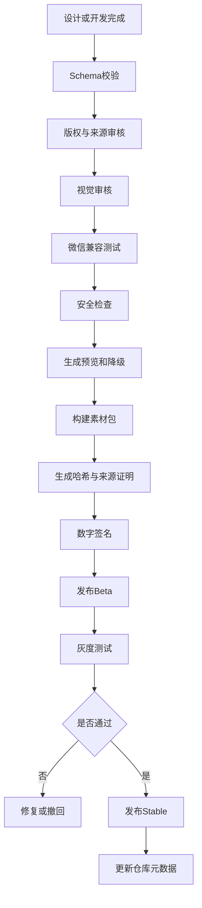
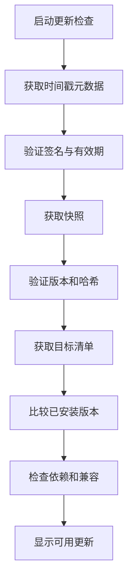
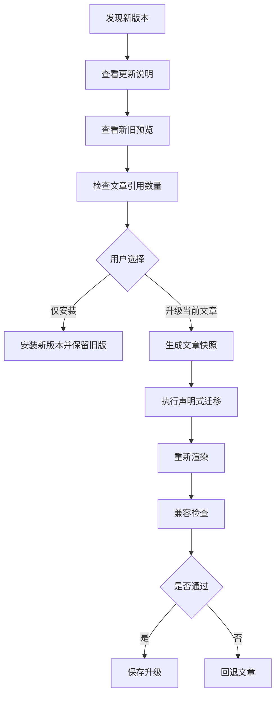

# 08_公众号智能视觉排版工具_素材更新与版本管理设计

> 文档版本：V1.0  
> 编制日期：2026年7月29日  
> 项目阶段：素材分发、版本治理与供应链安全设计  
> 上游依据：  
> - `00_公众号智能视觉排版工具_项目需求说明书.md`  
> - `01_公众号智能视觉排版工具_竞品分析与产品差异化设计.md`  
> - `02_公众号智能视觉排版工具_信息架构与页面清单.md`  
> - `03_公众号智能视觉排版工具_核心业务流程设计.md`  
> - `04_公众号智能视觉排版工具_编辑器与区块模型设计.md`  
> - `05_公众号智能视觉排版工具_主题系统与组件规范.md`  
> - `06_公众号智能视觉排版工具_SVG互动组件技术规范.md`  
> - `07_公众号智能视觉排版工具_多公众号品牌系统设计.md`  
> 文档用途：统一主题、组件、SVG、封面、配色、兼容规则和节日专题的远程发布、安装、签名、校验、灰度、回滚、下架及历史兼容机制。

---

# 一、建设目标

本项目需要长期保持视觉新鲜度和微信兼容性，因此素材系统不能是一次性内置资源，而应形成可持续更新能力。

系统需要支持更新：

- 完整主题；
- 静态组件；
- 专业语义组件；
- SVG互动模板；
- SVG互动引擎配置；
- 封面与首屏；
- 图片布局；
- 文末模板；
- 配色方案；
- 图标；
- 节日专题包；
- 行业专题包；
- 微信兼容规则；
- 素材迁移规则；
- 安全下架清单。

素材更新系统的目标是：

```text
持续发现设计趋势
→ 形成原创素材
→ 审核与兼容测试
→ 安全发布
→ 用户可控安装
→ 新旧版本并存
→ 历史文章稳定复现
→ 发生问题可快速回滚
```

---

# 二、核心原则

# 2.1 远程素材声明式

远程素材包只允许包含：

- JSON配置；
- 图片；
- SVG静态资源；
- 受控互动协议；
- 设计Token；
- 预览图；
- 兼容配置；
- 迁移数据；
- 文档说明。

远程素材包不得包含：

- 任意JavaScript；
- 动态加载的React组件；
- 任意服务端脚本；
- Shell脚本；
- 可执行二进制；
- 未审核HTML；
- 未审核CSS；
- 外部脚本地址；
- 可直接运行的插件代码。

原则：

> 新的渲染能力通过应用程序正式版本发布；新的视觉素材通过远程素材包发布。

这样可以避免素材中心成为远程代码执行通道。

# 2.2 用户可控更新

默认行为：

- 自动检查；
- 自动下载清单；
- 显示更新；
- 用户选择安装；
- 不自动覆盖旧版本。

可以自动安装的内容仅限：

- 已验证的严重兼容补丁；
- 明确标记为无视觉变化的安全修订；
- 且用户在设置中主动开启自动安全更新。

# 2.3 新旧版本并存

任何主题、组件或SVG更新后：

- 旧版本继续存在；
- 历史文章继续引用旧版本；
- 新文章默认使用新版本；
- 用户可主动升级旧文章；
- 升级前必须预览；
- 升级后必须可回退。

# 2.4 内容优先

素材升级不得：

- 修改原文；
- 删除图片；
- 改变章节；
- 修改法条；
- 改变SVG业务信息；
- 自动覆盖手工样式；
- 自动替换已冻结文末。

# 2.5 签名与完整性优先

所有正式素材包必须具备：

- 唯一包ID；
- 明确版本；
- 文件清单；
- 文件大小；
- 哈希；
- 数字签名；
- 发布者身份；
- 发布时间；
- 兼容范围；
- 依赖范围；
- 撤销状态。

客户端下载后必须先验证，再安装。

# 2.6 历史可复现

历史文章快照必须记录：

- 主题版本；
- 组件版本；
- SVG模板版本；
- 兼容规则版本；
- 品牌版本；
- 资源清单；
- 降级资源。

即使某素材停止推荐或下架，历史文章仍可预览和导出安全版本。

# 2.7 审美更新不等于强制更新

审美变化属于推荐层变化，不应强制修改历史文章。

例如：

- 某标题样式在2028年显得过时；
- 系统可停止推荐；
- 可提示有新版；
- 不能直接改变2026年的已发布文章。

---

# 三、素材中心总体架构

```text
设计与制作端
├── 趋势研究
├── 主题设计
├── 组件制作
├── SVG制作
├── 兼容测试
└── 发布审核

素材构建服务
├── Schema校验
├── 资源优化
├── 版权字段校验
├── 兼容测试结果绑定
├── 生成清单
├── 计算哈希
├── 生成来源证明
└── 数字签名

远程素材仓库
├── 发布元数据
├── 稳定渠道
├── 测试渠道
├── 灰度渠道
├── 素材包文件
├── 撤销清单
└── 镜像与CDN

客户端更新服务
├── 检查清单
├── 验证签名
├── 比较版本
├── 检查依赖
├── 下载缓存
├── 安装
├── 启用
├── 回滚
└── 清理

文章运行层
├── 精确版本引用
├── 旧渲染器兼容
├── 历史资源缓存
└── 安全降级
```

---

# 四、素材类型

# 4.1 完整主题包 `theme`

包括：

- 主题Token；
- 组件映射；
- 配色；
- 首屏；
- 标题；
- 正文；
- 图片；
- 专业组件；
- 文末；
- SVG适配；
- 预览；
- 兼容配置。

# 4.2 组件包 `component`

包括：

- 单个组件；
- 一组同类组件；
- 专业行业组件；
- 组件视觉变体；
- Slot定义；
- 微信渲染配置引用；
- 预览资源。

# 4.3 SVG模板包 `svg-template`

包括：

- 互动协议默认配置；
- 图层模板；
- 资源规格；
- 操作提示；
- 静态降级规则；
- 主题映射；
- 兼容报告。

不包含任意脚本。

# 4.4 封面包 `cover`

包括：

- 横版封面；
- 方形分享图；
- 安全裁切规则；
- 标题区域；
- Logo区域；
- 图片区域；
- 品牌映射；
- 预览图。

# 4.5 配色包 `palette`

包括：

- 主色；
- 辅助色；
- 强调色；
- 正文色；
- 背景；
- 状态色；
- 适用主题；
- 对比度结果。

# 4.6 图片布局包 `image-layout`

包括：

- 单图；
- 双图；
- 三图；
- 拼贴；
- 杂志；
- 图注；
- 小屏降级；
- 兼容规则。

# 4.7 文末包 `footer`

包括：

- 作者；
- 来源；
- 版权；
- 二维码；
- 关注引导；
- 相关阅读；
- 品牌口号。

# 4.8 节日专题包 `campaign`

例如：

- 元旦；
- 春节；
- 清明；
- 五一；
- 五四；
- 七一；
- 国庆；
- 宪法宣传周；
- 民法典宣传月；
- 廉洁教育月。

专题包可以组合：

- 主题；
- 首屏；
- 封面；
- 标题；
- 文末；
- SVG；
- 配色。

# 4.9 行业专题包 `industry`

例如：

- 巡察进驻；
- 巡察整改；
- 警示教育；
- 律所案例；
- AI测评；
- 咖啡记录；
- 摄影故事。

# 4.10 兼容规则包 `compatibility-rules`

包括：

- 微信HTML白名单；
- CSS白名单；
- SVG标签与属性白名单；
- 设备已知问题；
- 降级规则；
- 风险等级；
- 修复策略。

兼容规则包属于高敏感更新类型，必须使用独立签名角色和更严格审核。

---

# 五、包命名与标识

# 5.1 包ID

格式：

```text
pkg.{type}.{namespace}.{name}
```

示例：

```text
pkg.theme.official.inspection-documentary
pkg.component.official.legal-focus
pkg.svg.official.before-after
pkg.cover.official.modern-government
pkg.rules.official.wechat-compatibility
```

# 5.2 命名空间

建议：

- `official`：系统官方素材；
- `personal`：用户个人素材；
- `imported`：导入素材；
- `experimental`：实验素材；
- `legacy`：历史兼容素材。

第一版远程仓库只发布`official`。

# 5.3 资源ID

每个资源采用内容寻址或稳定ID：

```text
sha256:{digest}
```

或：

```text
res_{ulid}
```

推荐同时保存：

- 业务资源ID；
- SHA-256内容哈希。

---

# 六、版本规范

# 6.1 采用语义化版本

统一使用：

```text
MAJOR.MINOR.PATCH
```

规则：

- `MAJOR`：不向后兼容的结构变化；
- `MINOR`：向后兼容的新能力或新变体；
- `PATCH`：兼容修复、视觉微调、安全修复。

示例：

```text
1.0.0
1.1.0
1.1.1
2.0.0
```

# 6.2 预发布版本

支持：

```text
1.2.0-alpha.1
1.2.0-beta.1
1.2.0-rc.1
```

预发布版本不得进入稳定渠道默认推荐。

# 6.3 构建元数据

支持：

```text
1.2.0+build.20260729
```

构建元数据不影响版本优先级。

# 6.4 素材版本与协议版本分离

一个包应同时记录：

- 包版本；
- Schema版本；
- 组件协议版本；
- SVG协议版本；
- 最低应用版本；
- 最高已测试应用版本；
- 兼容规则版本。

---

# 七、素材包Manifest

# 7.1 顶层结构

```json
{
  "manifestVersion": "1.0.0",
  "package": {
    "id": "pkg.theme.official.inspection-documentary",
    "type": "theme",
    "name": "巡察纪实",
    "version": "1.2.0",
    "channel": "stable",
    "publisher": "official",
    "status": "active"
  },
  "compatibility": {},
  "dependencies": [],
  "files": [],
  "assets": [],
  "rights": {},
  "provenance": {},
  "release": {},
  "signature": {}
}
```

# 7.2 兼容字段

```json
{
  "compatibility": {
    "minimumAppVersion": "1.0.0",
    "maximumTestedAppVersion": "1.6.0",
    "documentSchema": ">=1.0.0 <2.0.0",
    "themeProtocol": "^1.0.0",
    "componentProtocol": "^1.1.0",
    "svgProtocol": "^1.0.0",
    "wechatRuleVersion": ">=1.0.0"
  }
}
```

# 7.3 依赖字段

```json
{
  "dependencies": [
    {
      "packageId": "pkg.component.official.government-core",
      "versionRange": "^1.2.0",
      "required": true
    }
  ]
}
```

要求：

- 依赖必须显式；
- 不允许循环依赖；
- 安装前解析；
- 版本冲突时不强制覆盖。

# 7.4 文件清单

```json
{
  "files": [
    {
      "path": "tokens.json",
      "size": 14320,
      "sha256": "..."
    },
    {
      "path": "preview/cover.webp",
      "size": 125300,
      "sha256": "..."
    }
  ]
}
```

# 7.5 权利与来源字段

```json
{
  "rights": {
    "license": "proprietary-internal",
    "commercialUseAllowed": true,
    "redistributionAllowed": false,
    "sourceNotes": "原创设计",
    "thirdPartyAssets": [],
    "reviewedAt": "2026-07-29T00:00:00+08:00"
  }
}
```

---

# 八、素材包目录结构

```text
package/
├── manifest.json
├── content/
│   ├── tokens.json
│   ├── components.json
│   ├── variants.json
│   ├── protocol.json
│   └── compatibility.json
├── assets/
│   ├── images/
│   ├── svg/
│   ├── icons/
│   └── fallback/
├── previews/
│   ├── card.webp
│   ├── long-page.webp
│   ├── mobile.webp
│   └── dark.webp
├── migrations/
│   └── migration.json
├── docs/
│   ├── README.md
│   └── CHANGELOG.md
├── provenance/
│   └── provenance.json
└── signature/
    └── bundle.sigstore.json
```

说明：

- `migrations`只能包含声明式映射；
- 不允许包含可执行迁移脚本；
- 复杂Schema迁移必须随应用版本发布代码。

---

# 九、更新仓库元数据

素材仓库参考安全更新框架的职责分离思路，设计四类顶层元数据：

# 9.1 根信任 `root`

记录：

- 受信任公钥；
- 签名角色；
- 签名阈值；
- 根版本；
- 过期时间；
- 密钥轮换规则。

根密钥应离线保存。

# 9.2 目标清单 `targets`

记录：

- 可安装素材包；
- 文件哈希；
- 文件大小；
- 包版本；
- 渠道；
- 撤销状态；
- 委托分类。

可按素材类型委托：

- themes；
- components；
- svg；
- compatibility；
- campaigns。

# 9.3 快照 `snapshot`

记录所有目标元数据版本和哈希，保证客户端看到一致仓库状态。

# 9.4 时间戳 `timestamp`

记录最新快照版本、哈希和短期有效期，帮助客户端识别陈旧清单或回滚攻击。

# 9.5 第一版实施方式

第一版不必从零实现完整通用更新框架，但应：

1. 使用上述角色与元数据模型；
2. 使用成熟库或兼容TUF思路的实现；
3. 至少完成签名清单、哈希、过期时间和防降级；
4. 为后续接入完整TUF客户端预留目录和字段。

---

# 十、数字签名与来源证明

# 10.1 签名目标

需要签名：

- Manifest；
- 发布清单；
- 兼容规则；
- 撤销清单；
- 素材包摘要；
- 来源证明。

# 10.2 推荐方式

建议采用：

- 离线根密钥；
- 在线发布签名密钥；
- 兼容规则独立密钥；
- 素材包使用Sigstore/Cosign Bundle或等效签名机制；
- CI构建生成来源证明。

# 10.3 签名验证

客户端验证：

1. 发布者身份；
2. 签名有效；
3. 清单未过期；
4. 包哈希匹配；
5. 文件大小匹配；
6. 包未撤销；
7. 版本未倒退；
8. 渠道正确；
9. 依赖合法。

# 10.4 离线验证

签名Bundle应尽量包含：

- 签名；
- 证书；
- 时间证明；
- 透明日志证明或等效材料；
- 产物摘要。

使系统在临时无法访问签名服务时，仍可验证已下载包。

# 10.5 来源证明Provenance

记录：

- 源代码或设计源版本；
- 构建工作流；
- 构建者；
- 输入文件摘要；
- 构建时间；
- 输出包摘要；
- 发布渠道。

目标不是首版立即达到最高供应链等级，而是具备可追溯性。

---

# 十一、密钥管理

# 11.1 密钥角色

| 角色 | 用途 | 建议存放 |
|---|---|---|
| Root | 根信任和密钥轮换 | 离线 |
| Targets | 正式素材包签名 | 受控CI或HSM |
| Compatibility | 兼容规则签名 | 独立受控环境 |
| Timestamp | 高频时间戳更新 | 在线受限密钥 |
| Emergency | 紧急撤销 | 离线或双人控制 |

# 11.2 密钥轮换

必须支持：

- 新增公钥；
- 双签过渡；
- 旧密钥撤销；
- 根元数据升级；
- 客户端信任更新；
- 泄露应急。

# 11.3 单人项目简化

第一阶段可以：

- 根密钥离线保存；
- 发布密钥放在受保护CI Secret；
- 兼容规则与普通素材使用不同密钥；
- 紧急撤销使用离线备用密钥。

不能将所有密钥放在Web服务器同一目录。

---

# 十二、发布渠道

# 12.1 Stable稳定渠道

面向日常使用。

要求：

- 完整设计审核；
- 微信兼容通过；
- 安全审核通过；
- 有降级；
- 有回滚版本；
- 无已知严重问题。

# 12.2 Beta测试渠道

用于：

- 新主题；
- 新组件；
- 新SVG；
- 新兼容规则候选。

仅主动开启Beta的用户可见。

# 12.3 Canary灰度渠道

用于：

- 小范围技术验证；
- 内部账号；
- 指定设备；
- 指定服务器实例。

# 12.4 Emergency紧急渠道

仅发布：

- 撤销清单；
- 严重安全补丁；
- 严重微信兼容修复；
- 紧急降级配置。

# 12.5 渠道切换

用户可在系统设置中选择：

- 稳定；
- 测试；
- 内部灰度。

兼容规则的紧急撤销不受普通渠道限制，但必须显示明确通知。

---

# 十三、灰度发布

# 13.1 灰度维度

可按：

- 用户ID；
- 服务器实例ID；
- 公众号类型；
- 应用版本；
- 浏览器；
- 操作系统；
- 随机百分比；
- 手动白名单。

第一版主要采用：

- 内部白名单；
- 单实例；
- 手动开启Beta。

# 13.2 灰度阶段

```text
内部开发
→ 测试账号
→ 10%灰度
→ 30%灰度
→ 100%稳定
```

个人私有系统可简化为：

```text
测试环境
→ 个人测试公众号
→ 正式环境
```

# 13.3 灰度观察指标

- 安装成功率；
- 包校验失败率；
- 编辑器加载失败；
- 微信复制差异；
- 兼容检查异常；
- SVG失败；
- 回滚次数；
- 用户主动卸载；
- 资源加载耗时。

---

# 十四、发布流程



---

# 十五、客户端更新检查

# 15.1 检查流程



# 15.2 防降级

客户端记录：

- 已信任根版本；
- 已见最高快照版本；
- 已安装最高版本；
- 撤销状态。

若远程返回较旧元数据：

- 拒绝；
- 记录安全告警；
- 保留本地版本；
- 不自动回退。

正式回滚必须通过一个更高版本号的修复包完成，例如：

```text
问题版本：1.2.0
回滚修复：1.2.1
```

而不是重新发布1.1.0覆盖。

---

# 十六、下载与缓存

# 16.1 下载策略

- Manifest优先；
- 预览图按需；
- 安装时下载完整包；
- 支持断点续传；
- 支持重试；
- 限制并发；
- 下载后先校验再解压。

# 16.2 缓存层级

```text
CDN
→ 服务端素材缓存
→ 本地文件缓存
→ 浏览器预览缓存
```

# 16.3 内容寻址

相同哈希资源只保存一份。

优势：

- 节省空间；
- 避免重复下载；
- 方便完整性验证；
- 便于历史版本复用。

# 16.4 缓存清理

优先清理：

- 未安装包；
- 过期预览；
- 已卸载且无文章引用的版本；
- 失败下载临时文件。

不得清理：

- 历史文章引用资源；
- Frozen品牌资源；
- 回滚所需上一稳定版本；
- 当前安装版本。

---

# 十七、安装流程

# 17.1 安装前检查

- 包签名；
- 清单有效期；
- 文件哈希；
- 文件大小；
- 应用版本；
- Schema版本；
- 协议版本；
- 依赖；
- 磁盘空间；
- 撤销状态；
- 版权字段。

# 17.2 安装步骤

```text
下载临时目录
→ 验证
→ 解压隔离目录
→ Schema校验
→ 资源导入
→ 注册包
→ 生成预览缓存
→ 标记已安装
→ 原子切换启用
```

# 17.3 原子安装

安装过程中不得让编辑器看到半安装状态。

建议：

```text
packages/{packageId}/{version}.staging
→ 验证完成
→ 重命名为正式目录
→ 数据库事务提交
```

# 17.4 安装失败

- 删除暂存目录；
- 保留旧版本；
- 记录失败原因；
- 提供重试；
- 不影响文章编辑。

---

# 十八、启用与停用

# 18.1 安装和启用分离

状态：

```text
available
downloaded
installed
enabled
disabled
deprecated
revoked
uninstalled
```

用户可安装但不启用。

# 18.2 默认启用

新安装主题和组件默认：

- 进入素材中心；
- 不自动替换当前文章；
- 不自动设为公众号默认；
- 不自动进入最近使用。

# 18.3 停用

停用后：

- 不出现在新建推荐；
- 已有文章继续使用；
- 可重新启用；
- 不删除文件。

---

# 十九、升级流程



# 19.1 批量升级

第一版不默认批量升级历史文章。

可支持：

- 仅检查；
- 按公众号筛选；
- 按主题筛选；
- 逐篇确认；
- 先生成批量预览报告。

# 19.2 自动安全修订

仅当满足全部条件时可自动安装：

- PATCH版本；
- 无视觉结构变化；
- 无Schema变化；
- 兼容或安全修复；
- 签名有效；
- 用户开启自动安全更新。

自动安装仍不直接改写历史文章，只更新渲染器安全规则或可替换资源。

---

# 二十、回滚机制

# 20.1 包级回滚

发生问题时：

- 禁用新版本；
- 恢复上一启用版本；
- 保留失败版本用于分析；
- 不删除文章引用；
- 重新生成预览。

# 20.2 文章级回滚

文章升级失败：

- 恢复升级前快照；
- 恢复旧组件引用；
- 恢复旧资源清单；
- 恢复旧兼容报告。

# 20.3 系统级回滚

严重兼容规则错误时：

1. 发布紧急撤销元数据；
2. 客户端停止使用问题规则；
3. 恢复上一规则版本；
4. 标记受影响文章；
5. 提示重新执行兼容检查。

# 20.4 回滚保留策略

至少保留：

- 当前稳定版本；
- 上一个稳定版本；
- 所有仍被文章引用的版本；
- 最近3个安装版本；
- 最近一次成功兼容规则版本。

---

# 二十一、撤销与紧急下架

# 21.1 撤销原因

- 安全风险；
- 微信严重不兼容；
- 版权问题；
- 数据损坏；
- 包签名异常；
- 恶意资源；
- 严重视觉错误；
- 错误发布。

# 21.2 撤销级别

## Stop Recommendation

停止推荐，但可继续使用。

## Disable New Use

禁止新文章使用，历史文章保留。

## Force Fallback

历史文章预览和导出时强制使用静态降级。

## Emergency Revoke

禁止加载问题包，使用安全替代或旧版本。

# 21.3 撤销清单

```json
{
  "packageId": "pkg.svg.official.example",
  "version": "1.2.0",
  "level": "force_fallback",
  "reasonCode": "wechat_incompatible",
  "message": "该版本在部分Android微信中无法操作",
  "replacement": {
    "packageId": "pkg.svg.official.example",
    "version": "1.2.1"
  },
  "effectiveAt": "2026-07-29T15:00:00+08:00"
}
```

# 21.4 历史文章处理

禁止直接删除内容。

应：

- 显示风险；
- 使用降级；
- 提供替换；
- 保留原始数据；
- 允许用户导出安全版。

---

# 二十二、废弃与淘汰

# 22.1 废弃状态

素材进入`deprecated`后：

- 不进入默认推荐；
- 搜索中标记旧版；
- 仍可用于历史文章；
- 提供替代方案；
- 不再新增变体。

# 22.2 淘汰条件

- 审美明显过时；
- 微信兼容下降；
- 与新组件高度重复；
- 使用率极低；
- 维护成本过高；
- 不支持品牌Token；
- 缺少降级；
- 存在不可修复问题。

# 22.3 归档

归档包：

- 只读；
- 不参与安装；
- 仅供历史恢复；
- 可迁移为静态安全版本。

---

# 二十三、历史文章兼容

# 23.1 精确版本引用

文章节点必须保存：

- packageId；
- packageVersion；
- componentId；
- componentVersion；
- rendererVersion；
- compatibilityRuleVersion。

不得只保存“最新版本”。

# 23.2 渲染兼容策略

```text
精确旧渲染器可用
→ 使用旧渲染器

旧渲染器不可用但有迁移
→ 生成迁移预览

存在安全撤销
→ 使用静态降级

资源缺失
→ 从历史缓存恢复

全部失败
→ 显示安全占位与原文
```

# 23.3 历史资源锁定

已复制、已同步或已发布文章对应快照，应冻结：

- 资源清单；
- 主题版本；
- 品牌版本；
- 降级资源；
- 渲染结果摘要。

# 23.4 长期归档

对于长期保存文章，可生成：

- 文档JSON；
- 微信HTML；
- 静态长图；
- 资源包；
- 版本Manifest。

即使未来编辑器升级，仍能查看历史效果。

---

# 二十四、兼容规则更新

# 24.1 兼容规则类型

- HTML标签；
- CSS属性；
- SVG标签；
- SVG属性；
- 图片规则；
- 字体规则；
- 链接规则；
- 设备问题；
- 微信后台问题；
- 降级策略。

# 24.2 规则更新等级

## Information

增加提示，不改变输出。

## Recommendation

优化建议变化。

## Compatibility Patch

输出转换规则变化。

## Critical

严重风险或撤销。

# 24.3 规则应用

新规则默认用于：

- 新文章；
- 新兼容检查；
- 新复制；
- 新草稿同步。

不直接改变已保存文档JSON。

已发布文章仅显示重新检查建议。

---

# 二十五、设计趋势扫描

# 25.1 目标

持续收集：

- 公众号优秀版式；
- 编辑设计趋势；
- 杂志排版；
- UI设计趋势；
- 品牌视觉；
- 字体搭配；
- 配色趋势；
- 互动形式；
- 节点传播趋势。

# 25.2 信息来源

优先：

- 设计机构；
- 专业设计媒体；
- 官方品牌案例；
- 优秀公众号；
- 设计奖项；
- 产品设计系统；
- 主流设计工具年度趋势。

# 25.3 扫描结果不直接入库

趋势扫描输出：

```text
趋势名称
视觉特点
适用内容
流行周期
是否适合公众号
微信兼容风险
与现有主题差异
原创转化建议
```

必须经过：

- 人工筛选；
- 原创重设计；
- 版权审核；
- 主题系统化；
- 长文测试。

# 25.4 趋势状态

- Emerging：新出现；
- Growing：增长；
- Mainstream：主流；
- Stable：稳定；
- Declining：下降；
- Outdated：过时。

系统可以降低过时风格推荐权重，但不删除历史素材。

---

# 二十六、节日专题更新

# 26.1 发布时间

专题包建议提前：

- 大型节日：3至4周；
- 普通节点：1至2周；
- 临时活动：按需。

# 26.2 党政与纪检节点

重点：

- 元旦春节廉洁提醒；
- 五四；
- 七一；
- 国庆；
- 宪法宣传周；
- 纪律教育；
- 廉洁文化；
- 巡察工作专题。

# 26.3 专题有效期

专题包可设置：

```text
recommendFrom
recommendUntil
```

过期后：

- 不再首页强推荐；
- 仍可搜索；
- 历史文章不受影响。

# 26.4 避免模板同质化

每个专题包应有：

- 正式版；
- 极简版；
- 设计版；
- 互动版。

不只做同一红色模板换文字。

---

# 二十七、素材审核

# 27.1 审核维度

- 内容完整；
- 视觉质量；
- 主题一致性；
- 长文阅读；
- 微信兼容；
- SVG降级；
- 多公众号适配；
- 安全；
- 版权；
- 可维护性。

# 27.2 发布门槛

正式素材必须：

- 无严重兼容问题；
- 有完整预览；
- 有版本说明；
- 有版权字段；
- 有签名；
- 有回滚版本；
- 有替代或降级；
- 通过Schema校验。

# 27.3 审核记录

```json
{
  "reviewId": "review_001",
  "packageId": "pkg.theme.official.example",
  "version": "1.0.0",
  "designStatus": "passed",
  "compatibilityStatus": "passed",
  "securityStatus": "passed",
  "rightsStatus": "passed",
  "reviewedBy": "owner",
  "reviewedAt": "2026-07-29T00:00:00+08:00"
}
```

---

# 二十八、版权与素材来源

# 28.1 原创优先

官方素材库应以：

- 原创主题；
- 原创组件；
- 原创SVG结构；
- 自制图标；
- 合法授权资源；

为主。

# 28.2 禁止

- 直接复制竞品付费模板；
- 抓取公众号文章作为模板售卖；
- 使用无授权字体文件；
- 使用来源不明插画；
- 使用未授权摄影作品；
- 修改少量颜色后视为原创。

# 28.3 来源记录

第三方资源必须记录：

- 作者；
- 来源；
- 许可证；
- 授权范围；
- 是否可商用；
- 是否可修改；
- 到期时间；
- 证明文件。

# 28.4 字体

素材包不得分发字体文件。

主题只能引用：

- 系统字体栈；
- 微信安全字体；
- 用户本机已有字体用于封面栅格化；
- 合法授权且不随包分发的设计字体。

---

# 二十九、用户个人素材

# 29.1 个人素材来源

- 用户上传；
- 官方组件复制；
- 用户修改后保存；
- 品牌专属组件；
- 历史文章提取。

# 29.2 个人素材版本

同样支持：

- 版本；
- 预览；
- 回退；
- 导出；
- 标签；
- 公众号绑定。

# 29.3 远程更新影响

官方包更新时：

- 不覆盖个人副本；
- 显示来源官方包有新版；
- 用户可对比；
- 用户可选择重新基于新版创建副本。

# 29.4 导入安全

导入个人素材包时：

- 验证Schema；
- 清洗HTML和SVG；
- 禁止可执行代码；
- 重新生成内部ID；
- 标记为`imported`；
- 默认不信任远程签名。

---

# 三十、服务器与CDN

# 30.1 仓库结构

```text
repository/
├── metadata/
│   ├── root.json
│   ├── timestamp.json
│   ├── snapshot.json
│   └── targets/
├── packages/
│   ├── themes/
│   ├── components/
│   ├── svg/
│   ├── covers/
│   ├── palettes/
│   ├── campaigns/
│   └── compatibility/
├── previews/
├── revocations/
└── provenance/
```

# 30.2 对象存储

建议使用对象存储保存：

- 包；
- 图片；
- 预览；
- 签名；
- 来源证明。

数据库保存：

- 包索引；
- 安装状态；
- 使用情况；
- 版本关系；
- 审核记录。

# 30.3 CDN

CDN用于：

- 公开更新元数据；
- 素材包下载；
- 预览图。

不用于：

- 用户文章私有图片；
- 公众号二维码；
- 私有品牌资产；
- 微信授权信息。

# 30.4 镜像

可配置：

- 主仓库；
- 备用仓库；
- 本地缓存。

客户端仍必须验证签名，不能因来自主域名就跳过验证。

---

# 三十一、数据库建议

至少包含：

- `material_packages`；
- `material_package_versions`；
- `material_files`；
- `material_dependencies`；
- `material_channels`；
- `material_releases`；
- `material_reviews`；
- `material_rights`；
- `material_provenance`；
- `material_signatures`；
- `material_revocations`；
- `material_installations`；
- `material_installation_logs`；
- `material_usage_records`；
- `material_rollbacks`；
- `material_migrations`；
- `compatibility_rule_versions`；
- `trend_observations`；
- `campaign_schedules`；
- `repository_metadata_versions`。

---

# 三十二、接口建议

# 32.1 更新检查

```text
GET /api/materials/updates
GET /api/materials/channels
GET /api/materials/packages/:packageId
GET /api/materials/packages/:packageId/versions
```

# 32.2 安装

```text
POST /api/materials/packages/:packageId/install
POST /api/materials/packages/:packageId/enable
POST /api/materials/packages/:packageId/disable
POST /api/materials/packages/:packageId/uninstall
POST /api/materials/packages/:packageId/rollback
```

# 32.3 升级预览

```text
POST /api/materials/packages/:packageId/upgrade-preview
POST /api/articles/:articleId/material-upgrade-preview
POST /api/articles/:articleId/material-upgrade
```

# 32.4 管理端

```text
POST /api/admin/materials/build
POST /api/admin/materials/publish
POST /api/admin/materials/promote
POST /api/admin/materials/revoke
POST /api/admin/materials/deprecate
GET  /api/admin/materials/reports
```

---

# 三十三、状态模型

# 33.1 包发布状态

```text
draft
review
signed
beta
canary
stable
deprecated
revoked
archived
```

# 33.2 安装状态

```text
not_installed
downloading
verifying
staging
installed
enabled
disabled
failed
rollback_pending
uninstalled
```

# 33.3 文章引用状态

```text
current
upgrade_available
deprecated
revoked
fallback_active
resource_missing
migration_required
```

---

# 三十四、通知策略

# 34.1 普通通知

- 新主题；
- 新组件；
- 节日包；
- 推荐更新。

# 34.2 重要通知

- 当前公众号默认主题有新版；
- 当前文章使用废弃组件；
- 有兼容补丁；
- 有品牌适配升级。

# 34.3 紧急通知

- 组件被撤销；
- 微信规则导致互动失效；
- 素材签名异常；
- 资源存在安全风险；
- 必须使用静态降级。

紧急通知应：

- 显示受影响文章数量；
- 提供一键检查；
- 提供安全修复；
- 不夸大风险；
- 不静默修改原文。

---

# 三十五、监控指标

# 35.1 发布指标

- 构建成功率；
- 签名成功率；
- 审核通过率；
- 发布耗时；
- 灰度通过率。

# 35.2 客户端指标

- 更新检查成功率；
- 下载成功率；
- 签名验证失败率；
- 安装成功率；
- 启用成功率；
- 回滚率；
- 缓存命中率。

# 35.3 使用指标

- 主题使用次数；
- 组件使用次数；
- SVG使用次数；
- 收藏率；
- 安装后未使用率；
- 主动卸载率；
- 公众号适配率。

# 35.4 质量指标

- 微信兼容问题；
- SVG降级次数；
- 文章升级失败；
- 旧版资源缺失；
- 视觉冲突提示；
- 用户回退次数。

---

# 三十六、日志与审计

必须记录：

- 谁构建；
- 谁审核；
- 谁签名；
- 谁发布；
- 发布哪个渠道；
- 谁升级；
- 谁回滚；
- 谁撤销；
- 客户端验证结果；
- 文章受影响范围；
- 紧急修复结果。

日志不得记录：

- 签名私钥；
- 微信密钥；
- 用户文章正文；
- 私有二维码原始内容；
- 敏感凭据。

---

# 三十七、备份与灾难恢复

# 37.1 备份内容

- 仓库元数据；
- 素材包；
- 签名Bundle；
- 来源证明；
- 审核记录；
- 撤销清单；
- 安装记录；
- 旧版本渲染资源。

# 37.2 恢复顺序

```text
恢复根信任
→ 恢复仓库元数据
→ 恢复素材包
→ 校验哈希
→ 恢复数据库索引
→ 恢复客户端安装状态
→ 验证历史文章引用
```

# 37.3 灾难场景

- 数据库丢失；
- 对象存储丢失；
- CDN污染；
- 发布密钥泄露；
- 错误兼容规则；
- 错误撤销；
- 仓库被回滚。

每种场景必须有独立预案。

---

# 三十八、首版实现范围

# 38.1 V0.5

完成：

- 官方素材清单；
- 主题和组件包；
- SHA-256校验；
- 单一正式签名；
- 手动安装；
- 新旧版本并存；
- 升级预览；
- 包级回滚；
- 历史文章精确版本引用。

# 38.2 V1.0

增加：

- Stable与Beta渠道；
- 根信任和发布角色分离；
- 撤销清单；
- SVG包；
- 兼容规则包；
- 节日专题包；
- 灰度发布；
- 来源证明；
- 签名Bundle；
- 自动安全更新选项。

# 38.3 V1.5

增加：

- 多镜像；
- 完整TUF兼容仓库；
- Sigstore透明日志验证；
- 素材趋势中心；
- 批量文章升级报告；
- 更细的灰度规则；
- 设计审核工作流。

---

# 三十九、开发顺序

# 39.1 第一阶段：包模型

1. 包ID；
2. Manifest；
3. 文件清单；
4. 版本；
5. 依赖；
6. 兼容范围；
7. 权利字段。

# 39.2 第二阶段：本地安装

1. 下载；
2. 哈希；
3. 暂存；
4. Schema校验；
5. 原子安装；
6. 启用停用；
7. 回滚。

# 39.3 第三阶段：签名

1. 发布清单签名；
2. 素材包签名；
3. 根信任；
4. 过期时间；
5. 防降级；
6. 撤销清单。

# 39.4 第四阶段：渠道

1. Beta；
2. Stable；
3. 灰度；
4. 紧急撤销；
5. 推广升级。

# 39.5 第五阶段：趋势和专题

1. 趋势记录；
2. 专题排期；
3. 素材审核；
4. 推荐权重；
5. 过时淘汰。

---

# 四十、验收标准

# 40.1 安全

- 未签名包不可正式安装；
- 文件哈希不匹配立即拒绝；
- 清单过期可识别；
- 低版本回滚攻击可识别；
- 已撤销包可阻止；
- 远程包不能执行任意代码。

# 40.2 安装

- 下载中断可重试；
- 安装失败不影响旧版本；
- 安装过程原子化；
- 依赖可检查；
- 存储不足可提示；
- 同一资源不重复保存。

# 40.3 版本

- 新旧版本并存；
- 历史文章使用精确版本；
- 升级前可预览；
- 升级失败自动恢复；
- 废弃素材不影响历史文章；
- 撤销素材可静态降级。

# 40.4 发布

- Beta和Stable隔离；
- 灰度可暂停；
- 发布可追溯；
- 有审核记录；
- 有签名和来源证明；
- 有回滚版本。

# 40.5 视觉与版权

- 包含完整预览；
- 有适用场景；
- 有版权字段；
- 无未经授权字体文件；
- 无明显复制竞品模板；
- 通过长文和微信测试。

---

# 四十一、风险与控制

| 风险 | 控制措施 |
|---|---|
| 远程素材执行恶意代码 | 仅声明式包，渲染代码随应用发布 |
| 仓库文件被篡改 | 哈希、数字签名、元数据验证 |
| 签名密钥泄露 | 角色分离、离线根密钥、轮换和撤销 |
| 仓库回滚旧版本 | 版本单调、防降级和短期时间戳 |
| 半安装导致编辑器崩溃 | 暂存目录和原子切换 |
| 新版本破坏旧文章 | 精确版本引用和旧版并存 |
| 微信规则变化 | 独立兼容包、紧急撤销和降级 |
| 版权投诉 | 来源字段、审核、撤销和替换 |
| 素材数量过多 | 精选、状态管理和淘汰机制 |
| 灰度问题扩散 | 分渠道、白名单、指标观察和暂停 |
| 缓存被污染 | 内容哈希和每次验证 |
| CDN不可用 | 本地缓存和备用源 |
| 个人素材被官方更新覆盖 | 官方包与个人副本隔离 |
| 兼容规则误发布 | 独立签名、双重审核和快速回滚 |
| 历史资源被清理 | 引用计数和归档保护 |

---

# 四十二、技术决策冻结

本文件正式冻结以下规则：

1. 素材更新系统支持主题、组件、SVG、封面、配色、专题和兼容规则；
2. 远程素材包必须为声明式资源，不允许下发任意可执行代码；
3. 新渲染能力只能随应用正式版本发布；
4. 素材包统一使用Manifest、文件清单、哈希和数字签名；
5. 版本采用语义化版本；
6. 包版本与Schema、协议及兼容规则版本分离；
7. 更新仓库采用Root、Targets、Snapshot、Timestamp职责分离思路；
8. 根密钥离线保存，兼容规则使用独立签名角色；
9. 客户端必须验证签名、哈希、大小、有效期、版本和撤销状态；
10. 更新支持Stable、Beta、Canary和Emergency渠道；
11. 安装采用暂存目录和原子切换；
12. 新旧版本必须并存；
13. 历史文章精确引用素材版本；
14. 升级前必须生成预览和快照；
15. 审美更新不自动改变历史文章；
16. 严重问题通过撤销清单、静态降级和替代版本处理；
17. 兼容规则更新不直接修改文档JSON；
18. 个人素材与官方素材隔离；
19. 素材包必须记录版权和来源；
20. 不得随素材包分发字体文件；
21. 过时素材停止推荐但不删除；
22. 第一版先实现签名清单和哈希，逐步完善完整安全更新框架；
23. 所有后续系统架构、数据库和接口均以本规范为依据。

---

# 四十三、主要技术参考

以下官方规范用于本更新方案的安全与版本设计，访问日期为2026年7月29日：

1. The Update Framework：角色化元数据、签名阈值、目标文件哈希与大小、快照一致性、时间戳有效期和防陈旧更新；
2. Sigstore/Cosign：对文件或Blob生成签名Bundle，并支持签名、证书、时间和透明日志证明的验证；
3. SLSA：构建来源证明，用于记录产物由什么源、构建过程和构建主体产生；
4. Semantic Versioning 2.0.0：使用MAJOR.MINOR.PATCH表达不兼容变化、兼容新增和兼容修复。

参考地址：

- https://theupdateframework.io/docs/metadata/
- https://theupdateframework.io/spec/
- https://theupdateframework.io/docs/security/
- https://docs.sigstore.dev/cosign/signing/signing_with_blobs/
- https://docs.sigstore.dev/cosign/verifying/verify/
- https://docs.sigstore.dev/about/bundle/
- https://slsa.dev/spec/v1.2/
- https://slsa.dev/spec/v1.2/build-track-basics
- https://semver.org/

说明：

> 本项目不需要在第一版完整复制大型公共软件仓库的全部安全体系，但素材更新属于供应链入口，必须从一开始保留签名、哈希、版本、防回滚和撤销能力，不能等公开部署后再补救。

---

# 四十四、下一份开发文件

下一步进入：

> `09_公众号智能视觉排版工具_系统架构设计.md`

该文件应详细明确：

- 前端、后端和基础设施总体架构；
- 编辑器服务；
- DOCX与网页导入服务；
- 主题和素材服务；
- SVG渲染与清洗服务；
- 微信HTML渲染和兼容检查；
- 多公众号连接器；
- 图片与对象存储；
- 数据库；
- 缓存和队列；
- 部署拓扑；
- 云服务器规格；
- 日志、监控、备份和安全边界；
- 单体优先还是微服务；
- 开发、测试和生产环境。
