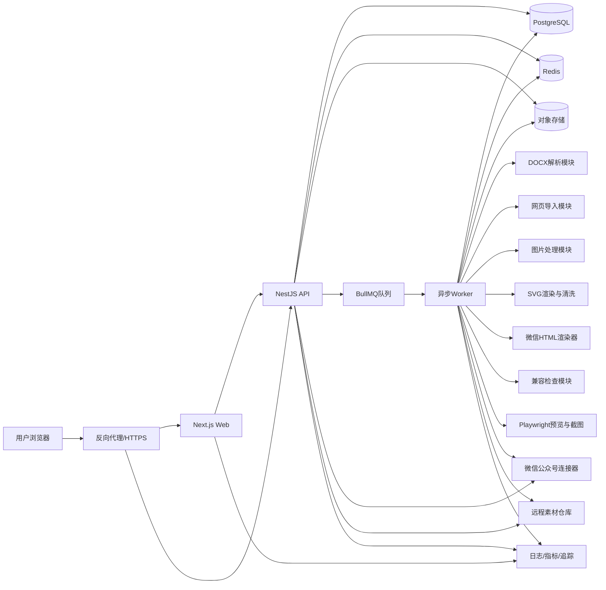
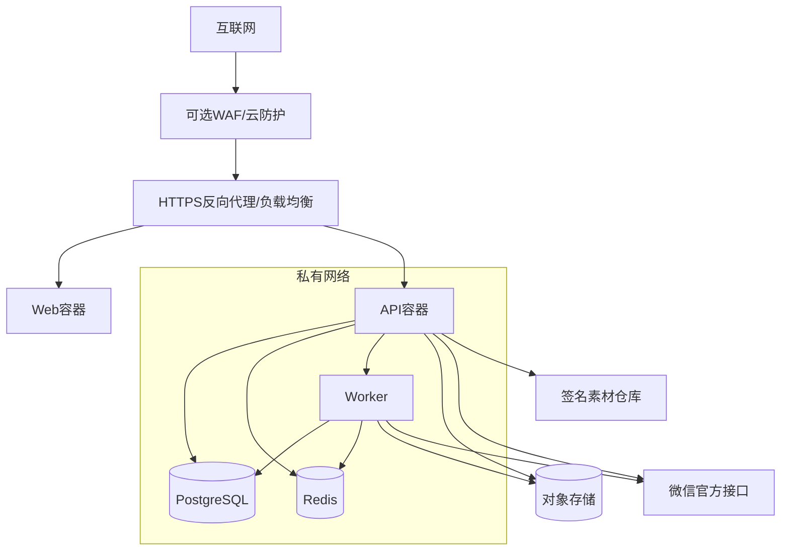

# 09_公众号智能视觉排版工具_系统架构设计

> 文档版本：V1.0  
> 编制日期：2026年7月29日  
> 项目阶段：总体系统架构设计  
> 上游依据：  
> - `00_公众号智能视觉排版工具_项目需求说明书.md`  
> - `01_公众号智能视觉排版工具_竞品分析与产品差异化设计.md`  
> - `02_公众号智能视觉排版工具_信息架构与页面清单.md`  
> - `03_公众号智能视觉排版工具_核心业务流程设计.md`  
> - `04_公众号智能视觉排版工具_编辑器与区块模型设计.md`  
> - `05_公众号智能视觉排版工具_主题系统与组件规范.md`  
> - `06_公众号智能视觉排版工具_SVG互动组件技术规范.md`  
> - `07_公众号智能视觉排版工具_多公众号品牌系统设计.md`  
> - `08_公众号智能视觉排版工具_素材更新与版本管理设计.md`  
> 文档用途：确定前端、后端、异步任务、数据库、对象存储、缓存、渲染、导入、部署、监控、备份与安全边界。

---

# 一、架构结论

本项目第一版采用：

> **模块化单体主应用＋独立异步Worker＋对象存储＋PostgreSQL＋Redis队列**。

不在首版采用大规模微服务。

总体技术方案：

```text
Next.js Web应用
+ NestJS API主应用
+ Tiptap/ProseMirror编辑器
+ PostgreSQL主数据库
+ Redis缓存与BullMQ任务队列
+ Worker异步处理进程
+ S3兼容对象存储
+ 微信HTML服务端渲染器
+ SVG生成、清洗和降级渲染模块
+ DOCX/网页导入模块
+ Playwright浏览器测试与预览
+ Docker Compose首版部署
```

第一版可以部署在一台云服务器，也可以将数据库和对象存储替换为云厂商托管服务。

---

# 二、核心架构原则

# 2.1 单体优先，边界清楚

首版采用模块化单体，原因：

- 当前为个人使用；
- 业务仍在快速迭代；
- 分布式事务没有必要；
- 部署和调试成本需要控制；
- 大量业务模块共享文章、主题、品牌和版本模型；
- 微服务会过早引入网络、鉴权、追踪和一致性复杂度。

但代码必须按照领域模块分离，后续可拆出的模块包括：

- DOCX导入；
- 网页抓取；
- 图片处理；
- SVG渲染；
- 微信HTML渲染；
- 微信连接器；
- 素材仓库。

# 2.2 编辑器数据与发布结果分离

权威数据：

```text
Tiptap/ProseMirror JSON
```

派生数据：

- 编辑器HTML；
- 微信HTML；
- 手机预览HTML；
- 静态长图；
- SVG输出；
- 静态降级图。

不得把微信HTML作为文章唯一存储格式。

# 2.3 同步请求与耗时任务分离

以下任务不得阻塞普通API请求：

- DOCX解析；
- 网页抓取；
- 图片压缩；
- SVG静态图生成；
- 微信HTML正式渲染；
- 批量兼容检查；
- 长图导出；
- 素材包安装；
- 系统备份。

这些任务通过Redis和BullMQ进入Worker。

# 2.4 云服务可替换

业务代码通过适配器访问：

- 对象存储；
- 邮件；
- 微信接口；
- 签名服务；
- AI辅助结构识别；
- 远程素材仓库。

默认可使用腾讯云，但不把业务逻辑写死在腾讯云SDK中。

# 2.5 安全默认

默认：

- HTTPS；
- 私有对象存储；
- 签名URL；
- 服务端密钥；
- 单用户登录；
- CSRF防护；
- 输入清洗；
- 文件白名单；
- 操作审计；
- 自动备份。

# 2.6 可观测优先

导入、渲染、复制、同步等复杂流程必须有：

- Job ID；
- Trace ID；
- 结构化日志；
- 状态；
- 错误原因；
- 重试次数；
- 耗时；
- 用户可理解的结果。

---

# 三、推荐技术栈

# 3.1 运行时

## Node.js 24 LTS

项目首版建议固定：

```text
Node.js 24 LTS
```

不在生产环境使用仍处于Current阶段的Node.js 26。

原则：

- 使用偶数LTS版本；
- 固定精确主版本；
- 定期更新安全修订；
- 不自动跨主版本升级。

# 3.2 前端

```text
Next.js 16.2
React 19
TypeScript
Tiptap
ProseMirror
TanStack Query
Zustand
Tailwind CSS
Radix UI
dnd-kit
Zod
```

说明：

- Next.js负责Web应用、路由和部分服务端页面；
- 编辑器使用客户端组件；
- TanStack Query管理服务端状态；
- Zustand管理编辑器外部UI状态；
- ProseMirror文档状态不重复存入Zustand；
- Radix UI提供无障碍基础交互；
- dnd-kit用于素材面板和受控区块拖拽；
- Zod用于前端表单和接口数据校验。

# 3.3 后端

```text
NestJS 11
TypeScript
REST API
Server-Sent Events
OpenAPI
Zod或class-validator边界校验
```

说明：

- NestJS按照领域模块组织；
- REST API作为首版主接口；
- 耗时任务进度使用SSE；
- 第一版不需要GraphQL；
- 第一版不需要通用WebSocket；
- 未来协同编辑再引入WebSocket/Yjs服务。

# 3.4 数据库

```text
PostgreSQL 18.x
```

生产环境使用当前受支持的小版本，并及时安装安全修订。

使用PostgreSQL保存：

- 用户；
- 公众号；
- 文章元数据；
- 编辑器JSON；
- 版本快照；
- 主题与组件索引；
- 资源元数据；
- 任务记录；
- 审计记录；
- 微信映射；
- 素材安装状态。

# 3.5 ORM与迁移

推荐：

```text
Drizzle ORM
+ SQL迁移
```

理由：

- 对PostgreSQL类型控制清晰；
- SQL迁移可审查；
- JSONB支持自然；
- 适合复杂索引和部分原生SQL；
- 不强依赖自动生成的黑盒Schema迁移。

可选方案：

```text
Prisma
```

但若使用Prisma，复杂JSONB查询、部分索引和数据库特性仍应允许原生SQL迁移。

本项目正式推荐Drizzle。

# 3.6 Redis与任务队列

```text
Redis 8.2.x
BullMQ
```

Redis用途：

- BullMQ任务队列；
- 短期缓存；
- 登录会话或限流状态；
- 幂等键；
- SSE任务进度；
- 分布式锁；
- 临时预览Token。

Redis不保存不可恢复的唯一业务数据。

# 3.7 对象存储

生产推荐：

```text
腾讯云COS
```

也可替换：

- 阿里云OSS；
- AWS S3；
- Cloudflare R2；
- MinIO。

开发环境：

```text
MinIO
```

对象存储保存：

- 原始DOCX；
- 原始图片；
- 优化图片；
- SVG资源；
- 静态降级图；
- 封面；
- 预览长图；
- 素材包；
- 备份文件。

# 3.8 图片处理

```text
Sharp
```

用途：

- 格式识别；
- 尺寸读取；
- 压缩；
- 缩放；
- 裁剪；
- WebP预览；
- JPEG/PNG发布资源；
- 水印；
- 静态拼图；
- SVG转栅格图。

# 3.9 浏览器自动化

```text
Playwright
```

用途：

- Chromium/WebKit/Firefox端到端测试；
- 编辑器UI测试；
- 手机尺寸预览；
- 预览页截图；
- 长图导出；
- SVG最终状态截图；
- 外部网页导入的受控浏览器回退；
- 微信HTML视觉回归测试。

# 3.10 可观测性

```text
OpenTelemetry
+ Prometheus
+ Grafana
+ Loki
```

首版简化方案：

- OpenTelemetry埋点；
- 应用结构化日志；
- Prometheus指标；
- Grafana面板；
- Loki集中日志。

可选接入Sentry处理前端和后端异常。

# 3.11 测试

```text
Vitest
Playwright
Testcontainers
Supertest
```

覆盖：

- 单元测试；
- 接口测试；
- 数据库集成测试；
- Worker测试；
- 浏览器端到端测试；
- 视觉快照；
- 微信渲染回归。

# 3.12 工程工具

```text
pnpm Workspace
Turborepo
ESLint
Prettier
Changesets
Docker
Docker Compose
GitHub Actions
```

---

# 四、总体逻辑架构



---

# 五、部署单元

首版不是一个进程完成全部工作，而是四个主要部署单元。

# 5.1 Web容器

职责：

- Next.js页面；
- 登录页；
- 工作台；
- 编辑器页面；
- 主题、组件和公众号管理；
- 服务端页面渲染；
- 静态资源入口。

不承担：

- DOCX重解析；
- 图片批处理；
- 长图导出；
- SVG重渲染；
- 备份。

# 5.2 API容器

职责：

- 认证；
- 文章CRUD；
- 公众号；
- 品牌；
- 主题与组件索引；
- 资源签名；
- 任务创建；
- 兼容报告查询；
- 复制和同步控制；
- 审计日志；
- SSE任务状态。

# 5.3 Worker容器

职责：

- 执行BullMQ任务；
- DOCX解析；
- 网页抓取；
- 图片处理；
- SVG生成；
- 静态降级；
- 微信HTML正式渲染；
- 兼容检查；
- 素材安装；
- 备份；
- 长图导出。

Worker可以按队列分别扩容，但首版可用一个Worker镜像运行多个处理器。

# 5.4 Scheduler容器

职责：

- 定时备份；
- 素材更新检查；
- 微信授权检查；
- 临时文件清理；
- 回收站清理；
- 兼容规则更新；
- 资源完整性检查。

Scheduler可以复用Worker代码，通过不同启动命令运行。

---

# 六、模块化单体领域划分

NestJS主应用划分为以下模块。

```text
AuthModule
UserModule
AccountModule
BrandModule
ArticleModule
DocumentModule
VersionModule
ImportModule
ResourceModule
ThemeModule
ComponentModule
SvgModule
CompatibilityModule
RenderModule
PreviewModule
WechatModule
MaterialModule
JobModule
AuditModule
NotificationModule
BackupModule
SettingsModule
HealthModule
```

# 6.1 AuthModule

职责：

- 登录；
- 登出；
- 会话；
- 密码；
- 双因素认证预留；
- 设备管理；
- 限流；
- CSRF。

# 6.2 AccountModule

职责：

- 多公众号档案；
- 状态；
- 内容定位；
- 默认配置；
- 归档；
- 删除；
- 迁移。

# 6.3 BrandModule

职责：

- 品牌Token；
- Logo；
- 二维码；
- 作者；
- 文末；
- 封面；
- 品牌版本；
- 品牌一致性检查。

# 6.4 ArticleModule

职责：

- 文章元数据；
- 文件夹；
- 标签；
- 状态；
- 文章归属；
- 内容组；
- 回收站；
- 归档。

# 6.5 DocumentModule

职责：

- 编辑器JSON；
- 乐观锁；
- 原文锁定；
- 原文哈希；
- 自动保存；
- 增量变更；
- 文档Schema迁移。

# 6.6 VersionModule

职责：

- 历史快照；
- 版本原因；
- 预览；
- 恢复；
- 资源Manifest；
- 差异摘要。

# 6.7 ImportModule

职责：

- 创建导入任务；
- 导入状态；
- DOCX；
- 复制粘贴HTML；
- 网页文章；
- 导入警告；
- 中间结构。

# 6.8 ResourceModule

职责：

- 上传；
- 资源元数据；
- 对象存储；
- 签名URL；
- 引用计数；
- 图片变体；
- 水印；
- 生命周期。

# 6.9 ThemeModule

职责：

- 主题索引；
- Token；
- 配色；
- 应用；
- 试穿；
- 混搭；
- 版本；
- 个人主题。

# 6.10 ComponentModule

职责：

- 组件注册；
- Slot；
- 变体；
- 专业语义组件；
- 收藏；
- 个人组件；
- 组件版本。

# 6.11 SvgModule

职责：

- 互动协议；
- 模板；
- 向导；
- 实例；
- 安全校验；
- 降级资源；
- 兼容状态。

# 6.12 CompatibilityModule

职责：

- HTML规则；
- CSS规则；
- SVG规则；
- 图片规则；
- 品牌冲突；
- 视觉建议；
- 兼容报告；
- 自动修复。

# 6.13 RenderModule

职责：

- 编辑器JSON转预览HTML；
- 微信HTML；
- 安全模式；
- 静态模式；
- 样式内联；
- DOM清洗；
- 输出快照。

# 6.14 WechatModule

职责：

- 微信连接器；
- 授权；
- 能力检测；
- 图片上传；
- 草稿创建；
- 草稿更新；
- 微信素材映射；
- 同步记录。

# 6.15 MaterialModule

职责：

- 素材仓库清单；
- 签名验证；
- 安装；
- 启用；
- 停用；
- 升级；
- 回滚；
- 撤销；
- 渠道。

---

# 七、前端架构

# 7.1 页面类型

## Server Component优先页面

- 登录外壳；
- 工作台首屏；
- 文章列表；
- 主题中心；
- 组件中心；
- 公众号列表；
- 更新中心；
- 设置页。

## Client Component页面

- 排版编辑器；
- SVG专业编辑器；
- 封面设计器；
- 长页动态预览；
- 主题实时试穿；
- 图片裁剪。

# 7.2 编辑器状态划分

```text
ProseMirror EditorState
→ 文章正文权威编辑状态

TanStack Query
→ 服务端文章、主题、公众号和任务状态

Zustand
→ 面板展开、当前标签、画布缩放、预览设备等UI状态

IndexedDB
→ 本地自动保存草稿和待上传变更
```

禁止：

- 将完整ProseMirror JSON高频复制进Zustand；
- 每次按键都触发全页面React状态更新；
- 让右侧属性面板直接修改底层文档对象。

# 7.3 前端目录建议

```text
apps/web/
├── app/
│   ├── (auth)/
│   ├── (workspace)/
│   ├── editor/[articleId]/
│   ├── preview/[articleId]/
│   └── api/
├── features/
│   ├── articles/
│   ├── editor/
│   ├── themes/
│   ├── components/
│   ├── svg/
│   ├── accounts/
│   ├── materials/
│   └── settings/
├── components/
├── lib/
├── stores/
└── styles/
```

# 7.4 前端错误边界

必须设置：

- 应用级错误边界；
- 编辑器错误边界；
- SVG节点错误边界；
- 图片资源错误边界；
- 主题试穿错误边界；
- 同步流程错误边界。

编辑器单个组件失败时，不应导致整篇文章无法打开。

---

# 八、API设计原则

# 8.1 REST主接口

首版使用REST，路径：

```text
/api/v1/...
```

原因：

- 资源模型清晰；
- 易调试；
- 易生成OpenAPI；
- 对当前单前端足够；
- 微信连接器和任务接口适合REST。

# 8.2 API响应格式

```json
{
  "success": true,
  "data": {},
  "meta": {
    "requestId": "req_001"
  }
}
```

失败：

```json
{
  "success": false,
  "error": {
    "code": "ARTICLE_VERSION_CONFLICT",
    "message": "文章已在其他标签页更新",
    "details": {}
  },
  "meta": {
    "requestId": "req_001"
  }
}
```

# 8.3 幂等

以下接口必须支持幂等键：

- 创建导入任务；
- 图片上传完成；
- 创建兼容检查；
- 生成微信HTML；
- 创建微信草稿；
- 更新微信草稿；
- 安装素材包；
- 生成备份。

# 8.4 乐观锁

文档保存：

```text
If-Match: documentVersion
```

或请求体携带：

```json
{
  "baseVersion": 12,
  "document": {}
}
```

版本不一致时返回冲突，不直接覆盖。

# 8.5 SSE

耗时任务进度通过：

```text
GET /api/v1/jobs/:jobId/events
```

事件：

- queued；
- started；
- progress；
- warning；
- completed；
- failed；
- cancelled。

# 8.6 OpenAPI

所有公共API必须生成OpenAPI文档，供：

- 前端类型生成；
- 接口测试；
- Claude/Codex开发；
- 后续插件或浏览器扩展。

---

# 九、异步任务架构

# 9.1 队列分类

```text
import-docx
import-webpage
image-process
svg-render
svg-fallback
wechat-render
compatibility-check
preview-render
material-install
wechat-sync
backup
maintenance
```

# 9.2 任务对象

```json
{
  "jobId": "job_001",
  "queue": "import-docx",
  "ownerId": "user_001",
  "articleId": "article_001",
  "payloadRef": "job_payload_001",
  "status": "queued",
  "attempt": 0,
  "maxAttempts": 3,
  "idempotencyKey": "import:file_001",
  "createdAt": "2026-07-29T15:00:00+08:00"
}
```

大型Payload不直接全部放入Redis，Redis中保存引用，正文和文件放数据库或对象存储。

# 9.3 重试策略

## 可自动重试

- 临时网络失败；
- 对象存储超时；
- 微信接口临时错误；
- 网页抓取超时；
- 图片下载失败；
- Worker重启。

## 不自动重试

- 文件格式非法；
- SVG安全校验失败；
- 公众号权限不足；
- Manifest签名失败；
- 文档Schema非法；
- 用户输入缺失。

# 9.4 退避

使用指数退避并加入随机抖动。

# 9.5 死信与失败任务

达到最大重试次数后：

- 标记失败；
- 保存错误摘要；
- 保留中间产物；
- 通知用户；
- 可人工重试；
- 不自动删除。

# 9.6 队列隔离

微信同步队列与图片处理队列分离，防止大批量图片任务阻塞草稿同步。

---

# 十、DOCX导入架构

# 10.1 处理管线

```text
上传DOCX
→ 文件安全校验
→ 解包OOXML
→ 解析段落和样式
→ 提取编号
→ 提取图片
→ 提取表格
→ 转换中间结构
→ 规则结构识别
→ 生成Tiptap JSON
→ 用户确认
```

# 10.2 实现方式

采用独立导入Worker，推荐Python实现复杂DOCX解析，原因：

- Python的OOXML、文档和图像处理生态成熟；
- 复杂表格、编号和图片提取更容易独立测试；
- 与主Node应用通过任务和中间JSON交互；
- 未来可以替换，不影响主API。

推荐依赖：

```text
python-docx
lxml
Pillow
```

必要时直接解析DOCX ZIP中的：

- `document.xml`；
- `styles.xml`；
- `numbering.xml`；
- `relationships`；
- `media`。

# 10.3 中间格式

Worker不直接生成最终主题HTML，而生成统一中间结构：

```json
{
  "sourceBlocks": [],
  "resources": [],
  "tables": [],
  "warnings": [],
  "documentJson": {}
}
```

# 10.4 WPS兼容

WPS保存的`.docx`按OOXML解析。

对于不规范结构：

- 尽可能提取文本；
- 提示格式损失；
- 保留原文件；
- 允许改用复制粘贴。

---

# 十一、网页导入架构

# 11.1 双层抓取

第一层：

```text
HTTP请求
+ Mozilla Readability
+ DOM清洗
```

第二层回退：

```text
Playwright受控浏览器
```

只有普通请求无法获取正文时才启动浏览器，降低资源消耗。

# 11.2 安全

网页导入必须防止SSRF：

- 禁止localhost；
- 禁止私网IP；
- 禁止云元数据地址；
- DNS解析后再次校验；
- 限制协议为HTTP/HTTPS；
- 限制重定向次数；
- 限制响应体积；
- 限制加载时间；
- 浏览器运行在隔离容器；
- 禁止下载可执行文件。

# 11.3 内容处理

- 删除脚本；
- 删除样式；
- 删除导航；
- 删除广告；
- 提取正文；
- 下载图片到私有对象存储；
- 记录原URL；
- 生成来源说明；
- 转换为结构JSON。

---

# 十二、图片与资源架构

# 12.1 资源分层

每张图片可能存在：

```text
原始文件
编辑器预览图
微信优化图
缩略图
封面裁切图
静态降级图
长图导出图
```

# 12.2 资源表

资源元数据保存：

- resourceId；
- ownerId；
- accountId可选；
- 类型；
- MIME；
- 宽高；
- 文件大小；
- SHA-256；
- 对象存储Key；
- 原始来源；
- 引用数；
- 版本；
- 删除状态。

# 12.3 去重

上传后计算哈希：

- 完全相同文件复用对象；
- 业务资源仍可建立不同引用；
- 不跨用户公开复用；
- 微信侧素材映射按公众号独立保存。

# 12.4 私有访问

编辑和预览使用：

- 短期签名URL；
- 或经应用鉴权的资源代理。

正式微信HTML使用：

- 微信可访问的正式地址；
- 或同步时转换为微信素材地址。

# 12.5 生命周期

```text
active
orphan_candidate
retained_by_snapshot
trash
deleted
```

有历史快照引用的资源不得物理删除。

---

# 十三、SVG架构

# 13.1 组件数据

数据库保存：

- SVG互动协议JSON；
- 模板版本；
- 资源引用；
- 静态降级资源；
- 兼容报告；
- 渲染摘要。

# 13.2 渲染流程

```text
协议JSON
→ Schema校验
→ 模板渲染
→ ID实例化
→ 安全清洗
→ 兼容转换
→ SVG输出
→ 栅格降级
→ 兼容报告
```

# 13.3 安全隔离

SVG渲染Worker：

- 不执行用户JavaScript；
- 不访问任意网络；
- 文件系统只读；
- 临时目录隔离；
- 限制CPU和内存；
- 限制节点数量；
- 限制文件大小；
- 限制处理时间。

# 13.4 降级渲染

使用Sharp或安全SVG渲染器生成PNG。

复杂页面级截图可使用Playwright，但SVG降级优先使用无脚本渲染路径。

---

# 十四、微信HTML渲染架构

# 14.1 输入

- 文章JSON；
- 主题版本；
- 品牌版本；
- 组件版本；
- SVG实例；
- 资源Manifest；
- 兼容规则版本；
- 输出模式。

# 14.2 输出模式

```text
standard
wechat_safe
static
```

# 14.3 管线

```text
文档Schema校验
→ 解析主题Token
→ 解析品牌Token
→ 节点渲染
→ 资源映射
→ 样式内联
→ DOM安全清洗
→ 微信规则转换
→ SVG处理
→ 最终HTML
→ 兼容报告
→ 输出哈希
```

# 14.4 可复现

每次正式复制或同步记录：

- rendererVersion；
- compatibilityRuleVersion；
- themeVersion；
- brandVersion；
- HTML哈希；
- 文档快照ID。

# 14.5 客户端复制

正式HTML由服务端生成后返回，浏览器执行Clipboard API。

失败时提供：

- 受控可视复制区域；
- 纯静态安全版；
- 下载HTML调试文件。

---

# 十五、兼容检查架构

# 15.1 两阶段检查

## 文档级检查

直接检查JSON：

- 节点类型；
- 样式字段；
- 嵌套深度；
- 资源；
- SVG协议；
- 品牌冲突；
- 原文哈希。

## 输出级检查

检查最终HTML：

- 标签；
- 属性；
- CSS；
- 资源URL；
- SVG；
- 文本溢出；
- 页面宽度；
- 安全规则。

# 15.2 增量检查

编辑过程中：

- 只检查变化区块；
- 缓存未变区块结果；
- 大型完整检查交给Worker。

# 15.3 报告

报告绑定：

- articleId；
- snapshotId；
- rendererVersion；
- ruleVersion；
- score；
- issues；
- generatedAt。

规则更新后旧报告标记为过期。

---

# 十六、微信连接器架构

# 16.1 适配器模式

```typescript
interface OfficialAccountProvider {
  authorize(): Promise<void>
  getCapabilities(): Promise<Capabilities>
  uploadContentImage(): Promise<MediaResult>
  createDraft(): Promise<DraftResult>
  updateDraft(): Promise<DraftResult>
  revoke(): Promise<void>
}
```

业务模块不直接依赖某个接口细节。

# 16.2 凭据

凭据：

- 单独数据表；
- 应用层加密；
- 密钥不进入前端；
- 不进入普通日志；
- 不进入文章快照；
- 可独立撤销。

# 16.3 图片映射

```text
resourceId
+ accountId
→ wechatMediaId / wechatUrl
```

不同公众号的微信侧映射不能混用。

# 16.4 同步事务

微信接口不是数据库事务，采用Saga式补偿：

1. 创建同步记录；
2. 上传图片；
3. 生成微信HTML；
4. 创建或更新草稿；
5. 保存映射；
6. 成功完成。

失败时：

- 保留已上传图片映射；
- 下次重试复用；
- 草稿创建失败不改变文章状态；
- 提供复制降级。

---

# 十七、素材更新架构

# 17.1 远程仓库

生产：

- 对象存储；
- CDN；
- 签名元数据；
- Stable/Beta渠道。

# 17.2 服务端验证

素材包安装由服务端完成：

- 获取清单；
- 验证签名；
- 验证哈希；
- 解压暂存；
- Schema校验；
- 数据库注册；
- 原子启用。

浏览器不直接安装远程包。

# 17.3 代码与素材分离

远程素材只能使用应用已经注册的：

- 节点类型；
- 渲染器；
- SVG引擎；
- Token字段；
- 组件Slot。

需要新代码时：

- 发布应用新版本；
- 再发布依赖该版本的素材包。

---

# 十八、认证与会话

# 18.1 首版认证

- 单用户账号；
- 用户名或邮箱；
- Argon2id密码哈希；
- HttpOnly安全Cookie；
- SameSite；
- CSRF Token；
- 登录失败限流；
- 设备记录；
- 会话撤销。

# 18.2 会话存储

推荐：

- 数据库保存长期会话记录；
- Redis保存短期会话状态和撤销缓存；
- Cookie只保存随机Session ID。

不在浏览器LocalStorage保存长期访问Token。

# 18.3 双因素认证

V1.0预留TOTP。

# 18.4 权限

首版：

```text
owner
```

数据库仍保留：

- owner；
- editor；
- publisher；
- viewer。

---

# 十九、安全边界

# 19.1 信任区

```text
公开互联网
→ 反向代理
→ Web/API应用区
→ 数据库与Redis私网区
→ Worker隔离区
→ 对象存储
→ 外部微信与素材服务
```

# 19.2 反向代理

建议：

```text
Nginx
```

职责：

- TLS终止；
- HTTP/2或HTTP/3按环境；
- 请求体大小；
- 速率限制；
- 安全响应头；
- Web/API路由；
- gzip或Brotli；
- 健康检查。

# 19.3 API安全

- DTO校验；
- Zod/Schema校验；
- 参数化SQL；
- CSRF；
- CORS严格配置；
- Rate Limit；
- 审计；
- 幂等；
- 文件上传隔离；
- SSRF防护；
- XSS清洗；
- SVG白名单；
- URL协议白名单。

# 19.4 容器安全

- 非root用户；
- 只读根文件系统；
- 最小镜像；
- 固定镜像摘要；
- 限制Capabilities；
- 临时目录独立；
- CPU/内存限制；
- 不挂载Docker Socket；
- Worker网络按任务限制。

# 19.5 密钥

生产使用：

- 云Secret Manager优先；
- 或独立加密环境文件；
- 主密钥不进入代码库；
- 数据库备份密钥单独管理；
- 微信密钥应用层加密；
- 素材根签名密钥离线。

---

# 二十、数据架构

# 20.1 PostgreSQL Schema划分

建议逻辑Schema：

```text
auth
content
design
brand
integration
operations
audit
```

若不使用数据库Schema，也应按表名前缀和代码模块区分。

# 20.2 JSONB使用

适合保存：

- Tiptap文档JSON；
- 主题Token；
- 品牌Token；
- SVG协议；
- 兼容问题详情；
- 任务参数摘要；
- 素材Manifest。

关系型字段仍单独保存：

- ID；
- 状态；
- 版本；
- 公众号；
- 创建时间；
- 更新人；
- 关联关系。

# 20.3 搜索

第一版使用PostgreSQL：

- 标题模糊搜索；
- 标签；
- 状态；
- 公众号；
- JSON提取的正文纯文本；
- 中文分词可后续扩展。

不首版引入Elasticsearch。

# 20.4 索引

重点索引：

- article.account_id；
- article.status；
- article.updated_at；
- document.article_id；
- snapshot.article_id；
- resource.sha256；
- resource.status；
- job.status；
- job.queue；
- component.package_id/version；
- material.package_id/version；
- publish_record.article_id/account_id。

---

# 二十一、缓存设计

# 21.1 可缓存内容

- 主题Manifest；
- 组件Manifest；
- 公众号品牌Token；
- 兼容规则；
- 预览结果；
- 临时资源签名；
- 任务进度；
- 用户设置。

# 21.2 不缓存或谨慎缓存

- 最新编辑器JSON；
- 微信长期凭据；
- 未加密品牌敏感配置；
- 不可恢复任务结果。

# 21.3 缓存失效

使用版本Key：

```text
theme:{id}:{version}
brand:{id}:{version}
rules:{version}
```

避免大量主动删除缓存。

---

# 二十二、开发环境架构

# 22.1 本地Docker Compose

容器：

```text
web
api
worker
scheduler
postgres
redis
minio
mailpit
otel-collector
```

可选：

```text
grafana
prometheus
loki
```

# 22.2 本地文件

源码不把上传资源直接写入项目目录。

开发也通过MinIO测试对象存储逻辑。

# 22.3 开发种子数据

包括：

- 单用户；
- 3个公众号；
- 6套首批主题；
- 基础组件；
- 4种SVG引擎；
- 5篇测试文章；
- 兼容规则；
- 示例图片。

---

# 二十三、测试环境

# 23.1 独立数据

测试环境必须：

- 独立数据库；
- 独立对象存储Bucket；
- 独立Redis；
- 独立微信测试账号或禁用真实同步；
- 独立素材渠道。

# 23.2 测试环境用途

- 数据迁移；
- 素材灰度；
- 微信草稿测试；
- SVG兼容；
- 备份恢复；
- 应用升级；
- Playwright E2E。

# 23.3 数据

禁止直接复制生产微信凭据。

生产文章用于测试时需导出脱敏项目包。

---

# 二十四、生产部署方案

# 24.1 方案A：首版低成本单机部署

适合：

- 个人使用；
- 使用量低；
- 快速上线；
- 易维护。

云服务器：

```text
4核CPU
8GB内存
100GB SSD系统盘
按需对象存储
```

Docker Compose运行：

- Nginx；
- Web；
- API；
- Worker；
- Scheduler；
- PostgreSQL；
- Redis。

图片和备份放对象存储。

适合V0.1至V0.5。

# 24.2 方案B：V1.0推荐部署

```text
云服务器：Web/API/Worker
托管PostgreSQL
托管Redis或独立Redis
腾讯云COS
CDN用于公开素材包
云日志/监控
```

建议云服务器：

```text
4至8核CPU
16GB内存
100GB以上SSD
```

优势：

- 数据库备份更稳定；
- 对象存储更可靠；
- 应用升级风险更低；
- Worker可单独扩容。

# 24.3 方案C：后续高可用

```text
负载均衡
2个Web/API实例
独立Worker集群
托管PostgreSQL高可用
托管Redis高可用
对象存储
容器编排
```

仅在：

- 多用户；
- 商业化；
- 多团队；
- 高频素材处理；

时采用。

首版不需要Kubernetes。

---

# 二十五、腾讯云推荐映射

默认部署可使用：

| 系统能力 | 腾讯云产品 |
|---|---|
| 云服务器 | CVM |
| 托管数据库 | TencentDB for PostgreSQL |
| Redis | TencentDB for Redis |
| 对象存储 | COS |
| CDN | CDN/EdgeOne按需 |
| 负载均衡 | CLB |
| 密钥管理 | KMS/Secrets相关能力 |
| 日志 | CLS |
| 监控 | 云监控 |
| 备份 | 数据库备份＋COS版本控制 |

业务层保持S3和标准协议抽象，方便迁移。

---

# 二十六、网络拓扑



数据库和Redis不开放公网端口。

---

# 二十七、CI/CD

# 27.1 Git分支

```text
main
develop
feature/*
fix/*
release/*
```

若由单人开发，可简化为：

```text
main
feature/*
```

所有正式部署通过Pull Request或明确审核的提交进入main。

# 27.2 GitHub Actions流程

```text
代码提交
→ Lint
→ Type Check
→ Unit Test
→ Integration Test
→ Build
→ Dependency Scan
→ Container Scan
→ 生成镜像
→ 签名镜像
→ 部署测试环境
→ Playwright E2E
→ 手动批准
→ 部署生产
→ 健康检查
```

# 27.3 数据库迁移

生产部署：

1. 备份；
2. 执行向后兼容迁移；
3. 部署应用；
4. 健康检查；
5. 后续再删除旧字段。

禁止应用部署时自动执行不可逆迁移。

# 27.4 容器镜像

- 固定基础镜像版本；
- 使用多阶段构建；
- 非root；
- 扫描依赖；
- 记录SBOM；
- 正式镜像使用Digest部署；
- 镜像保留上一稳定版。

---

# 二十八、监控与告警

# 28.1 系统指标

- CPU；
- 内存；
- 磁盘；
- 容器重启；
- 网络；
- 数据库连接；
- Redis内存；
- 队列长度；
- 对象存储错误。

# 28.2 应用指标

- API请求量；
- P50/P95/P99延迟；
- 5xx；
- 登录失败；
- 自动保存失败；
- 文档版本冲突；
- 导入成功率；
- SVG渲染成功率；
- 微信HTML生成成功率；
- 兼容检查耗时；
- 草稿同步成功率。

# 28.3 队列指标

- 等待任务；
- 活跃任务；
- 失败任务；
- 重试；
- 平均耗时；
- 最老等待任务；
- Worker心跳。

# 28.4 告警

建议：

- API 5xx持续升高；
- 自动保存失败；
- 数据库备份失败；
- 队列堆积；
- Worker离线；
- 磁盘超过80%；
- Redis内存高；
- 对象存储访问失败；
- 微信授权批量失效；
- 素材签名验证失败；
- 兼容规则紧急撤销。

---

# 二十九、日志

# 29.1 结构化日志

字段：

```json
{
  "timestamp": "",
  "level": "info",
  "service": "api",
  "requestId": "req_001",
  "traceId": "trace_001",
  "userId": "user_001",
  "articleId": "article_001",
  "jobId": null,
  "event": "article.saved",
  "durationMs": 120,
  "message": "文章保存成功"
}
```

# 29.2 禁止记录

- 密码；
- 会话Cookie；
- 微信Secret；
- 长期Token；
- 签名私钥；
- 完整文章正文；
- 二维码原始内容；
- 对象存储签名URL完整参数。

# 29.3 保留期

建议：

- 应用普通日志：30至90天；
- 审计日志：至少1年；
- 安全日志：至少1年；
- 调试日志：7至14天；
- 失败任务摘要：180天。

---

# 三十、备份设计

# 30.1 PostgreSQL

首版：

- 每日逻辑备份；
- 每周完整备份；
- 保留最近30天；
- 每月长期备份；
- 备份上传对象存储；
- 加密；
- 定期恢复演练。

V1.0推荐托管PostgreSQL：

- 自动备份；
- 时间点恢复；
- 跨可用区按预算；
- 仍保留应用级逻辑备份。

# 30.2 对象存储

- 开启版本控制；
- 生命周期规则；
- 原始文件与派生文件分目录；
- 备份Bucket或跨区域复制按需；
- 防误删保留期。

# 30.3 Redis

Redis不承载唯一业务数据。

无需将任务队列作为长期历史，但应：

- 保存任务数据库记录；
- Redis故障后可重建未完成任务；
- 重要Job Payload在数据库或对象存储有引用。

# 30.4 备份恢复演练

至少每季度：

1. 新建空数据库；
2. 恢复数据库；
3. 恢复对象存储索引；
4. 打开历史文章；
5. 生成微信HTML；
6. 验证品牌和主题；
7. 记录恢复时间。

---

# 三十一、灾难恢复目标

个人系统首版建议：

```text
RPO：24小时以内
RTO：4小时以内
```

V1.0推荐：

```text
RPO：1小时以内
RTO：2小时以内
```

具体取决于是否使用托管数据库时间点恢复。

# 31.1 故障场景

- 应用容器损坏；
- 云服务器损坏；
- PostgreSQL损坏；
- 对象存储误删；
- Redis丢失；
- 素材仓库被污染；
- 微信密钥泄露；
- 发布错误；
- 兼容规则错误。

每个场景必须在运维文档中有恢复步骤。

---

# 三十二、性能目标

# 32.1 Web

- 工作台首屏：常规网络3秒内可用；
- 编辑器壳加载：3秒内；
- 编辑器首次可操作：5秒内；
- 常规面板切换：100ms级反馈；
- 自动保存不阻塞输入。

# 32.2 API

- 普通查询P95小于500ms；
- 文档保存P95小于1秒；
- 任务创建P95小于500ms；
- 复杂渲染使用异步任务。

# 32.3 Worker

- 3000字DOCX常规导入：目标30秒内；
- 单图处理：目标5秒内；
- 普通微信HTML渲染：目标10秒内；
- SVG降级：目标15秒内；
- 长图导出可更长，但必须显示进度。

以上为工程目标，不作为外部服务的绝对承诺。

# 32.4 并发

首版目标：

- 单用户多标签页；
- 5个以内并发异步任务；
- 50张图片文章；
- 10个SVG；
- 10000字文章可编辑。

---

# 三十三、扩容策略

# 33.1 Web/API

无状态化：

- Session在数据库/Redis；
- 文件在对象存储；
- 可水平扩容。

# 33.2 Worker

按队列扩容：

```text
worker-import
worker-image
worker-render
worker-wechat
```

首版共用镜像，后续不同启动参数。

# 33.3 PostgreSQL

扩容顺序：

1. 索引优化；
2. 慢查询优化；
3. 连接池；
4. 提升实例；
5. 读副本；
6. 分区。

首版不分库分表。

# 33.4 Redis

首版单实例加持久化即可。

高可用只在商业化后考虑。

---

# 三十四、Monorepo结构

```text
wechat-layout-workbench/
├── apps/
│   ├── web/
│   ├── api/
│   ├── worker/
│   └── scheduler/
├── services/
│   └── docx-worker-python/
├── packages/
│   ├── editor-core/
│   ├── document-schema/
│   ├── design-tokens/
│   ├── component-registry/
│   ├── svg-protocol/
│   ├── wechat-renderer/
│   ├── compatibility-rules/
│   ├── storage-adapter/
│   ├── wechat-connector/
│   ├── api-contracts/
│   ├── config/
│   └── test-fixtures/
├── infrastructure/
│   ├── docker/
│   ├── nginx/
│   ├── compose/
│   ├── monitoring/
│   ├── terraform/
│   └── scripts/
├── docs/
├── .github/
└── pnpm-workspace.yaml
```

---

# 三十五、共享包设计

# 35.1 `document-schema`

- Tiptap节点类型；
- JSON Schema；
- 迁移版本；
- 原文哈希规则。

# 35.2 `editor-core`

- Tiptap扩展；
- 命令；
- 事务；
- 选择适配；
- Node View接口。

# 35.3 `design-tokens`

- 主题Token；
- 品牌Token；
- Token解析；
- 样式优先级。

# 35.4 `svg-protocol`

- SVG协议；
- 校验；
- 引擎配置；
- 迁移；
- 类型。

# 35.5 `wechat-renderer`

- JSON转微信HTML；
- 节点渲染器；
- 样式内联；
- 安全清洗；
- 输出模式。

# 35.6 `api-contracts`

- DTO；
- 错误码；
- OpenAPI生成类型；
- SSE事件类型。

---

# 三十六、配置管理

# 36.1 环境配置

```text
.env.local
.env.test
.env.production
```

只保存非敏感默认值。

敏感配置从Secret Manager或部署环境注入。

# 36.2 配置校验

应用启动时使用Schema校验：

- 数据库；
- Redis；
- 对象存储；
- 加密密钥；
- 公开URL；
- CORS；
- 微信连接；
- 素材仓库；
- 监控。

缺失关键配置时拒绝启动，不带错误配置继续运行。

# 36.3 Feature Flag

用于：

- 草稿同步；
- SVG专业编辑；
- Beta素材；
- AI结构识别；
- 长图导出；
- 多用户。

第一版可用数据库或配置文件实现，不引入大型Feature Flag平台。

---

# 三十七、AI能力边界

本项目不提供AI写作。

可选AI仅用于：

- 段落语义识别；
- 内容类型判断；
- 主题推荐；
- 组件推荐；
- 版式冲突说明。

AI输入必须：

- 可关闭；
- 不改原文；
- 结果需可解释；
- 失败时由规则引擎兜底；
- 不进入核心保存链路；
- 不成为导入、编辑和复制的单点依赖。

架构上通过：

```text
AiAnalysisProvider接口
```

实现，首版可不接入或使用外部模型。

---

# 三十八、实施阶段

# 38.1 V0.1

架构范围：

- Web；
- API；
- PostgreSQL；
- Redis；
- Worker；
- MinIO/COS；
- 粘贴导入；
- 编辑器；
- 基础主题；
- 预览；
- 微信HTML；
- 一键复制；
- 自动保存。

# 38.2 V0.5

增加：

- Python DOCX Worker；
- 网页导入；
- 图片处理；
- 多公众号；
- 4类SVG引擎；
- 兼容检查；
- 历史版本；
- 素材更新基础；
- 生产备份。

# 38.3 V1.0

增加：

- 16类SVG引擎；
- 36个SVG模板；
- 完整主题中心；
- 品牌版本；
- 草稿同步；
- 素材签名；
- Stable/Beta渠道；
- 完整监控；
- 测试环境；
- 自动部署。

---

# 三十九、架构验收标准

# 39.1 基础架构

- Web、API、Worker可独立启动；
- 本地Docker Compose一键启动；
- 生产可使用外部PostgreSQL和对象存储；
- 所有服务有健康检查；
- 配置缺失时明确失败。

# 39.2 数据

- 编辑器JSON可完整恢复；
- 文档保存有乐观锁；
- 历史版本不可变；
- 资源有引用计数；
- Redis丢失不造成业务数据永久丢失。

# 39.3 异步任务

- 任务可查看进度；
- 可重试；
- 可取消；
- 可恢复；
- 失败有错误摘要；
- 队列之间互不阻塞。

# 39.4 渲染

- 微信HTML服务端生成；
- 渲染结果可复现；
- 输出有版本和哈希；
- SVG有静态降级；
- 兼容规则可版本化。

# 39.5 安全

- 数据库和Redis不暴露公网；
- 文件上传经过验证；
- 网页导入有SSRF防护；
- SVG不执行任意脚本；
- 微信密钥只在服务端；
- 远程素材不能执行代码。

# 39.6 运维

- 日志可查询；
- 指标可查看；
- 备份可恢复；
- 上一应用版本可回滚；
- 数据库迁移有审核；
- 素材签名失败可阻止安装。

---

# 四十、风险与控制

| 风险 | 控制措施 |
|---|---|
| 微服务过度设计 | 模块化单体＋Worker |
| 编辑器和后端模型不一致 | 共享document-schema包 |
| Node任务阻塞 | BullMQ异步队列 |
| DOCX复杂解析困难 | 独立Python Worker和中间JSON |
| Redis丢失任务 | 数据库保存任务记录和Payload引用 |
| 对象存储依赖厂商 | S3适配器 |
| 网页导入SSRF | 网络限制、IP校验、隔离浏览器 |
| SVG安全 | 统一协议、白名单、隔离Worker |
| 微信接口变化 | 连接器和能力检测 |
| 素材供应链风险 | 声明式包、签名、哈希和撤销 |
| 单机故障 | 对象存储备份、数据库备份、镜像可重建 |
| 数据库迁移失败 | 向后兼容迁移、部署前备份 |
| 编辑器长文卡顿 | Node View懒加载、图片懒加载、增量检查 |
| 监控过重 | 首版OTel＋基础Prometheus/Grafana |
| Kubernetes维护过重 | 首版Docker Compose |
| AI服务不可用 | 规则引擎兜底，AI非核心依赖 |

---

# 四十一、架构决策冻结

本文件正式冻结以下架构决策：

1. 首版采用模块化单体，不采用大规模微服务；
2. Web、API、Worker、Scheduler为独立部署单元；
3. 前端采用Next.js、React、TypeScript和Tiptap；
4. 后端采用NestJS和REST API；
5. 生产运行时采用Node.js 24 LTS；
6. 数据库采用PostgreSQL；
7. ORM推荐Drizzle；
8. Redis只承担缓存、队列和临时状态；
9. 异步任务采用BullMQ；
10. 对象存储采用S3兼容适配，默认可使用腾讯云COS；
11. 开发环境采用MinIO；
12. 图片处理采用Sharp；
13. 浏览器自动化和视觉测试采用Playwright；
14. DOCX解析使用独立Python Worker；
15. 网页导入采用HTTP解析优先、Playwright回退；
16. 正式微信HTML由服务端统一渲染；
17. 编辑器JSON是权威数据；
18. 兼容检查分文档级和输出级；
19. 微信接入采用连接器模式；
20. 远程素材只能声明式更新；
21. 首版部署采用Docker Compose；
22. V1.0推荐数据库、Redis和对象存储使用托管服务；
23. 数据库和Redis不得暴露公网；
24. 日志、指标和追踪采用OpenTelemetry体系；
25. 测试采用Vitest、Testcontainers和Playwright；
26. Monorepo采用pnpm Workspace和Turborepo；
27. CI/CD使用GitHub Actions；
28. 首版不使用Kubernetes、Elasticsearch、GraphQL和实时协同；
29. AI能力不是核心依赖，必须可关闭并有规则兜底；
30. 后续数据库字段、API和部署文档必须遵循本架构。

---

# 四十二、当前版本参考

编制本文时采用的主要稳定版本判断：

- Node.js 24处于LTS；
- Node.js 26仍为Current，并计划在2026年10月进入LTS；
- Next.js 16.2已经发布；
- NestJS 11采用Express 5作为默认Express版本；
- PostgreSQL 18.4为已发布稳定修订版本；
- Redis Open Source 8.2系列可用；
- BullMQ基于Redis实现任务队列；
- Playwright支持Chromium、WebKit和Firefox。

项目初始化时应锁定具体版本；正式编码和部署前再次核对官方安全公告与当前修订版本。

官方参考：

- https://nodejs.org/en/about/previous-releases
- https://nodejs.org/en/blog/release/v26.0.0/
- https://nextjs.org/blog/next-16-2
- https://docs.nestjs.com/migration-guide
- https://www.postgresql.org/support/versioning/
- https://www.postgresql.org/docs/release/18.4/
- https://redis.io/docs/latest/operate/oss_and_stack/install/version-mgmt/
- https://docs.bullmq.io/
- https://playwright.dev/
- https://opentelemetry.io/docs/

---

# 四十三、下一份开发文件

下一步进入：

> `10_公众号智能视觉排版工具_数据库字段详细设计.md`

该文件应详细明确：

- 用户与会话表；
- 公众号与品牌表；
- 文章、文档和版本表；
- 原文区块与哈希表；
- 图片和资源表；
- 主题和组件表；
- SVG互动表；
- 素材包与版本表；
- 微信授权、素材映射和草稿映射；
- 任务、通知、日志与备份表；
- 字段类型；
- 主键、外键和索引；
- JSONB字段边界；
- 软删除和数据保留规则。
