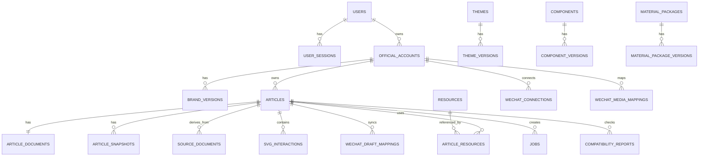

# 10_公众号智能视觉排版工具_数据库字段详细设计

> 文档版本：V1.0  
> 编制日期：2026年7月29日  
> 项目阶段：数据库详细设计  
> 数据库：PostgreSQL 18.x  
> ORM建议：Drizzle ORM＋SQL迁移  
> 上游依据：  
> - `00_公众号智能视觉排版工具_项目需求说明书.md`  
> - `01_公众号智能视觉排版工具_竞品分析与产品差异化设计.md`  
> - `02_公众号智能视觉排版工具_信息架构与页面清单.md`  
> - `03_公众号智能视觉排版工具_核心业务流程设计.md`  
> - `04_公众号智能视觉排版工具_编辑器与区块模型设计.md`  
> - `05_公众号智能视觉排版工具_主题系统与组件规范.md`  
> - `06_公众号智能视觉排版工具_SVG互动组件技术规范.md`  
> - `07_公众号智能视觉排版工具_多公众号品牌系统设计.md`  
> - `08_公众号智能视觉排版工具_素材更新与版本管理设计.md`  
> - `09_公众号智能视觉排版工具_系统架构设计.md`  
> 文档用途：供后端开发、数据库迁移、接口设计、测试数据、备份恢复和后续性能优化使用。

---

# 一、设计目标

数据库设计需要同时满足：

1. 文章内容、主题、品牌和微信发布解耦；
2. 编辑器JSON可完整恢复；
3. 历史文章可按精确版本复现；
4. 原文可校验、可锁定、可追踪变化；
5. 多公众号品牌资料相互隔离；
6. 图片、SVG、主题和组件可复用；
7. 微信侧素材映射按公众号独立管理；
8. 异步任务可重试、可追踪；
9. 素材更新可签名、可回滚；
10. 数据可软删除、归档和恢复；
11. Redis丢失后核心业务仍可恢复；
12. 后续多人协作可扩展，但首版不过度设计。

---

# 二、数据库总体分区

建议按业务域划分PostgreSQL Schema。

```text
auth
content
design
brand
integration
operations
audit
```

说明：

- `auth`：用户、会话、设备和安全；
- `content`：文章、文档、版本、原文、资源；
- `design`：主题、组件、SVG、素材包；
- `brand`：公众号和品牌资产；
- `integration`：微信连接、草稿、素材映射；
- `operations`：任务、通知、备份、设置；
- `audit`：审计日志、安全事件。

若首版暂不使用多个PostgreSQL Schema，也应保留相同模块边界，并在表名前使用统一前缀。

---

# 三、通用字段规范

# 3.1 主键

统一使用：

```sql
id uuid primary key
```

主键由应用生成UUIDv7。

原因：

- 时间有序；
- 适合分布式生成；
- 避免数据库序列暴露业务量；
- 后续拆分服务无需改造；
- API可直接使用。

# 3.2 时间字段

统一使用：

```sql
timestamptz
```

保存UTC时间，前端按用户时区显示。

通用字段：

```sql
created_at timestamptz not null default now()
updated_at timestamptz not null default now()
deleted_at timestamptz null
```

# 3.3 软删除

需要恢复的数据使用：

```sql
deleted_at timestamptz null
deleted_by uuid null
```

查询默认过滤：

```sql
deleted_at is null
```

不建议为所有表设置软删除。版本快照、审计日志和任务日志一般采用不可变或保留策略，不使用普通软删除。

# 3.4 状态字段

状态字段优先使用：

```sql
varchar(32)
```

配合CHECK约束，而不是PostgreSQL Enum。

理由：

- 状态增加更容易；
- 迁移更灵活；
- 便于多环境兼容。

示例：

```sql
status varchar(32) not null
check (status in ('draft','active','archived'))
```

# 3.5 JSONB边界

JSONB适合：

- 编辑器文档；
- 主题Token；
- 品牌Token；
- SVG协议；
- 兼容问题；
- Manifest；
- 任务Payload摘要；
- 版本差异摘要。

必须单独建列的字段：

- 主键；
- 外键；
- 状态；
- 版本；
- 名称；
- 公众号；
- 时间；
- 排序；
- 是否启用；
- 是否删除；
- 查询和筛选频繁的属性。

原则：

> 需要关联、筛选、排序、唯一约束和统计的字段，不放在JSONB中。

# 3.6 版本字段

统一：

```sql
version varchar(32)
```

文档内部乐观锁：

```sql
document_version bigint not null default 1
```

# 3.7 排序字段

统一：

```sql
sort_order integer not null default 0
```

# 3.8 文本长度

- 名称：`varchar(200)`；
- 简称：`varchar(100)`；
- URL：`text`；
- 描述：`text`；
- 哈希：`varchar(128)`；
- MIME：`varchar(100)`；
- 版本：`varchar(32)`；
- 状态：`varchar(32)`。

# 3.9 哈希

文件和文本统一使用SHA-256：

```sql
sha256 varchar(64)
```

如需携带前缀，在业务层展示，不存入字段。

---

# 四、关系总览



---

# 五、Auth域

# 5.1 `auth.users`

用户主表。

| 字段 | 类型 | 必填 | 默认 | 说明 |
|---|---|---:|---|---|
| id | uuid | 是 | 应用生成 | 主键 |
| email | varchar(320) | 是 |  | 登录邮箱 |
| username | varchar(100) | 否 |  | 用户名 |
| display_name | varchar(100) | 是 |  | 显示名称 |
| avatar_resource_id | uuid | 否 |  | 头像资源 |
| password_hash | text | 是 |  | Argon2id哈希 |
| role | varchar(32) | 是 | owner | owner/editor/publisher/viewer |
| status | varchar(32) | 是 | active | active/disabled/locked |
| timezone | varchar(64) | 是 | Asia/Singapore | 用户时区 |
| locale | varchar(20) | 是 | zh-CN | 语言 |
| two_factor_enabled | boolean | 是 | false | 是否启用双因素 |
| two_factor_secret_encrypted | text | 否 |  | 加密TOTP密钥 |
| password_changed_at | timestamptz | 否 |  | 密码修改时间 |
| last_login_at | timestamptz | 否 |  | 最近登录 |
| failed_login_count | integer | 是 | 0 | 连续失败次数 |
| locked_until | timestamptz | 否 |  | 临时锁定至 |
| created_at | timestamptz | 是 | now() | 创建 |
| updated_at | timestamptz | 是 | now() | 更新 |
| deleted_at | timestamptz | 否 |  | 软删除 |

约束：

```sql
unique (lower(email)) where deleted_at is null
```

索引：

```sql
idx_users_status
idx_users_last_login_at
```

# 5.2 `auth.user_sessions`

服务端会话表。

| 字段 | 类型 | 必填 | 说明 |
|---|---|---:|---|
| id | uuid | 是 | 会话ID |
| user_id | uuid | 是 | 用户 |
| session_token_hash | varchar(64) | 是 | Session Token哈希 |
| device_id | uuid | 否 | 设备 |
| ip_address | inet | 否 | 登录IP |
| user_agent | text | 否 | User-Agent |
| created_at | timestamptz | 是 | 创建 |
| last_seen_at | timestamptz | 是 | 最近活动 |
| expires_at | timestamptz | 是 | 到期 |
| revoked_at | timestamptz | 否 | 撤销 |
| revoke_reason | varchar(100) | 否 | 原因 |

索引：

```sql
unique(session_token_hash)
idx_user_sessions_user_id
idx_user_sessions_expires_at
idx_user_sessions_active on (user_id, expires_at) where revoked_at is null
```

# 5.3 `auth.user_devices`

设备记录。

字段：

- id；
- user_id；
- device_name；
- device_fingerprint_hash；
- first_ip；
- last_ip；
- first_seen_at；
- last_seen_at；
- trusted_at；
- revoked_at；
- metadata_json。

唯一建议：

```sql
unique(user_id, device_fingerprint_hash)
```

# 5.4 `auth.password_reset_tokens`

字段：

- id；
- user_id；
- token_hash；
- expires_at；
- used_at；
- created_at。

Token只保存哈希。

# 5.5 `auth.login_attempts`

字段：

- id；
- email_hash；
- user_id可空；
- ip_address；
- success；
- failure_reason；
- attempted_at；
- user_agent。

保留90至180天。

---

# 六、Brand域

# 6.1 `brand.official_accounts`

公众号品牌空间主表。

| 字段 | 类型 | 必填 | 默认 | 说明 |
|---|---|---:|---|---|
| id | uuid | 是 |  | 主键 |
| owner_user_id | uuid | 是 |  | 所有者 |
| name | varchar(200) | 是 |  | 全称 |
| short_name | varchar(100) | 否 |  | 简称 |
| slug | varchar(120) | 是 |  | 内部标识 |
| description | text | 否 |  | 说明 |
| content_types | jsonb | 是 | [] | 内容定位 |
| account_type | varchar(32) | 是 | unknown | service/subscription/unknown |
| verification_status | varchar(32) | 是 | unknown | unknown/unverified/verified |
| status | varchar(32) | 是 | draft | draft/active/disabled/archived |
| default_theme_id | uuid | 否 |  | 默认主题 |
| default_palette_id | uuid | 否 |  | 默认配色 |
| current_brand_version_id | uuid | 否 |  | 当前品牌版本 |
| is_default | boolean | 是 | false | 默认公众号 |
| archived_at | timestamptz | 否 |  | 归档时间 |
| created_at | timestamptz | 是 | now() | 创建 |
| updated_at | timestamptz | 是 | now() | 更新 |
| deleted_at | timestamptz | 否 |  | 软删除 |

约束：

```sql
unique(owner_user_id, slug) where deleted_at is null
```

索引：

```sql
idx_official_accounts_owner
idx_official_accounts_status
idx_official_accounts_default
```

# 6.2 `brand.account_brand_profiles`

当前可编辑品牌档案。

| 字段 | 类型 | 必填 | 说明 |
|---|---|---:|---|
| id | uuid | 是 | 主键 |
| account_id | uuid | 是 | 公众号 |
| brand_mode | varchar(32) | 是 | full/soft/identity |
| color_tokens | jsonb | 是 | 品牌色 |
| typography_tokens | jsonb | 是 | 字体偏好 |
| shape_tokens | jsonb | 是 | 圆角、边框、阴影 |
| image_tokens | jsonb | 是 | 图片默认 |
| default_layout_config | jsonb | 是 | 默认排版 |
| author_defaults | jsonb | 是 | 默认作者 |
| copyright_defaults | jsonb | 是 | 默认版权 |
| footer_binding_mode | varchar(32) | 是 | linked/frozen |
| schema_version | varchar(32) | 是 | 品牌Schema |
| created_at | timestamptz | 是 | 创建 |
| updated_at | timestamptz | 是 | 更新 |

约束：

```sql
unique(account_id)
```

# 6.3 `brand.account_brand_versions`

不可变品牌快照。

| 字段 | 类型 | 必填 | 说明 |
|---|---|---:|---|
| id | uuid | 是 | 主键 |
| account_id | uuid | 是 | 公众号 |
| version | varchar(32) | 是 | 品牌版本 |
| profile_snapshot | jsonb | 是 | 完整品牌快照 |
| asset_manifest | jsonb | 是 | 品牌资源清单 |
| change_summary | text | 否 | 更新说明 |
| created_by | uuid | 是 | 创建人 |
| created_at | timestamptz | 是 | 创建 |
| is_current | boolean | 是 | 是否当前 |

约束：

```sql
unique(account_id, version)
```

索引：

```sql
idx_brand_versions_account_created
idx_brand_versions_current where is_current = true
```

# 6.4 `brand.account_assets`

公众号品牌资产。

| 字段 | 类型 | 必填 | 说明 |
|---|---|---:|---|
| id | uuid | 是 | 主键 |
| account_id | uuid | 是 | 公众号 |
| resource_id | uuid | 是 | 系统资源 |
| asset_type | varchar(50) | 是 | avatar/logo/qr/watermark/cover等 |
| variant | varchar(50) | 否 | primary/mono_dark/mono_light等 |
| version | varchar(32) | 是 | 版本 |
| status | varchar(32) | 是 | active/disabled/archived |
| is_default | boolean | 是 | 默认 |
| metadata_json | jsonb | 是 | 尺寸、背景、用途 |
| created_at | timestamptz | 是 | 创建 |
| updated_at | timestamptz | 是 | 更新 |
| deleted_at | timestamptz | 否 | 软删除 |

索引：

```sql
idx_account_assets_account_type
idx_account_assets_resource
```

# 6.5 `brand.account_authors`

作者档案。

字段：

- id；
- account_id；
- name；
- title；
- bio；
- avatar_resource_id；
- contact_json；
- is_default；
- is_public；
- sort_order；
- created_at；
- updated_at；
- deleted_at。

约束：

```sql
unique(account_id, name) where deleted_at is null
```

# 6.6 `brand.account_copyright_templates`

字段：

- id；
- account_id；
- name；
- template_type；
- content_text；
- content_json；
- is_default；
- applicable_content_types；
- version；
- created_at；
- updated_at；
- deleted_at。

# 6.7 `brand.account_footer_templates`

字段：

- id；
- account_id；
- name；
- component_id；
- component_version；
- configuration_json；
- binding_mode；
- is_default；
- version；
- created_at；
- updated_at；
- deleted_at。

# 6.8 `brand.account_cover_templates`

字段：

- id；
- account_id；
- name；
- base_cover_template_id；
- configuration_json；
- asset_manifest；
- is_default；
- version；
- created_at；
- updated_at；
- deleted_at。

# 6.9 `brand.account_theme_rules`

按内容类型设置默认主题。

| 字段 | 类型 | 说明 |
|---|---|---|
| id | uuid | 主键 |
| account_id | uuid | 公众号 |
| content_type | varchar(50) | 内容类型 |
| theme_id | uuid | 主题 |
| theme_version | varchar(32) | 版本 |
| palette_id | uuid | 配色 |
| layout_strength | varchar(32) | 排版强度 |
| priority | integer | 优先级 |
| enabled | boolean | 启用 |
| created_at | timestamptz | 创建 |
| updated_at | timestamptz | 更新 |

约束：

```sql
unique(account_id, content_type, priority)
```

# 6.10 `brand.account_design_preferences`

记录使用偏好。

字段：

- id；
- account_id；
- preference_type；
- target_id；
- target_version；
- usage_count；
- last_used_at；
- score；
- metadata_json。

唯一：

```sql
unique(account_id, preference_type, target_id, target_version)
```

---

# 七、Content域：文章

# 7.1 `content.articles`

文章项目主表。

| 字段 | 类型 | 必填 | 默认 | 说明 |
|---|---|---:|---|---|
| id | uuid | 是 |  | 主键 |
| owner_user_id | uuid | 是 |  | 所有者 |
| account_id | uuid | 否 |  | 当前公众号 |
| content_group_id | uuid | 否 |  | 同源内容组 |
| title | varchar(500) | 是 |  | 项目标题 |
| subtitle | varchar(500) | 否 |  | 副标题 |
| slug | varchar(160) | 否 |  | 内部标识 |
| content_type | varchar(50) | 是 | general | 内容类型 |
| source_type | varchar(32) | 是 | blank | docx/paste/web/blank/copy |
| status | varchar(32) | 是 | pending_import | 生命周期状态 |
| theme_id | uuid | 否 |  | 当前主题 |
| theme_version | varchar(32) | 否 |  | 当前主题版本 |
| palette_id | uuid | 否 |  | 当前配色 |
| brand_version_id | uuid | 否 |  | 当前品牌版本 |
| layout_strength | varchar(32) | 是 | standard | 排版强度 |
| text_locked | boolean | 是 | true | 原文锁定 |
| word_count | integer | 是 | 0 | 字数 |
| image_count | integer | 是 | 0 | 图片数 |
| svg_count | integer | 是 | 0 | SVG数 |
| compatibility_score | smallint | 否 |  | 0-100 |
| compatibility_status | varchar(32) | 否 |  | excellent/usable/risk |
| current_snapshot_id | uuid | 否 |  | 当前快照 |
| copied_at | timestamptz | 否 |  | 最近复制 |
| synced_at | timestamptz | 否 |  | 最近同步 |
| published_at | timestamptz | 否 |  | 标记发布 |
| archived_at | timestamptz | 否 |  | 归档 |
| created_at | timestamptz | 是 | now() | 创建 |
| updated_at | timestamptz | 是 | now() | 更新 |
| deleted_at | timestamptz | 否 |  | 回收站 |
| delete_purge_after | timestamptz | 否 |  | 物理清理时间 |

索引：

```sql
idx_articles_owner_updated
idx_articles_account_status
idx_articles_content_group
idx_articles_theme
idx_articles_deleted_at
idx_articles_published_at
```

全文搜索：

建议增加：

```sql
search_text text
search_vector tsvector
```

由触发器或应用更新。

# 7.2 `content.content_groups`

同源文章组。

字段：

- id；
- owner_user_id；
- name；
- master_article_id；
- sync_mode；
- created_at；
- updated_at；
- deleted_at。

`sync_mode`：

- none；
- original_only；
- content_and_structure。

# 7.3 `content.article_documents`

文章当前权威文档。

| 字段 | 类型 | 必填 | 说明 |
|---|---|---:|---|
| id | uuid | 是 | 主键 |
| article_id | uuid | 是 | 文章 |
| schema_version | varchar(32) | 是 | 文档Schema |
| document_json | jsonb | 是 | Tiptap文档 |
| document_version | bigint | 是 | 乐观锁 |
| original_text_hash | varchar(64) | 否 | 原文总哈希 |
| current_text_hash | varchar(64) | 否 | 当前文字哈希 |
| text_change_summary | jsonb | 是 | 差异摘要 |
| last_transaction_id | uuid | 否 | 最近事务 |
| last_saved_by | uuid | 是 | 保存人 |
| last_saved_at | timestamptz | 是 | 保存时间 |
| created_at | timestamptz | 是 | 创建 |
| updated_at | timestamptz | 是 | 更新 |

约束：

```sql
unique(article_id)
check(document_version > 0)
```

索引：

```sql
gin(document_json jsonb_path_ops)
```

说明：

- 不建议频繁对整份JSONB做复杂查询；
- GIN索引用于有限结构检索和维护；
- 主要查询仍使用文章元数据和抽取字段。

# 7.4 `content.article_document_transactions`

编辑事务摘要。

字段：

- id；
- article_id；
- document_version_before；
- document_version_after；
- origin；
- group_id；
- label；
- changed_block_ids；
- transaction_summary；
- created_by；
- created_at。

不保存每次按键完整文档。

保留建议：

- 普通事务摘要90天；
- 关键事务长期保留；
- 完整恢复依赖快照，不依赖无限事务日志。

索引：

```sql
idx_doc_transactions_article_version
idx_doc_transactions_group
```

# 7.5 `content.article_snapshots`

不可变版本快照。

| 字段 | 类型 | 必填 | 说明 |
|---|---|---:|---|
| id | uuid | 是 | 主键 |
| article_id | uuid | 是 | 文章 |
| snapshot_number | bigint | 是 | 文章内序号 |
| reason | varchar(50) | 是 | import/theme_apply/before_copy等 |
| document_schema_version | varchar(32) | 是 | Schema |
| document_json | jsonb | 是 | 完整文档 |
| theme_id | uuid | 否 | 主题 |
| theme_version | varchar(32) | 否 | 主题版本 |
| brand_version_id | uuid | 否 | 品牌版本 |
| compatibility_rule_version | varchar(32) | 否 | 规则版本 |
| renderer_version | varchar(32) | 否 | 渲染器版本 |
| resource_manifest | jsonb | 是 | 资源引用 |
| package_manifest | jsonb | 是 | 组件、主题、SVG版本 |
| text_hash | varchar(64) | 否 | 文字哈希 |
| compatibility_score | smallint | 否 | 得分 |
| html_hash | varchar(64) | 否 | 正式输出哈希 |
| note | text | 否 | 备注 |
| created_by | uuid | 是 | 创建人 |
| created_at | timestamptz | 是 | 创建 |

约束：

```sql
unique(article_id, snapshot_number)
```

索引：

```sql
idx_snapshots_article_created
idx_snapshots_reason
```

快照不可更新，只可因法律或安全原因逻辑撤销。

# 7.6 `content.article_folders`

字段：

- id；
- owner_user_id；
- parent_id；
- name；
- sort_order；
- created_at；
- updated_at；
- deleted_at。

# 7.7 `content.article_folder_relations`

字段：

- article_id；
- folder_id；
- created_at。

首版一篇文章只放一个文件夹时，可直接在articles表加`folder_id`。若后续支持多文件夹，再使用关系表。

# 7.8 `content.tags`

字段：

- id；
- owner_user_id；
- name；
- color；
- created_at；
- deleted_at。

# 7.9 `content.article_tags`

复合主键：

```sql
primary key(article_id, tag_id)
```

# 7.10 `content.article_status_history`

字段：

- id；
- article_id；
- from_status；
- to_status；
- reason；
- source；
- created_by；
- created_at。

---

# 八、原文与导入

# 8.1 `content.source_documents`

保存导入来源。

| 字段 | 类型 | 说明 |
|---|---|---|
| id | uuid | 主键 |
| article_id | uuid | 文章 |
| source_type | varchar(32) | docx/paste/web |
| original_resource_id | uuid | 原文件 |
| original_url | text | 网页地址 |
| original_text | text | 标准化纯文本 |
| original_text_hash | varchar(64) | 哈希 |
| source_metadata | jsonb | 文件和网页信息 |
| import_job_id | uuid | 导入任务 |
| created_at | timestamptz | 创建 |

同一文章可保留多个来源，但标记一个主来源。

可增加：

```sql
is_primary boolean
```

# 8.2 `content.source_blocks`

原文区块。

| 字段 | 类型 | 说明 |
|---|---|---|
| id | uuid | 主键 |
| source_document_id | uuid | 来源文档 |
| source_block_id | varchar(100) | 稳定来源ID |
| block_type | varchar(50) | paragraph/heading/image等 |
| text_content | text | 原文字 |
| text_hash | varchar(64) | 区块哈希 |
| order_index | integer | 顺序 |
| style_metadata | jsonb | 原样式参考 |
| relation_metadata | jsonb | 图片、列表关系 |
| created_at | timestamptz | 创建 |

约束：

```sql
unique(source_document_id, source_block_id)
```

索引：

```sql
idx_source_blocks_document_order
idx_source_blocks_text_hash
```

# 8.3 `content.import_records`

导入记录。

字段：

- id；
- article_id；
- source_document_id；
- import_type；
- status；
- cleaning_mode；
- detected_source；
- parser_version；
- warnings_json；
- statistics_json；
- started_at；
- completed_at；
- failed_at；
- error_code；
- error_message；
- created_by。

# 8.4 `content.import_tables`

复杂表格中间数据。

字段：

- id；
- source_document_id；
- source_block_id；
- rows_count；
- columns_count；
- table_json；
- render_strategy；
- warning_json。

---

# 九、资源与图片

# 9.1 `content.resources`

统一资源表。

| 字段 | 类型 | 必填 | 说明 |
|---|---|---:|---|
| id | uuid | 是 | 主键 |
| owner_user_id | uuid | 是 | 所有者 |
| account_id | uuid | 否 | 品牌专属资源 |
| resource_type | varchar(50) | 是 | image/docx/gif/svg/html/backup等 |
| source_type | varchar(32) | 是 | upload/import/generated/system |
| original_filename | text | 否 | 原文件名 |
| storage_provider | varchar(32) | 是 | cos/s3/minio |
| storage_bucket | varchar(100) | 是 | Bucket |
| storage_key | text | 是 | 对象Key |
| mime_type | varchar(100) | 是 | MIME |
| file_extension | varchar(20) | 否 | 扩展名 |
| file_size | bigint | 是 | 字节 |
| width | integer | 否 | 图片宽 |
| height | integer | 否 | 图片高 |
| duration_ms | integer | 否 | GIF/视频时长 |
| sha256 | varchar(64) | 是 | 内容哈希 |
| status | varchar(32) | 是 | active/processing/failed/trash |
| is_private | boolean | 是 | true |
| metadata_json | jsonb | 是 | EXIF、处理信息 |
| parent_resource_id | uuid | 否 | 派生自 |
| created_at | timestamptz | 是 | 创建 |
| updated_at | timestamptz | 是 | 更新 |
| deleted_at | timestamptz | 否 | 逻辑删除 |
| purge_after | timestamptz | 否 | 清理时间 |

约束：

```sql
unique(owner_user_id, sha256, storage_provider, storage_bucket)
```

索引：

```sql
idx_resources_owner_type
idx_resources_sha256
idx_resources_parent
idx_resources_status_purge
```

# 9.2 `content.resource_variants`

保存缩略图、微信图、封面裁切等。

字段：

- id；
- original_resource_id；
- variant_type；
- resource_id；
- transformation_json；
- processor_version；
- created_at。

唯一：

```sql
unique(original_resource_id, variant_type, transformation_hash)
```

建议增加：

```sql
transformation_hash varchar(64)
```

# 9.3 `content.article_resources`

文章与资源引用。

| 字段 | 类型 | 说明 |
|---|---|---|
| id | uuid | 主键 |
| article_id | uuid | 文章 |
| resource_id | uuid | 资源 |
| block_id | varchar(100) | 文档区块 |
| usage_type | varchar(50) | body/cover/svg/fallback/footer等 |
| sort_order | integer | 顺序 |
| frozen_by_snapshot_id | uuid | 被快照冻结 |
| created_at | timestamptz | 创建 |
| deleted_at | timestamptz | 删除 |

索引：

```sql
idx_article_resources_article
idx_article_resources_resource
idx_article_resources_snapshot
```

# 9.4 `content.resource_reference_counts`

可选的缓存表。

字段：

- resource_id；
- live_article_refs；
- snapshot_refs；
- brand_refs；
- material_refs；
- updated_at。

它只是加速缓存，真实引用仍以关系表为准。

---

# 十、Design域：主题

# 10.1 `design.theme_families`

字段：

- id；
- code；
- name；
- description；
- category；
- status；
- sort_order；
- created_at；
- updated_at。

# 10.2 `design.themes`

主题主记录。

| 字段 | 类型 | 说明 |
|---|---|---|
| id | uuid | 主键 |
| family_id | uuid | 主题家族 |
| package_id | uuid | 来源素材包 |
| code | varchar(120) | 稳定编码 |
| name | varchar(200) | 名称 |
| description | text | 说明 |
| categories | jsonb | 分类 |
| recommended_content_types | jsonb | 推荐场景 |
| current_version | varchar(32) | 当前版本 |
| default_palette_id | uuid | 默认配色 |
| compatibility_level | varchar(32) | safe/compatible等 |
| status | varchar(32) | draft/published/deprecated |
| is_builtin | boolean | 是否内置 |
| created_at | timestamptz | 创建 |
| updated_at | timestamptz | 更新 |
| deleted_at | timestamptz | 删除 |

约束：

```sql
unique(code) where deleted_at is null
```

# 10.3 `design.theme_versions`

字段：

- id；
- theme_id；
- version；
- schema_version；
- token_json；
- component_mapping_json；
- compatibility_profile_json；
- preview_manifest；
- migration_manifest；
- package_version_id；
- release_notes；
- status；
- created_at；
- deprecated_at。

约束：

```sql
unique(theme_id, version)
```

# 10.4 `design.theme_palettes`

字段：

- id；
- theme_id；
- code；
- name；
- version；
- color_tokens；
- contrast_report；
- status；
- created_at；
- updated_at。

约束：

```sql
unique(theme_id, code, version)
```

# 10.5 `design.user_themes`

用户保存的自定义主题。

字段：

- id；
- owner_user_id；
- source_theme_id；
- source_theme_version；
- name；
- token_overrides；
- component_overrides；
- account_id可空；
- version；
- status；
- created_at；
- updated_at；
- deleted_at。

---

# 十一、Design域：组件

# 11.1 `design.components`

| 字段 | 类型 | 说明 |
|---|---|---|
| id | uuid | 主键 |
| package_id | uuid | 来源包 |
| code | varchar(160) | 稳定编码 |
| name | varchar(200) | 名称 |
| category | varchar(50) | HEAD/GOV/LEGAL等 |
| semantic_roles | jsonb | 适用语义 |
| node_type | varchar(50) | semanticCard/image等 |
| current_version | varchar(32) | 当前版本 |
| compatibility_level | varchar(32) | 等级 |
| status | varchar(32) | published/deprecated |
| is_builtin | boolean | 内置 |
| created_at | timestamptz | 创建 |
| updated_at | timestamptz | 更新 |
| deleted_at | timestamptz | 删除 |

约束：

```sql
unique(code) where deleted_at is null
```

# 11.2 `design.component_versions`

字段：

- id；
- component_id；
- version；
- schema_version；
- slot_schema；
- variants_json；
- default_token_map；
- editor_renderer_key；
- wechat_renderer_key；
- fallback_renderer_key；
- compatibility_profile；
- migration_manifest；
- package_version_id；
- release_notes；
- status；
- created_at；
- deprecated_at。

约束：

```sql
unique(component_id, version)
```

# 11.3 `design.component_variants`

字段：

- id；
- component_version_id；
- code；
- name；
- style_tokens；
- supported_themes；
- compatibility_level；
- preview_resource_id；
- sort_order；
- created_at。

# 11.4 `design.user_components`

字段：

- id；
- owner_user_id；
- source_component_id；
- source_component_version；
- name；
- node_type；
- semantic_role；
- slot_data；
- style_overrides；
- account_id；
- version；
- status；
- created_at；
- updated_at；
- deleted_at。

# 11.5 `design.design_favorites`

统一收藏表。

字段：

- id；
- user_id；
- target_type；
- target_id；
- target_version；
- created_at。

约束：

```sql
unique(user_id, target_type, target_id, target_version)
```

# 11.6 `design.design_usage_logs`

字段：

- id；
- user_id；
- account_id；
- article_id；
- target_type；
- target_id；
- target_version；
- action；
- used_at。

用于推荐，可按月归档。

---

# 十二、SVG域

# 12.1 `design.svg_templates`

字段：

- id；
- package_id；
- code；
- name；
- interaction_type；
- scene_types；
- difficulty；
- current_version；
- compatibility_level；
- status；
- is_builtin；
- created_at；
- updated_at；
- deleted_at。

# 12.2 `design.svg_template_versions`

字段：

- id；
- template_id；
- version；
- protocol_version；
- default_config；
- resource_spec；
- compatibility_profile；
- fallback_rules；
- editor_preview_resource_id；
- package_version_id；
- release_notes；
- status；
- created_at；
- deprecated_at。

# 12.3 `design.svg_interactions`

文章内SVG实例。

| 字段 | 类型 | 说明 |
|---|---|---|
| id | uuid | 主键 |
| article_id | uuid | 所属文章 |
| block_id | varchar(100) | 编辑器区块 |
| template_id | uuid | 模板 |
| template_version | varchar(32) | 模板版本 |
| protocol_version | varchar(32) | 协议版本 |
| interaction_type | varchar(50) | 类型 |
| scene_type | varchar(50) | 场景 |
| configuration_json | jsonb | 互动配置 |
| resource_manifest | jsonb | 资源 |
| fallback_resource_id | uuid | 静态降级 |
| compatibility_level | varchar(32) | 等级 |
| compatibility_report_id | uuid | 最近报告 |
| status | varchar(32) | draft/ready/risk/revoked |
| created_at | timestamptz | 创建 |
| updated_at | timestamptz | 更新 |
| deleted_at | timestamptz | 删除 |

约束：

```sql
unique(article_id, block_id) where deleted_at is null
```

# 12.4 `design.svg_render_outputs`

字段：

- id；
- interaction_id；
- template_version；
- protocol_version；
- renderer_version；
- output_mode；
- resource_id；
- output_sha256；
- compatibility_rule_version；
- generated_at；
- status；
- error_json。

---

# 十三、素材包与版本

# 13.1 `design.material_packages`

字段：

- id；
- package_key；
- package_type；
- namespace；
- name；
- description；
- current_version；
- status；
- publisher；
- created_at；
- updated_at。

约束：

```sql
unique(package_key)
```

# 13.2 `design.material_package_versions`

| 字段 | 类型 | 说明 |
|---|---|---|
| id | uuid | 主键 |
| package_id | uuid | 素材包 |
| version | varchar(32) | 版本 |
| channel | varchar(32) | stable/beta/canary |
| manifest_json | jsonb | Manifest |
| manifest_sha256 | varchar(64) | 哈希 |
| signature_bundle | jsonb | 签名Bundle |
| schema_version | varchar(32) | 包Schema |
| minimum_app_version | varchar(32) | 最低应用版本 |
| maximum_tested_app_version | varchar(32) | 最高测试版本 |
| status | varchar(32) | signed/stable/revoked等 |
| release_notes | text | 更新说明 |
| published_at | timestamptz | 发布 |
| deprecated_at | timestamptz | 废弃 |
| revoked_at | timestamptz | 撤销 |
| created_at | timestamptz | 创建 |

约束：

```sql
unique(package_id, version, channel)
```

# 13.3 `design.material_files`

字段：

- id；
- package_version_id；
- path；
- resource_id；
- file_size；
- sha256；
- mime_type；
- created_at。

约束：

```sql
unique(package_version_id, path)
```

# 13.4 `design.material_dependencies`

字段：

- id；
- package_version_id；
- dependency_package_key；
- version_range；
- required；
- created_at。

# 13.5 `design.material_installations`

字段：

- id；
- user_id；
- package_id；
- package_version_id；
- status；
- enabled；
- installed_at；
- enabled_at；
- disabled_at；
- rolled_back_from_version_id；
- installation_log_id；
- created_at；
- updated_at。

约束：

```sql
unique(user_id, package_version_id)
```

# 13.6 `design.material_revocations`

字段：

- id；
- package_id；
- package_version_id；
- level；
- reason_code；
- message；
- replacement_package_version_id；
- effective_at；
- metadata_signature；
- created_at。

# 13.7 `design.material_reviews`

字段：

- id；
- package_version_id；
- design_status；
- compatibility_status；
- security_status；
- rights_status；
- score_json；
- reviewed_by；
- reviewed_at；
- notes。

# 13.8 `design.material_rights`

字段：

- id；
- package_version_id；
- license；
- commercial_use_allowed；
- redistribution_allowed；
- source_notes；
- third_party_assets；
- proof_resource_ids；
- reviewed_at；
- expires_at。

# 13.9 `design.compatibility_rule_versions`

字段：

- id；
- rule_version；
- package_version_id；
- rules_json；
- status；
- severity；
- effective_at；
- deprecated_at；
- revoked_at；
- created_at。

约束：

```sql
unique(rule_version)
```

---

# 十四、兼容检查

# 14.1 `content.compatibility_reports`

| 字段 | 类型 | 说明 |
|---|---|---|
| id | uuid | 主键 |
| article_id | uuid | 文章 |
| snapshot_id | uuid | 对应快照 |
| document_version | bigint | 文档版本 |
| rule_version | varchar(32) | 规则版本 |
| renderer_version | varchar(32) | 渲染器版本 |
| output_mode | varchar(32) | standard/safe/static |
| score | smallint | 0-100 |
| status | varchar(32) | passed/warning/failed |
| summary_json | jsonb | 摘要 |
| generated_at | timestamptz | 生成 |
| expires_at | timestamptz | 规则过期后失效 |

# 14.2 `content.compatibility_issues`

字段：

- id；
- report_id；
- block_id；
- issue_code；
- severity；
- category；
- title；
- message；
- details_json；
- auto_fixable；
- fix_action；
- resolved_at；
- ignored_at；
- ignored_by。

索引：

```sql
idx_compat_issues_report_severity
idx_compat_issues_block
```

# 14.3 `content.compatibility_fix_records`

字段：

- id；
- article_id；
- report_id；
- issue_id；
- fix_action；
- before_json；
- after_json；
- transaction_id；
- applied_by；
- applied_at；
- reverted_at。

---

# 十五、渲染输出

# 15.1 `content.render_outputs`

字段：

- id；
- article_id；
- snapshot_id；
- output_type；
- output_mode；
- renderer_version；
- compatibility_rule_version；
- theme_version；
- brand_version_id；
- html_content可选；
- resource_id可选；
- output_sha256；
- size_bytes；
- status；
- generated_at；
- expires_at；
- error_json。

说明：

- 小型HTML可存`html_content`；
- 大型长图、PDF、备份等存对象存储资源；
- 正式复制HTML建议保存快照或哈希，便于复现。

# 15.2 `content.copy_records`

字段：

- id；
- article_id；
- snapshot_id；
- render_output_id；
- account_id；
- compatibility_report_id；
- status；
- copied_by；
- copied_at；
- browser_info；
- failure_reason。

# 15.3 `content.preview_links`

字段：

- id；
- article_id；
- snapshot_id；
- token_hash；
- access_mode；
- expires_at；
- max_views；
- view_count；
- revoked_at；
- created_by；
- created_at。

临时预览链接不公开索引。

---

# 十六、Integration域：微信

# 16.1 `integration.wechat_connections`

| 字段 | 类型 | 说明 |
|---|---|---|
| id | uuid | 主键 |
| account_id | uuid | 公众号 |
| connection_type | varchar(32) | direct/open_platform |
| status | varchar(32) | connected/expired等 |
| app_id | varchar(100) | AppID |
| external_account_id | varchar(200) | 微信侧标识 |
| authorizer_name | varchar(200) | 授权名称 |
| permissions_json | jsonb | 权限集合 |
| credentials_encrypted | bytea | 加密凭据 |
| credential_key_version | varchar(32) | 加密密钥版本 |
| credential_expires_at | timestamptz | 到期 |
| last_refreshed_at | timestamptz | 刷新 |
| last_checked_at | timestamptz | 能力检查 |
| error_code | varchar(100) | 错误 |
| error_message | text | 错误说明 |
| created_at | timestamptz | 创建 |
| updated_at | timestamptz | 更新 |
| revoked_at | timestamptz | 撤销 |

约束：

```sql
unique(account_id, connection_type) where revoked_at is null
```

# 16.2 `integration.wechat_capabilities`

字段：

- id；
- connection_id；
- capability_code；
- available；
- source；
- details_json；
- checked_at；
- expires_at。

约束：

```sql
unique(connection_id, capability_code)
```

# 16.3 `integration.wechat_media_mappings`

系统资源到微信素材映射。

| 字段 | 类型 | 说明 |
|---|---|---|
| id | uuid | 主键 |
| account_id | uuid | 公众号 |
| connection_id | uuid | 连接 |
| resource_id | uuid | 系统资源 |
| media_type | varchar(32) | content_image/cover/permanent等 |
| wechat_media_id | text | 微信素材ID |
| wechat_url | text | 微信地址 |
| status | varchar(32) | active/expired/failed |
| uploaded_at | timestamptz | 上传 |
| expires_at | timestamptz | 到期 |
| last_verified_at | timestamptz | 验证 |
| metadata_json | jsonb | 其他信息 |

约束：

```sql
unique(account_id, resource_id, media_type)
```

# 16.4 `integration.wechat_draft_mappings`

字段：

- id；
- article_id；
- account_id；
- connection_id；
- wechat_draft_id；
- current_snapshot_id；
- title；
- status；
- created_at；
- updated_at；
- last_synced_at；
- deleted_at。

一个文章可有多个草稿历史，但需标记当前：

```sql
is_current boolean
```

# 16.5 `integration.wechat_sync_records`

字段：

- id；
- article_id；
- account_id；
- draft_mapping_id；
- snapshot_id；
- job_id；
- action；
- status；
- request_summary；
- response_summary；
- uploaded_media_count；
- started_at；
- completed_at；
- error_code；
- error_message；
- retry_count。

# 16.6 `integration.publish_records`

统一发布操作记录。

字段：

- id；
- article_id；
- account_id；
- snapshot_id；
- action；
- channel；
- status；
- external_id；
- brand_version_id；
- theme_version；
- renderer_version；
- compatibility_rule_version；
- created_by；
- created_at；
- completed_at；
- metadata_json。

---

# 十七、Operations域：任务

# 17.1 `operations.jobs`

| 字段 | 类型 | 说明 |
|---|---|---|
| id | uuid | 主键 |
| queue_name | varchar(100) | 队列 |
| job_type | varchar(100) | 任务类型 |
| owner_user_id | uuid | 用户 |
| article_id | uuid | 文章 |
| account_id | uuid | 公众号 |
| status | varchar(32) | queued/running/success/failed等 |
| priority | smallint | 优先级 |
| progress | smallint | 0-100 |
| idempotency_key | varchar(200) | 幂等键 |
| payload_ref | text | 大Payload引用 |
| payload_summary | jsonb | 摘要 |
| result_ref | text | 结果引用 |
| result_summary | jsonb | 结果摘要 |
| attempt_count | integer | 重试次数 |
| max_attempts | integer | 最大次数 |
| scheduled_at | timestamptz | 计划时间 |
| started_at | timestamptz | 开始 |
| completed_at | timestamptz | 完成 |
| failed_at | timestamptz | 失败 |
| error_code | varchar(100) | 错误码 |
| error_message | text | 错误 |
| trace_id | varchar(100) | 追踪ID |
| created_at | timestamptz | 创建 |
| updated_at | timestamptz | 更新 |

约束：

```sql
unique(idempotency_key) where idempotency_key is not null
```

索引：

```sql
idx_jobs_status_queue
idx_jobs_article
idx_jobs_scheduled
idx_jobs_failed
```

# 17.2 `operations.job_events`

字段：

- id；
- job_id；
- event_type；
- progress；
- message；
- metadata_json；
- created_at。

用于SSE和任务历史。

# 17.3 `operations.scheduled_tasks`

字段：

- id；
- task_code；
- cron_expression；
- enabled；
- last_run_at；
- next_run_at；
- configuration_json；
- updated_at。

---

# 十八、通知与设置

# 18.1 `operations.notifications`

字段：

- id；
- user_id；
- notification_type；
- severity；
- title；
- message；
- action_url；
- related_type；
- related_id；
- metadata_json；
- read_at；
- dismissed_at；
- created_at；
- expires_at。

索引：

```sql
idx_notifications_user_unread
```

# 18.2 `operations.user_settings`

字段：

- id；
- user_id；
- setting_group；
- settings_json；
- schema_version；
- updated_at。

约束：

```sql
unique(user_id, setting_group)
```

设置组：

- editor；
- appearance；
- import；
- backup；
- update；
- security；
- preview。

# 18.3 `operations.feature_flags`

字段：

- id；
- flag_key；
- enabled；
- rollout_percentage；
- rules_json；
- description；
- created_at；
- updated_at。

---

# 十九、备份

# 19.1 `operations.backup_records`

| 字段 | 类型 | 说明 |
|---|---|---|
| id | uuid | 主键 |
| backup_type | varchar(32) | database/resources/full/article |
| scope_type | varchar(32) | system/user/article/account |
| scope_id | uuid | 范围ID |
| status | varchar(32) | running/success/failed |
| resource_id | uuid | 备份文件 |
| database_lsn | text | 数据库位置 |
| manifest_json | jsonb | 内容清单 |
| encryption_key_version | varchar(32) | 密钥版本 |
| started_at | timestamptz | 开始 |
| completed_at | timestamptz | 完成 |
| expires_at | timestamptz | 到期 |
| error_message | text | 错误 |
| created_by | uuid | 创建人 |
| created_at | timestamptz | 创建 |

# 19.2 `operations.restore_records`

字段：

- id；
- backup_record_id；
- restore_type；
- target_scope；
- safety_snapshot_id；
- status；
- started_at；
- completed_at；
- error_message；
- report_json；
- created_by。

---

# 二十、Audit域

# 20.1 `audit.audit_logs`

不可变审计日志。

| 字段 | 类型 | 说明 |
|---|---|---|
| id | uuid | 主键 |
| actor_user_id | uuid | 操作人 |
| actor_type | varchar(32) | user/system/worker |
| action | varchar(100) | 动作 |
| target_type | varchar(50) | article/account/brand等 |
| target_id | uuid | 目标 |
| account_id | uuid | 公众号 |
| article_id | uuid | 文章 |
| request_id | varchar(100) | 请求ID |
| trace_id | varchar(100) | 追踪ID |
| ip_address | inet | IP |
| user_agent | text | UA |
| before_summary | jsonb | 修改前摘要 |
| after_summary | jsonb | 修改后摘要 |
| metadata_json | jsonb | 其他 |
| created_at | timestamptz | 时间 |

索引：

```sql
idx_audit_actor_created
idx_audit_target
idx_audit_article
idx_audit_account
idx_audit_action_created
```

审计日志不保存完整文章正文和密钥。

# 20.2 `audit.security_events`

字段：

- id；
- user_id；
- event_type；
- severity；
- ip_address；
- device_id；
- details_json；
- detected_at；
- resolved_at；
- resolution_notes。

事件：

- login_failed；
- account_locked；
- session_revoked；
- suspicious_upload；
- svg_rejected；
- material_signature_failed；
- wechat_credential_error；
- backup_integrity_failed。

# 20.3 `audit.data_access_logs`

仅在未来多人或高安全场景启用。

字段：

- id；
- user_id；
- resource_type；
- resource_id；
- access_type；
- created_at。

---

# 二十一、删除和保留规则

# 21.1 文章

- 删除后进入回收站；
- 默认保留30天；
- 30天后进入物理清理任务；
- 有发布、同步或审计要求时可延长；
- 删除前生成删除清单。

# 21.2 历史快照

默认长期保留。

可以按策略压缩：

- 保留所有关键快照；
- 普通自动快照保留90天；
- 每日保留1个；
- 每月保留1个长期版本。

第一版建议全部保留，数据量可控。

# 21.3 原始DOCX和来源文件

建议：

- 普通文章至少保留1年；
- 已发布文章长期保留；
- 用户可手动清理；
- 清理前确保存在可恢复文档JSON。

# 21.4 图片资源

只有同时满足：

- 无当前文章引用；
- 无快照引用；
- 无品牌引用；
- 无素材包引用；
- 超过保留期；

才物理删除。

# 21.5 任务记录

- 成功任务：保留180天；
- 失败任务：保留1年；
- Payload大文件按生命周期清理；
- 审计相关任务长期保留摘要。

# 21.6 审计日志

至少保留1年。

若系统商业化，建议保留3年。

# 21.7 登录和安全日志

- 登录尝试：180天；
- 安全事件：至少1年；
- 活跃会话：到期后30天可清理。

# 21.8 预览链接

- 到期立即失效；
- 记录可保留90天；
- Token哈希可清理。

# 21.9 微信凭据

授权撤销后：

- 立即停止使用；
- 凭据密文进入清理队列；
- 审计记录保留；
- 不删除品牌资料。

---

# 二十二、外键策略

# 22.1 默认策略

业务外键使用：

```sql
on delete restrict
```

防止误删主数据。

# 22.2 可级联删除

仅用于纯从属且无独立审计价值的表，例如：

- article_tags；
- component_variants；
- job_events；
- user_sessions。

# 22.3 软删除对象

有软删除的主表不依赖数据库级联物理删除。

应用服务负责：

- 标记删除；
- 写审计；
- 生成清理任务；
- 最终物理删除。

---

# 二十三、索引策略

# 23.1 常用复合索引

```sql
articles(owner_user_id, updated_at desc)
articles(account_id, status, updated_at desc)
article_snapshots(article_id, snapshot_number desc)
resources(owner_user_id, resource_type, created_at desc)
jobs(status, queue_name, created_at)
notifications(user_id, read_at, created_at desc)
audit_logs(target_type, target_id, created_at desc)
```

# 23.2 部分索引

```sql
create index ... where deleted_at is null;
create index ... where status = 'active';
create index ... where read_at is null;
create index ... where revoked_at is null;
```

# 23.3 JSONB索引

只给确有查询需求的JSONB建立GIN索引。

建议：

- document_json：有限调试和迁移；
- manifest_json：包查询；
- content_types：公众号分类；
- permissions_json：微信能力检索。

禁止无差别给所有JSONB建GIN索引。

# 23.4 全文搜索

文章正文抽取为纯文本：

```sql
search_text text
search_vector tsvector
```

中文分词第一版可使用简单`simple`配置加关键词匹配。

后续再评估：

- pg_jieba；
- zhparser；
- 外部搜索引擎。

首版不引入Elasticsearch。

---

# 二十四、约束与校验

# 24.1 数据库CHECK

适合：

- 状态值；
- 兼容评分0至100；
- 进度0至100；
- 文件大小非负；
- 版本号非空；
- 文章字数非负。

示例：

```sql
check (compatibility_score between 0 and 100)
check (progress between 0 and 100)
check (file_size >= 0)
```

# 24.2 应用层Schema

JSONB必须经过Zod或JSON Schema验证。

数据库不直接承担复杂JSON Schema校验。

# 24.3 唯一性

需要唯一约束：

- 用户邮箱；
- 公众号Slug；
- 主题Code；
- 组件Code；
- 素材Package Key；
- 文章内快照序号；
- 文章内SVG Block ID；
- 公众号资源到微信映射；
- 幂等键。

---

# 二十五、并发与事务

# 25.1 文档保存

使用乐观锁：

```sql
update content.article_documents
set document_json = $1,
    document_version = document_version + 1
where article_id = $2
  and document_version = $3;
```

受影响行数为0时返回版本冲突。

# 25.2 主题应用

事务内：

1. 锁定文章当前文档；
2. 创建快照；
3. 更新文档；
4. 更新文章主题字段；
5. 写事务记录；
6. 写审计日志；
7. 提交。

# 25.3 品牌切换

事务内：

- 创建快照；
- 更新公众号、品牌版本和主题；
- 更新Linked系统节点；
- 写品牌冲突结果；
- 写审计。

图片和SVG重渲染可异步执行。

# 25.4 素材安装

采用：

- 数据库事务；
- 文件暂存目录；
- 原子目录切换；
- 安装状态机。

数据库提交前不得标记为已启用。

# 25.5 微信同步

微信接口不能参与数据库事务，使用Saga。

数据库保存每一步状态和可重试信息。

---

# 二十六、分区建议

第一版不强制分区。

后续可分区的表：

- audit_logs：按月；
- login_attempts：按月；
- job_events：按月；
- design_usage_logs：按月；
- publish_records：按年或月。

触发条件：

- 单表超过千万级；
- 查询明显变慢；
- 保留和归档需要独立管理。

---

# 二十七、数据加密

# 27.1 应用层加密字段

必须加密：

- 微信凭据；
- 双因素密钥；
- 第三方API密钥；
- 对象存储长期密钥；
- 签名服务在线密钥引用；
- 敏感连接器配置。

# 27.2 不应加密但应哈希

- Session Token；
- 重置Token；
- 预览Token；
- 幂等Token可选。

# 27.3 密钥版本

加密字段同时记录：

```text
credential_key_version
```

支持密钥轮换和重新加密。

# 27.4 备份

数据库备份和对象存储备份必须加密。

---

# 二十八、数据库迁移规范

# 28.1 迁移文件

```text
0001_initial.sql
0002_add_brand_versions.sql
0003_add_svg_protocol.sql
```

# 28.2 规则

- 所有迁移进入Git；
- 不在生产自动执行不可逆迁移；
- 删除列分两阶段；
- 新增非空列先允许NULL，再回填，再加约束；
- 大表索引使用并发创建；
- 发布前备份；
- 回滚脚本或恢复方案必须存在。

# 28.3 文档Schema与数据库Schema分离

数据库迁移处理表结构。

文档JSON迁移处理：

- 节点；
- 属性；
- 协议；
- 主题和组件引用。

两者分别版本化。

---

# 二十九、种子数据

首版种子数据包括：

# 29.1 用户

- 1个Owner。

# 29.2 公众号

- 党政纪检公众号；
- 律所公众号；
- 个人媒体公众号。

# 29.3 主题

首批6套：

- 高级极简；
- 现代政务红；
- 巡察纪实；
- 律所蓝灰；
- 产品评测；
- 日系编辑。

# 29.4 SVG

首批4类：

- 点击展开；
- 点击换图；
- 横向滑动；
- 前后对比。

# 29.5 测试文章

- 巡察进驻；
- 整改成效；
- 法律案例；
- AI评测；
- 咖啡随笔。

# 29.6 兼容规则

- HTML基础白名单；
- CSS基础白名单；
- SVG基础白名单；
- 图片规则；
- 安全模式。

---

# 三十、主要表清单

| 编号 | 表名 | 用途 |
|---|---|---|
| 01 | auth.users | 用户 |
| 02 | auth.user_sessions | 会话 |
| 03 | auth.user_devices | 设备 |
| 04 | brand.official_accounts | 公众号 |
| 05 | brand.account_brand_profiles | 当前品牌 |
| 06 | brand.account_brand_versions | 品牌版本 |
| 07 | brand.account_assets | 品牌资产 |
| 08 | brand.account_authors | 作者 |
| 09 | brand.account_footer_templates | 文末 |
| 10 | content.articles | 文章 |
| 11 | content.content_groups | 同源内容 |
| 12 | content.article_documents | 当前文档 |
| 13 | content.article_snapshots | 历史快照 |
| 14 | content.article_document_transactions | 事务摘要 |
| 15 | content.source_documents | 原始来源 |
| 16 | content.source_blocks | 原文区块 |
| 17 | content.import_records | 导入记录 |
| 18 | content.resources | 资源 |
| 19 | content.resource_variants | 资源变体 |
| 20 | content.article_resources | 文章资源引用 |
| 21 | design.themes | 主题 |
| 22 | design.theme_versions | 主题版本 |
| 23 | design.theme_palettes | 配色 |
| 24 | design.components | 组件 |
| 25 | design.component_versions | 组件版本 |
| 26 | design.svg_templates | SVG模板 |
| 27 | design.svg_template_versions | SVG模板版本 |
| 28 | design.svg_interactions | SVG实例 |
| 29 | design.material_packages | 素材包 |
| 30 | design.material_package_versions | 素材包版本 |
| 31 | design.material_installations | 安装 |
| 32 | content.compatibility_reports | 兼容报告 |
| 33 | content.compatibility_issues | 兼容问题 |
| 34 | content.render_outputs | 渲染输出 |
| 35 | content.copy_records | 复制记录 |
| 36 | integration.wechat_connections | 微信连接 |
| 37 | integration.wechat_media_mappings | 微信资源映射 |
| 38 | integration.wechat_draft_mappings | 草稿映射 |
| 39 | integration.wechat_sync_records | 同步记录 |
| 40 | operations.jobs | 异步任务 |
| 41 | operations.job_events | 任务事件 |
| 42 | operations.notifications | 通知 |
| 43 | operations.backup_records | 备份 |
| 44 | audit.audit_logs | 审计 |
| 45 | audit.security_events | 安全事件 |

---

# 三十一、开发优先级

# 31.1 V0.1必须表

- users；
- user_sessions；
- articles；
- article_documents；
- article_snapshots；
- source_documents；
- source_blocks；
- resources；
- article_resources；
- themes；
- theme_versions；
- components；
- component_versions；
- compatibility_reports；
- render_outputs；
- copy_records；
- jobs；
- job_events；
- audit_logs。

# 31.2 V0.5增加

- official_accounts；
- brand_profiles；
- brand_versions；
- account_assets；
- authors；
- footers；
- content_groups；
- svg_templates；
- svg_interactions；
- material_packages；
- material_installations；
- notifications；
- backups。

# 31.3 V1.0增加

- wechat_connections；
- wechat_capabilities；
- wechat_media_mappings；
- draft_mappings；
- sync_records；
- material_signatures；
- revocations；
- reviews；
- feature_flags；
- security_events。

---

# 三十二、验收标准

# 32.1 完整性

- 文章可关联文档、公众号、主题、品牌和资源；
- 快照可完整恢复；
- 原文区块可追踪；
- SVG可精确记录模板和协议版本；
- 微信资源映射按公众号隔离；
- 素材包可精确到版本。

# 32.2 一致性

- 文档保存有乐观锁；
- 主题应用生成快照；
- 品牌切换生成快照；
- 微信同步记录快照；
- 资源删除不破坏历史版本；
- 旧主题和旧组件可继续解析。

# 32.3 性能

- 文章列表使用索引；
- 任务队列查询使用索引；
- 资源按哈希快速去重；
- 快照按文章和序号查询；
- 未读通知快速查询；
- JSONB索引不滥用。

# 32.4 安全

- 密钥不明文；
- Token只保存哈希；
- 审计日志不保存正文和密钥；
- 删除有恢复期；
- 备份有清单和加密版本；
- 远程素材包有签名和哈希。

# 32.5 可维护性

- 状态不依赖数据库Enum；
- 迁移可审查；
- 文档Schema独立版本化；
- JSONB有明确边界；
- 软删除只用于需要恢复的表；
- 历史表不可随意更新。

---

# 三十三、风险与控制

| 风险 | 控制措施 |
|---|---|
| 文档JSON过大 | 只保存当前文档和关键快照，图片存对象存储 |
| 快照数量增长 | 关键快照长期，普通快照按策略压缩 |
| JSONB查询慢 | 频繁字段单列，减少复杂JSON查询 |
| 资源误删 | 引用关系＋快照Manifest＋延迟清理 |
| 微信映射串号 | account_id参与唯一约束 |
| 品牌更新影响旧文章 | 品牌版本和Frozen模式 |
| 主题升级破坏历史文章 | 精确版本引用 |
| 乐观锁冲突 | 版本冲突生成副本或差异处理 |
| Redis任务丢失 | Jobs主记录保存在PostgreSQL |
| 审计日志过大 | 后续按月分区与归档 |
| 状态扩展困难 | varchar＋CHECK，避免数据库Enum |
| 删除级联误伤 | 默认RESTRICT，软删除优先 |
| 密钥轮换困难 | 加密字段记录key version |
| 迁移失败 | 备份、分阶段迁移和回滚方案 |

---

# 三十四、数据库设计冻结

本文件正式冻结以下数据库规则：

1. PostgreSQL 作为唯一核心业务数据库；
2. 主键统一使用应用生成的UUIDv7；
3. 所有时间字段使用`timestamptz`；
4. 状态使用`varchar＋CHECK`，不使用数据库Enum；
5. 编辑器JSON使用JSONB保存；
6. 需要筛选、关联和约束的字段必须单独建列；
7. 文章当前文档与历史快照分表；
8. 快照不可变；
9. 原文来源和原文区块单独保存；
10. 原文与编辑器节点通过Source ID关联；
11. 图片和文件统一进入资源表；
12. 资源与文章通过关系表引用；
13. 主题、组件、SVG和品牌都必须版本化；
14. 历史文章必须精确引用版本；
15. 微信资源映射按公众号隔离；
16. Redis不保存唯一业务数据；
17. 异步任务主记录必须进入PostgreSQL；
18. 微信凭据和双因素密钥采用应用层加密；
19. Session、预览和重置Token只保存哈希；
20. 删除文章进入回收站并延迟物理清理；
21. 有快照引用的资源不得删除；
22. 审计日志不可保存完整正文和密钥；
23. 第一版不分库分表；
24. 全文搜索先使用PostgreSQL；
25. 数据库迁移与文档JSON迁移分别版本化；
26. 所有后续API接口、测试和迁移脚本以本设计为准。

---

# 三十五、下一份开发文件

下一步进入：

> `11_公众号智能视觉排版工具_API接口设计.md`

该文件应详细明确：

- API版本与通用响应；
- 登录与会话；
- 公众号与品牌；
- 文章、文档、快照和版本；
- 导入任务；
- 图片和资源上传；
- 主题与组件；
- SVG互动；
- 兼容检查；
- 微信HTML渲染；
- 一键复制；
- 微信授权与草稿同步；
- 素材包更新；
- 任务进度SSE；
- 错误码；
- 幂等、鉴权和限流规则。
