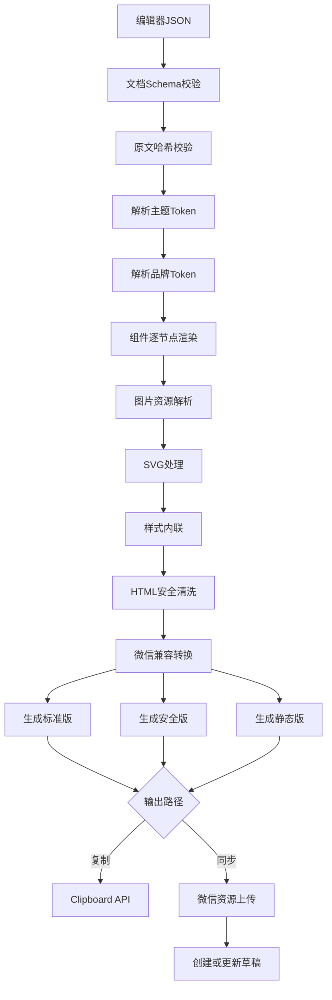
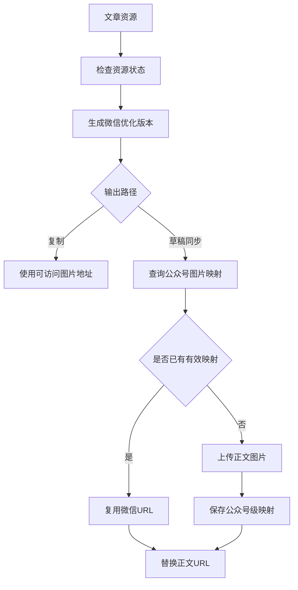
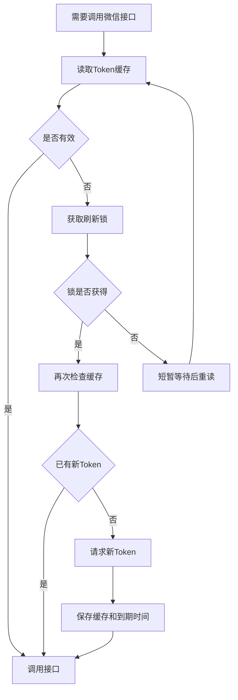
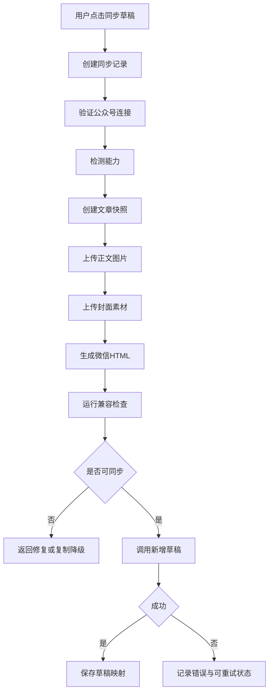

# 13_公众号智能视觉排版工具_微信复制与草稿同步方案

> 文档版本：V1.0  
> 编制日期：2026年7月29日  
> 项目阶段：微信公众号输出与同步专项设计  
> 上游依据：  
> - `00_公众号智能视觉排版工具_项目需求说明书.md`  
> - `03_公众号智能视觉排版工具_核心业务流程设计.md`  
> - `04_公众号智能视觉排版工具_编辑器与区块模型设计.md`  
> - `06_公众号智能视觉排版工具_SVG互动组件技术规范.md`  
> - `07_公众号智能视觉排版工具_多公众号品牌系统设计.md`  
> - `09_公众号智能视觉排版工具_系统架构设计.md`  
> - `10_公众号智能视觉排版工具_数据库字段详细设计.md`  
> - `11_公众号智能视觉排版工具_API接口设计.md`  
> - `12_公众号智能视觉排版工具_前端页面原型与交互说明.md`  
> 文档用途：指导微信HTML生成、剪贴板复制、图片素材上传、微信公众号授权、草稿创建与更新、失败补偿、兼容测试和规则维护。

---

# 一、建设目标

本系统需要提供两条微信公众号输出路径：

```text
路径一：一键复制
编辑器JSON
→ 微信安全HTML
→ 浏览器剪贴板
→ 用户粘贴到微信公众号后台
```

```text
路径二：同步草稿
编辑器JSON
→ 图片上传到目标公众号
→ 微信安全HTML
→ 标题/作者/摘要/封面映射
→ 创建或更新微信公众号草稿
```

两条路径必须满足：

1. 原文不被改写；
2. 图片不丢失；
3. 样式尽量稳定；
4. SVG具备兼容检查和静态降级；
5. 多公众号资源不混用；
6. 操作可重试、可审计、可恢复；
7. 微信接口不可用时自动降级为复制；
8. 所有正式输出可按版本复现；
9. 微信规则变化时可集中修复；
10. 系统不得自动群发文章。

---

# 二、核心决策

本专项正式采用以下方案：

1. 微信HTML由服务端统一生成；
2. 编辑器JSON是唯一权威数据；
3. 浏览器复制使用`text/html`和`text/plain`双格式；
4. 复制必须由用户点击触发，并在HTTPS环境运行；
5. 复制失败时提供受控手动复制区；
6. 正文图片和封面图片采用不同微信上传流程；
7. 每个公众号维护独立的微信图片映射；
8. 草稿创建与更新使用幂等键；
9. 微信Access Token由服务端集中缓存、刷新和加锁；
10. 同步任务使用BullMQ异步队列；
11. 微信接口层采用连接器，不将业务写死在具体接口；
12. 所有微信字段和权限在实际账号上动态检测；
13. 同步成功只表示进入草稿箱，不表示已发布；
14. 第一版不自动提交发布；
15. 微信接口文档、权限及限制在编码前必须再次核对官方最新说明。

---

# 三、输出体系总览



---

# 四、三种输出模式

# 4.1 标准模式 `standard`

保留：

- 已验证的完整主题；
- 静态组件；
- 兼容SVG；
- 阴影；
- 背景；
- 多图布局；
- 品牌文末。

适合：

- 已通过实机测试；
- 普通正式发布；
- 用户希望保留设计效果。

# 4.2 微信安全模式 `wechat_safe`

主动降级：

- 复杂容器；
- 高风险SVG；
- 特殊定位；
- 深层嵌套；
- 复杂阴影；
- 低兼容样式；
- 不稳定图片布局。

适合：

- 兼容优先；
- Android表现不确定；
- 正式党政或法律文章；
- 复制后样式出现异常。

# 4.3 静态模式 `static`

处理：

- SVG全部转静态图；
- 复杂图组转图片；
- 互动卡片转展开状态；
- 高风险背景栅格化；
- 保留正文纯文本。

适合：

- 微信规则变化；
- 重要文章兜底；
- 极端兼容场景；
- 素材包被撤销。

---

# 五、微信HTML渲染原则

# 5.1 JSON到HTML，不从编辑器DOM复制

禁止直接复制当前Tiptap编辑器DOM。

原因：

- 编辑器DOM包含控制按钮；
- Node View包含React包装结构；
- 临时选中状态会污染输出；
- 客户端浏览器差异大；
- 无法准确记录渲染版本；
- 无法集中执行兼容规则。

正式流程：

```text
Document JSON
→ 服务端Renderer
→ 微信HTML
```

# 5.2 节点级渲染

每种节点注册独立渲染器：

```text
paragraph
heading
blockquote
orderedList
imageBlock
imageGallery
semanticCard
svgInteraction
brandFooter
qrCodeBlock
```

示例接口：

```typescript
interface WechatNodeRenderer<TNode> {
  supports(node: TNode): boolean
  render(
    node: TNode,
    context: WechatRenderContext
  ): Promise<WechatRenderResult>
}
```

# 5.3 渲染上下文

```typescript
interface WechatRenderContext {
  articleId: string
  accountId: string
  snapshotId: string
  outputMode: 'standard' | 'wechat_safe' | 'static'
  theme: ResolvedTheme
  brand: ResolvedBrand
  resourceMap: ResourceMap
  compatibilityRules: CompatibilityRuleSet
  rendererVersion: string
}
```

---

# 六、HTML结构规范

# 6.1 根结构

正文建议输出：

```html
<section style="margin:0;padding:0;box-sizing:border-box;">
  <!-- 正文节点 -->
</section>
```

不输出：

- `<html>`；
- `<head>`；
- `<body>`；
- 全局`<style>`；
- `<script>`；
- `<link>`；
- `<iframe>`；
- 编辑器专用节点。

# 6.2 基础标签候选

系统内部白名单候选：

```text
section
div
p
span
strong
b
em
i
u
s
blockquote
ol
ul
li
br
img
a
table
tbody
thead
tr
td
th
svg及受控子标签
```

正式允许列表由当前微信实测规则包确定。

# 6.3 禁止标签

```text
script
iframe
object
embed
form
input
button
textarea
select
video
audio
canvas
link
meta
base
```

视频和音频由用户在微信公众号后台使用原生能力补充。

# 6.4 语义标签转换

为了降低差异，可将部分语义标签转换为稳定结构：

```text
h1/h2/h3
→ section/span结构

figure/figcaption
→ section/p结构

details/summary
→ 静态展开或SVG受控结构
```

---

# 七、CSS输出规范

# 7.1 样式全部内联

最终HTML不依赖外部样式表。

示例：

```html
<p style="margin:0 0 16px;font-size:16px;line-height:1.8;color:#1f2937;">
  正文内容
</p>
```

# 7.2 允许属性候选

```text
margin
margin-top
margin-right
margin-bottom
margin-left
padding
padding-top
padding-right
padding-bottom
padding-left
color
background
background-color
font-size
font-weight
font-style
line-height
letter-spacing
text-align
text-decoration
white-space
word-break
overflow-wrap
width
max-width
min-width
height
max-height
border
border-width
border-style
border-color
border-radius
box-sizing
display
vertical-align
opacity
overflow
```

SVG另有专门白名单。

# 7.3 谨慎属性

以下属性只能由通过测试的组件使用：

```text
position
left
right
top
bottom
transform
transform-origin
float
clear
z-index
flex
grid
filter
box-shadow
background-image
```

# 7.4 默认禁止

```text
fixed定位
sticky定位
外部CSS变量依赖
CSS动画
JavaScript事件
未知浏览器前缀
远程字体
复杂混合模式
复杂滤镜
```

# 7.5 单位

优先：

- `px`；
- `%`；
- 无单位`line-height`。

谨慎：

- `vw`；
- `vh`；
- `rem`；
- `em`。

微信正文关键字号和间距使用`px`，避免继承环境差异。

# 7.6 宽度

普通内容：

```css
max-width:100%;
box-sizing:border-box;
```

图片：

```css
width:100%;
height:auto;
display:block;
```

不得输出超过正文容器的固定宽度。

---

# 八、排版基础转换

# 8.1 正文

默认安全样式：

```css
margin:0 0 16px;
font-size:16px;
line-height:1.8;
letter-spacing:0.3px;
color:#1f2937;
text-align:justify;
word-break:break-word;
overflow-wrap:anywhere;
```

# 8.2 一级标题

```css
margin:30px 0 16px;
font-size:21px;
line-height:1.5;
font-weight:700;
```

具体装饰由主题组件渲染器负责。

# 8.3 列表

保留原有序号语义。

党政和法律文章中：

- 不重新生成错误编号；
- 不自动将“一、”改为“1.”；
- 原始编号可作为文本保存；
- 微信输出前校验编号连续性。

# 8.4 引用

安全模式优先：

- 左侧边线；
- 浅色背景；
- 正常字号；
- 不使用复杂引号背景图。

# 8.5 分割线

优先使用：

```html
<section style="height:1px;background:#e5e7eb;margin:24px 0;"></section>
```

不依赖`<hr>`默认样式。

---

# 九、字体策略

# 9.1 不分发字体文件

最终正文不依赖项目自带字体文件。

字体栈：

```css
-apple-system,
BlinkMacSystemFont,
"Segoe UI",
"PingFang SC",
"Hiragino Sans GB",
"Microsoft YaHei",
sans-serif
```

# 9.2 特殊字体

特殊字体仅可用于：

- 封面；
- 首屏栅格化文字；
- 静态图片；
- 用户拥有合法授权的设计输出。

不得依赖读者设备安装特殊字体。

# 9.3 党政公文字体

公众号正文与正式Word公文不同。

即使用户在Word中使用：

- 方正小标宋；
- 仿宋_GB2312；
- 黑体；
- 楷体；

导入后也不能假定微信读者设备具备这些字体。

系统保存语义层级，不强制复制字体文件。

---

# 十、链接处理

# 10.1 链接白名单

允许：

- HTTPS；
- 经确认的微信文章链接；
- 当前微信规则允许的目标类型；
- 系统明确验证的公众号、小程序或视频号入口。

禁止：

- `javascript:`；
- `data:`脚本；
- 未知协议；
- 本地文件；
- 私网地址；
- 短链隐藏恶意目标。

# 10.2 链接属性

输出时：

- 删除事件属性；
- 保留必要`href`；
- 删除不支持属性；
- 记录原链接；
- 发布前复检。

# 10.3 失效链接

兼容报告中标记：

- 可访问；
- 重定向；
- 超时；
- 失效；
- 被安全策略阻止。

---

# 十一、表格处理

# 11.1 原则

微信公众号小屏不适合复杂宽表格。

根据列数处理：

| 条件 | 输出 |
|---|---|
| 2列以内 | 普通表格 |
| 3至4列且内容短 | 压缩表格或卡片 |
| 多列 | 转纵向卡片 |
| 超宽数据表 | 生成高清长图 |
| 法律/党政重要表格 | 正文摘要＋表格图片 |

# 11.2 安全表格

```html
<table style="width:100%;border-collapse:collapse;table-layout:fixed;">
```

单元格：

```css
padding:8px;
border:1px solid #e5e7eb;
font-size:14px;
line-height:1.6;
word-break:break-word;
```

# 11.3 不允许

- 横向滚动依赖；
- 固定超宽表格；
- 过小字号；
- 复杂合并单元格在未测试情况下直接输出。

---

# 十二、图片处理总流程



---

# 十三、一键复制图片策略

# 13.1 复制前要求

正文图片URL必须：

- 使用HTTPS；
- 外部可访问；
- 不需要登录Cookie；
- 有稳定有效期；
- 响应MIME正确；
- 不返回HTML错误页；
- 尺寸已优化。

# 13.2 私有对象存储问题

编辑器使用短期签名URL，但不能把短期URL复制到微信正文。

复制输出必须采用以下之一：

## 方案A：公开发布资源域名

为已确认复制的图片生成长期可访问发布地址。

优点：

- 实现简单；
- 粘贴可立即加载。

风险：

- 资源公开；
- 需要防盗链策略谨慎；
- 不能设置微信无法访问的严格Referer限制。

## 方案B：复制前上传到微信正文图片接口

即使用户选择复制，也先将图片上传到目标公众号，获得微信图片URL，再生成HTML。

优点：

- 图片稳定；
- 与草稿同步共用映射；
- 不依赖系统资源域名长期公开。

缺点：

- 需要连接公众号；
- 复制前耗时；
- 未授权账号无法使用。

## 首版建议

未连接公众号：

```text
使用系统发布资源地址
```

已连接公众号：

```text
优先使用微信图片地址
```

# 13.3 图片地址冻结

每次正式复制记录：

- 使用的图片URL；
- 资源ID；
- 公众号ID；
- 映射版本；
- HTML哈希。

---

# 十四、草稿同步图片分类

微信同步时区分两类图片。

# 14.1 正文图片

用途：

- 正文照片；
- 插图；
- 图表；
- SVG降级图；
- 文末二维码；
- Logo。

处理：

```text
上传图文消息内图片
→ 获取微信可用URL
→ 替换HTML中的src
```

连接器内部当前候选接口：

```text
POST https://api.weixin.qq.com/cgi-bin/media/uploadimg
```

请求：

```text
multipart/form-data
media=<图片>
```

返回候选结构：

```json
{
  "url": "微信图片地址"
}
```

实际字段与限制必须以开发时微信官方文档为准。

# 14.2 封面图片

草稿字段需要封面素材标识。

处理：

```text
封面图片
→ 上传为微信图片素材
→ 获取media_id
→ 写入thumb_media_id
```

连接器内部当前候选接口：

```text
POST https://api.weixin.qq.com/cgi-bin/material/add_material
```

或使用当前官方允许的封面素材上传方式。

正文图片URL不能直接当作`thumb_media_id`。

# 14.3 公众号级映射

数据库唯一关系：

```text
account_id
+ resource_id
+ media_type
→ wechat_media_id / wechat_url
```

同一张系统图片上传到不同公众号后，映射必须分开保存。

---

# 十五、图片同步处理规范

# 15.1 上传前

检查：

- MIME；
- 文件头；
- 尺寸；
- 文件大小；
- 色彩空间；
- EXIF；
- 透明背景；
- 二维码清晰度；
- 微信当前限制。

# 15.2 优化

照片：

- JPEG；
- sRGB；
- 合理质量；
- 移除不必要EXIF。

截图和文字图：

- PNG或高质量JPEG；
- 避免压缩导致文字发虚。

# 15.3 重复上传

先查询映射。

满足以下条件可复用：

- 公众号一致；
- 系统资源SHA-256一致；
- 微信映射未失效；
- 用途一致；
- 最近验证通过。

# 15.4 上传失败

单张图片失败时：

- 记录失败资源；
- 不继续创建错误草稿；
- 可单独重试；
- 可替换图片；
- 可生成系统公开地址复制版；
- 不丢弃已成功上传映射。

---

# 十六、SVG输出

# 16.1 标准模式

通过实机兼容测试的SVG可以内联输出。

要求：

- ID已实例化；
- 无脚本；
- 无外链；
- 有静态降级；
- 资源已转换；
- 当前规则未撤销。

# 16.2 安全模式

Conditional或高风险SVG：

- 转静态图；
- 或转展开后的完整状态；
- 或改为多图布局。

# 16.3 静态模式

全部SVG转为静态资源。

# 16.4 复制前检查

必须检查：

- 内部ID冲突；
- 事件目标；
- 图片地址；
- `viewBox`；
- 宽度；
- 高度；
- 点击区域；
- 静态备用图；
- 微信规则版本。

# 16.5 草稿同步

若当前账号和设备验证表明SVG可用：

- 正文内联SVG；
- 内部位图资源替换为微信可用URL；
- 保存模板与规则版本。

若不确定：

- 默认使用静态降级；
- 用户可在高级选项中明确保留互动版。

---

# 十七、HTML安全清洗

# 17.1 双层清洗

第一层：

```text
节点渲染器仅生成受控结构
```

第二层：

```text
最终HTML Sanitizer白名单清洗
```

# 17.2 服务端清洗

推荐：

- DOMPurify＋jsdom；
- 或sanitize-html；
- 再叠加自定义微信规则转换。

# 17.3 必须移除

- `<script>`；
- 事件属性；
- 外部CSS；
- iframe；
- 表单；
- 未知协议；
- 未审核SVG；
- 编辑器控制节点；
- 数据追踪属性；
- 临时资源Token；
- 调试注释。

# 17.4 Trusted Types

前端预览中涉及HTML注入时：

- 使用受控Sanitizer；
- 采用Trusted Types；
- 配置CSP；
- 不直接将任意字符串写入`innerHTML`。

# 17.5 不信任服务端派生HTML

即使HTML由本系统生成，进入浏览器前仍应：

- 带渲染版本；
- 校验输出哈希；
- 使用可信渲染通道；
- 避免被中间层篡改。

---

# 十八、样式内联流程

# 18.1 输入

组件渲染器可产生：

- 结构；
- 样式Token；
- 局部样式；
- 品牌覆盖。

# 18.2 合并优先级

```text
系统安全默认
< 主题Token
< 品牌Token
< 组件变体
< 文章局部覆盖
< 行内Mark
```

# 18.3 输出

所有最终样式转换为：

```html
style="..."
```

# 18.4 去重与压缩

可以：

- 删除默认无意义属性；
- 规范颜色格式；
- 规范数字；
- 删除空样式；
- 合并相邻兼容结构。

不得：

- 为压缩破坏SVG ID；
- 删除对微信兼容必要的冗余；
- 将样式重新放回全局Class。

---

# 十九、一键复制实现

# 19.1 前置条件

Clipboard API要求：

- HTTPS安全上下文；
- 用户主动点击；
- 浏览器支持；
- 页面未被权限策略阻止。

# 19.2 推荐实现

浏览器在点击“复制”后：

1. 请求服务端生成正式输出；
2. 等待任务完成；
3. 获取短期复制Payload；
4. 构造HTML Blob；
5. 构造纯文本Blob；
6. 写入ClipboardItem；
7. 上报成功或失败。

TypeScript示例：

```typescript
type CopyWechatResult =
  | { ok: true }
  | { ok: false; reason: string }

export async function copyWechatArticle(
  html: string,
  plainText: string,
): Promise<CopyWechatResult> {
  try {
    if (
      !window.isSecureContext ||
      !navigator.clipboard ||
      typeof ClipboardItem === 'undefined'
    ) {
      return {
        ok: false,
        reason: 'CLIPBOARD_API_UNAVAILABLE',
      }
    }

    const item = new ClipboardItem({
      'text/html': new Blob([html], {
        type: 'text/html;charset=utf-8',
      }),
      'text/plain': new Blob([plainText], {
        type: 'text/plain;charset=utf-8',
      }),
    })

    await navigator.clipboard.write([item])
    return { ok: true }
  } catch (error) {
    return {
      ok: false,
      reason:
        error instanceof Error
          ? error.name
          : 'CLIPBOARD_WRITE_FAILED',
    }
  }
}
```

# 19.3 为什么同时写入纯文本

部分粘贴目标可能只读取`text/plain`。

双格式可以：

- 微信后台读取HTML；
- 其他应用读取纯文本；
- 复制失败时保留文本；
- 避免剪贴板内容为空。

# 19.4 用户激活时机

不可在异步任务完成后自动无条件写剪贴板。

推荐交互：

```text
用户点击“生成并复制”
→ 生成HTML
→ 页面保持复制流程弹窗
→ 任务完成后显示“立即写入剪贴板”
→ 用户再次点击
→ Clipboard API执行
```

也可以在较短同步链路中同一用户激活内执行，但不能依赖所有浏览器都保留激活状态。

# 19.5 浏览器兼容检测

运行时检查：

```typescript
const canWriteHtml =
  window.isSecureContext &&
  !!navigator.clipboard?.write &&
  typeof ClipboardItem !== 'undefined' &&
  (
    typeof ClipboardItem.supports !== 'function' ||
    ClipboardItem.supports('text/html')
  )
```

---

# 二十、复制降级方案

# 20.1 降级一：受控手动复制区

显示只读可视内容区：

```html
<div contenteditable="true" aria-label="手动复制内容"></div>
```

注意：

- 内容进入DOM前必须清洗；
- 用户点击“全选内容”；
- 系统执行Selection；
- 用户按Command+C或Ctrl+C。

# 20.2 降级二：兼容复制命令

在用户点击事件中，可将已清洗HTML放入隔离的`contenteditable`区域，再调用兼容复制命令。

该方式只作为旧浏览器兜底，并单独测试。

# 20.3 降级三：纯文本复制

当富文本剪贴板完全不可用：

- 复制纯文本；
- 提示无法保留排版；
- 不误报“富文本复制成功”。

# 20.4 降级四：下载调试HTML

用于：

- 调试；
- 人工检查；
- 技术支持。

不是普通用户的主要发布路径。

---

# 二十一、复制验证

# 21.1 系统侧成功不等于微信粘贴成功

Clipboard API成功只代表：

```text
内容已写入系统剪贴板
```

不能证明微信后台最终保留全部样式。

# 21.2 用户反馈

复制成功页提示：

> 内容已写入剪贴板。请粘贴到微信公众号后台，并完成标题、封面和最终预览。

# 21.3 可选粘贴验证

系统提供测试页面：

- 用户将剪贴板内容粘回系统；
- 系统解析粘贴结果；
- 与原输出比较；
- 生成差异报告。

但这不能完全代替微信后台实测。

# 21.4 微信后台验收

开发测试时需：

1. 复制；
2. 粘贴到公众号后台；
3. 保存草稿；
4. 微信预览到手机；
5. iPhone检查；
6. Android检查；
7. 检查SVG；
8. 检查图片；
9. 检查文末；
10. 检查链接。

---

# 二十二、微信连接方式

# 22.1 直连模式

适合：

- 个人使用；
- 少量自有公众号；
- 私有部署。

配置：

- AppID；
- AppSecret；
- 服务器IP白名单；
- 公众号权限。

优点：

- 实现直接；
- 不需要搭建第三方平台授权体系。

缺点：

- 每个公众号单独配置；
- Secret管理要求高；
- 扩展为公开SaaS不理想。

# 22.2 第三方平台授权模式

适合：

- 多用户；
- 多公众号；
- SaaS公开服务。

流程：

```text
用户选择授权
→ 跳转微信授权页面
→ 管理员扫码确认
→ 系统获得授权信息
→ 动态检测权限
```

优点：

- 不需要用户直接提供公众号密码；
- 更适合规模化接入。

缺点：

- 开发、审核和运维更复杂；
- 需要严格遵循微信开放平台规则。

# 22.3 首版路线

V0.5：

```text
一键复制
```

V1.0：

```text
直连模式优先
```

后续公开SaaS：

```text
第三方平台授权
```

业务层始终通过统一连接器调用。

---

# 二十三、Access Token管理

# 23.1 原则

Access Token只能由服务端管理。

不得：

- 返回前端；
- 写入日志；
- 写入文章JSON；
- 写入URL供浏览器调用；
- 每次请求都重新获取。

# 23.2 缓存

Redis Key示例：

```text
wechat:access-token:{connectionId}
```

内容加密或置于受保护Redis网络。

记录：

- Token；
- 获取时间；
- 到期时间；
- 安全提前刷新时间；
- 连接版本。

# 23.3 刷新锁

使用分布式锁：

```text
wechat:token-refresh-lock:{connectionId}
```

防止多个Worker同时刷新，导致旧Token失效。

# 23.4 获取流程



# 23.5 直连候选接口

```text
GET https://api.weixin.qq.com/cgi-bin/token
```

参数候选：

```text
grant_type=client_credential
appid=APPID
secret=APPSECRET
```

具体到期时间、错误码和白名单要求以当前官方文档为准。

# 23.6 失效重试

若微信返回Token失效类错误：

1. 删除缓存；
2. 获取刷新锁；
3. 刷新Token；
4. 原请求只重试一次；
5. 再失败则终止；
6. 记录微信原错误码和系统错误码。

避免无限重试。

---

# 二十四、账号能力检测

# 24.1 动态能力

系统连接后检测：

- 正文图片上传；
- 封面素材上传；
- 新增草稿；
- 修改草稿；
- 获取草稿；
- 删除草稿；
- 发布相关能力；
- 其他当前接口权限。

# 24.2 能力状态

```text
available
unavailable
unknown
temporarily_failed
```

# 24.3 UI

不可用能力：

- 禁用按钮；
- 显示原因；
- 提供重新检测；
- 提供复制降级。

# 24.4 检测频率

- 初次连接；
- 每日后台；
- 同步前；
- 授权刷新后；
- 权限错误后；
- 微信规则更新后。

---

# 二十五、草稿字段映射

# 25.1 系统字段

| 系统字段 | 微信草稿字段候选 |
|---|---|
| 标题 | title |
| 作者 | author |
| 摘要 | digest |
| 正文HTML | content |
| 原文链接 | content_source_url |
| 封面素材 | thumb_media_id |
| 评论开关 | need_open_comment |
| 仅粉丝评论 | only_fans_can_comment |

具体字段以开发时官方接口为准。

# 25.2 标题

校验：

- 不为空；
- 长度符合当前微信要求；
- 去除不可见字符；
- 不使用HTML；
- 不自动改写。

# 25.3 作者

来源：

1. 用户本次选择；
2. 文章作者；
3. 公众号默认作者；
4. 空。

不把系统登录名自动作为作者。

# 25.4 摘要

本项目不自动写作。

摘要来源：

- 用户手动填写；
- 用户已提供导语；
- 留空由微信后台处理；
- 不使用AI自动生成作为默认行为。

# 25.5 原文链接

只接受：

- HTTPS；
- 用户确认；
- 安全校验通过。

# 25.6 评论字段

仅在微信当前接口和账号能力支持时显示。

---

# 二十六、新增草稿流程

当前连接器候选接口：

```text
POST https://api.weixin.qq.com/cgi-bin/draft/add
```

候选请求结构：

```json
{
  "articles": [
    {
      "title": "文章标题",
      "author": "作者",
      "digest": "摘要",
      "content": "<section>...</section>",
      "content_source_url": "https://example.com",
      "thumb_media_id": "MEDIA_ID",
      "need_open_comment": 0,
      "only_fans_can_comment": 0
    }
  ]
}
```

实际接口、字段、长度、权限及返回值必须以编码时微信官方文档为准。

# 26.1 内部流程



# 26.2 返回

成功后保存：

- 微信草稿标识；
- 目标公众号；
- 快照ID；
- 品牌版本；
- 主题版本；
- HTML哈希；
- 图片映射；
- 微信返回摘要；
- 同步时间。

---

# 二十七、更新草稿流程

当前连接器候选接口：

```text
POST https://api.weixin.qq.com/cgi-bin/draft/update
```

候选结构：

```json
{
  "media_id": "DRAFT_MEDIA_ID",
  "index": 0,
  "articles": {
    "title": "文章标题",
    "author": "作者",
    "digest": "摘要",
    "content": "<section>...</section>",
    "content_source_url": "https://example.com",
    "thumb_media_id": "THUMB_MEDIA_ID",
    "need_open_comment": 0,
    "only_fans_can_comment": 0
  }
}
```

# 27.1 更新前确认

显示：

- 当前系统版本；
- 上次同步版本；
- 微信草稿ID；
- 标题变化；
- 图片变化；
- 正文变化；
- 封面变化；
- 是否覆盖。

# 27.2 保护规则

若当前草稿映射状态不明确：

- 不直接覆盖；
- 推荐创建新草稿；
- 或要求用户重新选择目标草稿。

# 27.3 更新成功

更新：

- current_snapshot_id；
- last_synced_at；
- HTML哈希；
- 资源映射；
- 同步记录。

---

# 二十八、草稿读取与删除

可根据当前微信能力实现：

- 获取草稿；
- 获取草稿列表；
- 获取草稿总数；
- 删除草稿。

系统默认：

- 不自动删除微信草稿；
- 删除系统文章不自动删除微信草稿；
- 删除操作需单独确认；
- 保留审计记录。

---

# 二十九、同步状态机

```text
created
→ validating
→ uploading_images
→ uploading_cover
→ rendering
→ compatibility_checking
→ submitting
→ success
```

异常：

```text
auth_failed
permission_failed
image_failed
cover_failed
render_failed
compatibility_failed
wechat_failed
cancelled
```

可重试：

```text
retry_pending
```

# 29.1 文章状态

同步成功：

```text
article.status = synced
```

同步失败：

- 不改变为已同步；
- 保持原状态；
- 记录失败；
- 不删除已有草稿映射。

---

# 三十、幂等

# 30.1 创建草稿

幂等键示例：

```text
wechat-draft-create:{articleId}:{snapshotId}:{accountId}
```

# 30.2 更新草稿

```text
wechat-draft-update:{draftMappingId}:{snapshotId}
```

# 30.3 图片上传

```text
wechat-image:{accountId}:{resourceSha256}:{mediaType}
```

# 30.4 行为

同一幂等键：

- 已成功：返回原结果；
- 进行中：返回原Job ID；
- 可重试失败：允许显式重试；
- 请求体不同：返回冲突。

---

# 三十一、失败补偿

微信接口不是数据库事务，采用Saga式流程。

# 31.1 图片已上传、草稿失败

处理：

- 保留图片映射；
- 下次重试复用；
- 不删除微信图片；
- 同步记录标记草稿失败；
- 文章状态不变。

# 31.2 封面已上传、正文图片失败

处理：

- 保留封面映射；
- 修复正文图片后重试；
- 不重新上传相同封面。

# 31.3 草稿成功、数据库保存失败

高风险场景。

处理：

1. 微信返回结果先写临时可靠记录；
2. 数据库事务失败后任务标记`reconciliation_required`；
3. 后台对账任务使用微信返回草稿ID恢复映射；
4. 不重复创建草稿；
5. 通知用户检查。

# 31.4 Token刷新失败

- 暂停该公众号同步；
- 保留复制能力；
- 通知重新连接或检查白名单；
- 不影响其他公众号。

# 31.5 微信超时

超时不一定代表请求未成功。

处理：

- 不立即重复创建；
- 尝试查询或对账；
- 无法确认时标记`unknown_result`；
- 由用户选择查询或创建新草稿；
- 避免重复草稿。

---

# 三十二、重试规则

# 32.1 自动重试

适合：

- 网络瞬时失败；
- 502/503；
- 明确临时错误；
- 对象存储超时；
- Token失效并可刷新。

# 32.2 不自动重试

- 权限不足；
- AppID或Secret错误；
- IP白名单错误；
- 标题非法；
- 封面格式不合规；
- 内容超限；
- 图片不合规；
- 草稿覆盖冲突；
- 接口能力不存在。

# 32.3 次数

建议：

- 网络失败：最多3次；
- Token刷新：1次；
- 单图上传：最多3次；
- 草稿创建：超时情况下不盲目自动重试。

---

# 三十三、微信错误归一化

连接器保存：

```json
{
  "provider": "wechat",
  "providerErrorCode": 40001,
  "providerMessage": "...",
  "systemCode": "WECHAT_AUTH_EXPIRED",
  "retryable": true,
  "userMessage": "微信公众号授权已失效，请重新连接后再试。"
}
```

# 33.1 用户界面

用户主要看到：

- 发生什么；
- 已完成哪些步骤；
- 是否影响文章；
- 是否可重试；
- 是否可降级复制。

开发详情折叠展示微信原错误码。

---

# 三十四、权限和白名单

# 34.1 直连模式

上线前检查：

- 公众号已开启开发配置；
- AppID正确；
- AppSecret正确；
- 服务器出口IP已加入白名单；
- 账号状态正常；
- 对应接口权限存在。

# 34.2 出口IP

云服务器需要稳定出口IP。

若使用：

- 多Worker；
- NAT；
- 弹性公网IP；
- 迁移服务器；

需要确保实际出口IP在白名单中。

# 34.3 不在浏览器调用微信接口

微信API调用全部由服务端发起。

原因：

- 保护Secret；
- 保护Token；
- 统一限流；
- 统一审计；
- 避免CORS；
- 保持公众号级映射。

---

# 三十五、多公众号隔离

# 35.1 连接隔离

每个公众号独立：

- connection_id；
- AppID；
- 凭据；
- Token；
- 能力；
- 图片映射；
- 草稿映射；
- 同步限流。

# 35.2 防串号

所有微信任务必须同时携带：

```text
article_id
account_id
connection_id
snapshot_id
```

Worker开始时再次校验：

```text
article.account_id == requested.account_id
```

若创建品牌副本，则使用副本文章ID。

# 35.3 URL替换

正文图片替换表必须按目标公众号生成，不得复用其他公众号的微信URL映射记录。

---

# 三十六、发布边界

# 36.1 系统首版只同步到草稿箱

不自动：

- 群发；
- 发布；
- 删除微信草稿；
- 修改已发布文章；
- 定时发布。

# 36.2 用户最终确认

用户需要在微信公众号后台：

1. 打开草稿；
2. 检查标题；
3. 检查封面；
4. 预览手机；
5. 检查原创、转载、评论等平台设置；
6. 手动发布。

# 36.3 后续发布接口

即使未来接入发布能力，也必须：

- 独立Feature Flag；
- 二次确认；
- 独立权限；
- 发布前快照；
- 发布状态查询；
- 完整审计；
- 不与草稿同步按钮混为一体。

---

# 三十七、兼容测试体系

# 37.1 四层测试

## 第一层：单元测试

测试：

- 节点渲染器；
- CSS白名单；
- URL替换；
- 图片映射；
- SVG降级；
- 字段映射。

## 第二层：HTML快照

对标准样稿保存预期HTML。

## 第三层：浏览器视觉回归

Playwright：

- Chromium；
- WebKit；
- Firefox；
- 手机宽度。

## 第四层：微信实机

- 微信后台粘贴；
- 草稿同步；
- iPhone；
- Android。

# 37.2 测试文章

统一包含：

- 三级标题；
- 长正文；
- 编号；
- 引用；
- 法条；
- 数据卡；
- 单图；
- 图组；
- 表格；
- SVG；
- 二维码；
- 文末；
- 链接。

# 37.3 测试公众号

至少：

- 党政纪检公众号；
- 律所公众号；
- 个人媒体公众号。

# 37.4 实机记录

记录：

- 微信版本；
- 操作系统；
- 设备；
- 测试时间；
- 输出模式；
- 规则版本；
- 差异截图；
- 是否通过。

---

# 三十八、复制验收矩阵

| 测试项 | Chrome | Safari | Edge |
|---|---|---|---|
| text/html写入 | 必测 | 必测 | 必测 |
| text/plain回退 | 必测 | 必测 | 必测 |
| HTTPS要求 | 必测 | 必测 | 必测 |
| 用户激活 | 必测 | 必测 | 必测 |
| 手动复制区 | 必测 | 必测 | 必测 |
| 大文章复制 | 必测 | 必测 | 必测 |
| 50张图片 | 必测 | 必测 | 必测 |
| SVG | 必测 | 必测 | 必测 |

# 38.1 Mac优先

用户主要使用Mac，首版必须优先保证：

- Chrome；
- Safari；
- 微信公众平台网页后台；
- Command+C交互。

---

# 三十九、同步验收矩阵

| 测试项 | 要求 |
|---|---|
| Token缓存 | 不重复频繁获取 |
| Token并发刷新 | 只有一个Worker刷新 |
| 正文图片上传 | URL全部替换 |
| 封面上传 | 获得可用素材ID |
| 新增草稿 | 成功映射 |
| 更新草稿 | 二次确认 |
| 多公众号 | 映射不混用 |
| 超时 | 不盲目重复创建 |
| 权限不足 | 降级复制 |
| 单图失败 | 可单独重试 |
| 数据库失败 | 可对账恢复 |
| 同步记录 | 完整可追溯 |

---

# 四十、兼容规则版本化

# 40.1 规则包包含

- HTML标签白名单；
- CSS白名单；
- SVG白名单；
- 属性转换；
- 图片限制；
- 表格规则；
- 链接规则；
- 设备已知问题；
- 微信后台已知问题；
- 自动修复；
- 强制降级。

# 40.2 版本字段

每次输出记录：

```text
compatibilityRuleVersion
rendererVersion
themeVersion
brandVersion
documentSnapshotId
```

# 40.3 规则更新

新规则应用于：

- 新预览；
- 新复制；
- 新同步；
- 重新兼容检查。

不直接修改文章JSON。

# 40.4 紧急规则

若某SVG或CSS突然失效：

1. 发布紧急兼容规则；
2. 停止推荐；
3. 标记受影响文章；
4. 标准输出自动提示；
5. 安全模式强制降级；
6. 用户重新复制或同步。

---

# 四十一、接口封装

# 41.1 微信连接器

```typescript
interface WechatOfficialAccountConnector {
  getCapabilities(
    connectionId: string,
  ): Promise<WechatCapabilities>

  uploadContentImage(
    connectionId: string,
    resource: UploadResource,
  ): Promise<WechatContentImageResult>

  uploadCoverMaterial(
    connectionId: string,
    resource: UploadResource,
  ): Promise<WechatCoverMaterialResult>

  createDraft(
    connectionId: string,
    draft: WechatDraftPayload,
  ): Promise<WechatDraftResult>

  updateDraft(
    connectionId: string,
    draftId: string,
    draft: WechatDraftPayload,
  ): Promise<WechatDraftResult>

  getDraft?(
    connectionId: string,
    draftId: string,
  ): Promise<WechatDraftResult>

  deleteDraft?(
    connectionId: string,
    draftId: string,
  ): Promise<void>

  revoke(
    connectionId: string,
  ): Promise<void>
}
```

# 41.2 Token Provider

```typescript
interface WechatTokenProvider {
  getValidAccessToken(
    connectionId: string,
  ): Promise<string>

  invalidate(
    connectionId: string,
    reason: string,
  ): Promise<void>
}
```

# 41.3 资源映射服务

```typescript
interface WechatMediaMappingService {
  findReusableMapping(input: {
    accountId: string
    resourceId: string
    mediaType: string
  }): Promise<WechatMediaMapping | null>

  saveMapping(
    mapping: WechatMediaMapping,
  ): Promise<void>
}
```

---

# 四十二、任务划分

同步任务建议拆成内部阶段，但保持一个用户Job。

```text
wechat-sync
├── validate-connection
├── prepare-snapshot
├── upload-content-images
├── upload-cover
├── render-html
├── compatibility-check
├── submit-draft
└── persist-result
```

# 42.1 阶段进度建议

| 阶段 | 进度 |
|---|---:|
| 验证连接 | 5 |
| 创建快照 | 10 |
| 上传正文图片 | 10至55 |
| 上传封面 | 60 |
| 生成HTML | 70 |
| 兼容检查 | 80 |
| 提交草稿 | 90 |
| 保存结果 | 100 |

百分比只作进度展示，不提供精确完成时间承诺。

---

# 四十三、数据记录

# 43.1 正式复制记录

保存：

- article_id；
- snapshot_id；
- render_output_id；
- account_id；
- output_mode；
- compatibility_report_id；
- HTML哈希；
- 浏览器；
- 成功/失败；
- 时间。

# 43.2 微信同步记录

保存：

- article_id；
- account_id；
- connection_id；
- snapshot_id；
- draft_mapping_id；
- job_id；
- 操作；
- 微信错误码；
- 系统错误码；
- 图片数量；
- 已复用映射数量；
- 新上传数量；
- 开始与完成时间。

# 43.3 敏感信息

不保存：

- 明文Access Token；
- 明文AppSecret；
- 完整凭据；
- 剪贴板内容日志；
- 正文完整内容到普通日志。

---

# 四十四、性能设计

# 44.1 HTML缓存

缓存Key：

```text
wechat-html:
{snapshotId}:
{outputMode}:
{rendererVersion}:
{ruleVersion}
```

# 44.2 图片并发

正文图片上传：

- 同一公众号低并发；
- 建议2至3张同时；
- 避免触发微信限流；
- 失败单独重试。

# 44.3 映射复用

有映射时跳过上传，可明显缩短同步时间。

# 44.4 大文章

若：

- 图片超过50张；
- HTML体积过大；
- SVG超过10个；
- 资源总量过高；

同步预检显示风险，并建议：

- 压缩；
- 拆分；
- 使用静态模式。

---

# 四十五、开发阶段

# 45.1 V0.1：复制闭环

完成：

- 服务端微信HTML渲染；
- 样式内联；
- HTML清洗；
- 标准、安全、静态三种模式；
- ClipboardItem复制；
- 手动复制兜底；
- 复制记录；
- 微信后台人工测试。

# 45.2 V0.5：公众号图片映射

完成：

- 直连公众号配置；
- Access Token缓存；
- 正文图片上传；
- 封面素材上传；
- 公众号资源映射；
- 已连接账号复制时优先微信URL。

# 45.3 V1.0：草稿同步

完成：

- 能力检测；
- 新增草稿；
- 更新草稿；
- 同步预检；
- 幂等；
- 失败补偿；
- 同步记录；
- 复制降级；
- 多公众号隔离。

# 45.4 V1.5：公开授权

增加：

- 微信开放平台第三方授权；
- 多用户；
- 更完整草稿管理；
- 可选发布能力；
- 更严格安全审计。

---

# 四十六、验收标准

# 46.1 微信HTML

- 原文哈希不变；
- 不含编辑器控件；
- 不含脚本；
- 样式全部内联；
- 图片可访问；
- 宽度不溢出；
- 安全模式稳定；
- 静态模式完整。

# 46.2 一键复制

- HTTPS下可复制HTML；
- 同时写入纯文本；
- Chrome、Safari和Edge可用；
- 用户点击触发；
- 失败提供手动复制；
- 成功不误报微信已发布；
- 复制记录完整。

# 46.3 图片

- 正文图和封面区分；
- 微信URL正确替换；
- 多公众号映射隔离；
- 相同资源可复用；
- 失败可单独重试；
- 二维码仍可扫描。

# 46.4 草稿

- 标题、作者、摘要和封面映射正确；
- 新增草稿可用；
- 更新草稿需确认；
- 幂等有效；
- 超时不重复创建；
- 同步成功只标记草稿状态；
- 同步失败可降级复制。

# 46.5 安全

- Secret和Token不进前端；
- HTML经过清洗；
- SVG无任意脚本；
- 网页链接经过校验；
- 写操作有审计；
- 微信原错误信息不泄露敏感内容。

---

# 四十七、风险与控制

| 风险 | 控制措施 |
|---|---|
| 微信后台过滤样式 | 实机测试、规则包、安全模式 |
| Clipboard API权限差异 | HTTPS、用户激活、手动复制兜底 |
| 图片短期URL失效 | 发布资源地址或微信图片映射 |
| 图片跨公众号串用 | account_id参与唯一映射 |
| Access Token并发刷新 | Redis锁和二次检查 |
| 微信超时导致重复草稿 | 幂等、对账、unknown_result |
| SVG失效 | 静态降级和紧急规则 |
| 封面与正文图片混淆 | 独立上传流程和media_type |
| 草稿更新覆盖错误 | 草稿映射、差异预览、二次确认 |
| 微信接口变化 | 连接器、能力检测、官方文档复核 |
| HTML存在XSS | 受控渲染、清洗、Trusted Types |
| 文章过大 | 同步预检、压缩、拆分建议 |
| 用户误以为已发布 | 明确“已同步草稿”状态 |
| AppSecret泄露 | 服务端加密、日志脱敏、密钥轮换 |
| IP白名单变化 | 稳定出口IP和连接健康检查 |

---

# 四十八、技术决策冻结

本文件正式冻结以下规则：

1. 一键复制和草稿同步是两条独立输出路径；
2. 正式微信HTML必须由服务端从文档JSON生成；
3. 不允许直接复制编辑器DOM；
4. 最终CSS采用内联样式；
5. 输出分标准、安全和静态三种模式；
6. Clipboard API同时写入`text/html`和`text/plain`；
7. 复制必须运行在HTTPS并由用户操作触发；
8. 复制失败必须提供受控手动复制区；
9. 正文图片和封面素材必须分开处理；
10. 多公众号微信资源映射严格隔离；
11. 已连接公众号复制时优先使用微信图片URL；
12. 微信连接采用适配器模式；
13. Access Token只由服务端缓存和刷新；
14. Token刷新必须使用分布式锁；
15. 草稿创建和更新必须使用幂等键；
16. 微信超时不能盲目重复创建草稿；
17. 同步任务采用Saga补偿；
18. 同步成功只表示草稿创建成功，不表示发布；
19. 第一版不自动群发；
20. 微信接口不可用时降级为一键复制；
21. SVG必须经过兼容检查并具备静态降级；
22. 所有正式输出记录渲染器、规则、主题、品牌和快照版本；
23. 微信接口的字段、限制与权限在编码前必须再次核对官方最新文档；
24. 后续测试、部署和开发任务均以本方案为准。

---

# 四十九、主要技术参考

以下资料用于本方案设计，访问日期为2026年7月29日。

## 微信官方文档入口

- 新增草稿：  
  `https://developers.weixin.qq.com/doc/offiaccount/Draft_Box/Add_draft.html`
- 修改草稿：  
  `https://developers.weixin.qq.com/doc/offiaccount/Draft_Box/Update_draft.html`
- 获取Access Token：  
  `https://developers.weixin.qq.com/doc/offiaccount/Basic_Information/Get_access_token.html`
- 素材管理：  
  `https://developers.weixin.qq.com/doc/offiaccount/Asset_Management/Adding_Permanent_Assets.html`
- 微信开放平台：  
  `https://open.weixin.qq.com/`

## Web剪贴板和安全

- Clipboard API：  
  `https://developer.mozilla.org/en-US/docs/Web/API/Clipboard_API`
- ClipboardItem：  
  `https://developer.mozilla.org/en-US/docs/Web/API/ClipboardItem`
- Clipboard.write：  
  `https://developer.mozilla.org/en-US/docs/Web/API/Clipboard/write`
- DOMParser安全说明：  
  `https://developer.mozilla.org/en-US/docs/Web/API/DOMParser/parseFromString`
- Trusted Types：  
  `https://developer.mozilla.org/en-US/docs/Web/API/Trusted_Types_API`
- OWASP XSS Prevention Cheat Sheet：  
  `https://cheatsheetseries.owasp.org/cheatsheets/Cross_Site_Scripting_Prevention_Cheat_Sheet.html`

说明：

> 微信开发文档页面可能存在动态加载、访问限制或接口调整。本文列出的接口路径与字段是连接器的当前候选实现，不应替代正式开发时的官方文档核验和实际公众号权限测试。

---

# 五十、下一份开发文件

下一步进入：

> `14_公众号智能视觉排版工具_安全部署与备份方案.md`

该文件应详细明确：

- 腾讯云部署拓扑；
- 云服务器、数据库、Redis和COS配置；
- 域名、HTTPS和反向代理；
- 容器安全；
- 账号与会话；
- 微信密钥和素材签名密钥；
- 文件上传、网页导入和SVG安全；
- 防火墙和私有网络；
- 日志、监控和告警；
- 数据库与对象存储备份；
- 灾难恢复；
- 应用升级和回滚；
- 上线检查清单。
