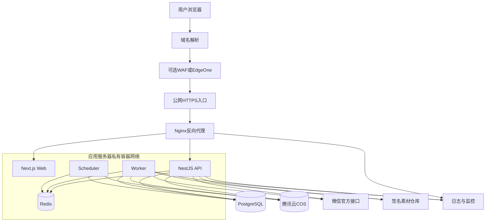
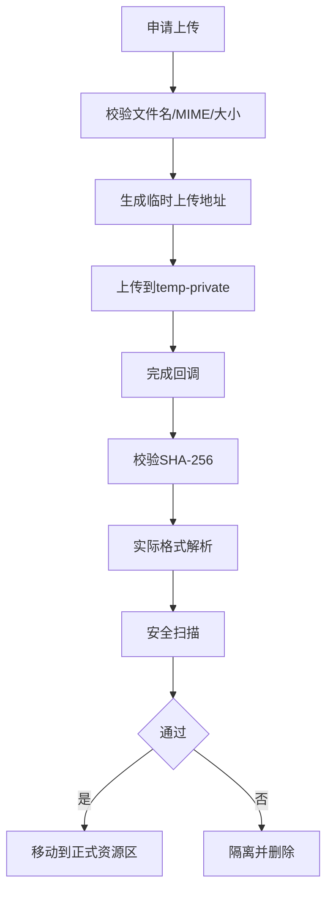
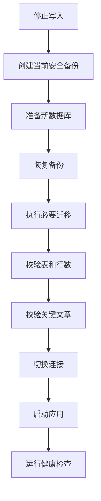
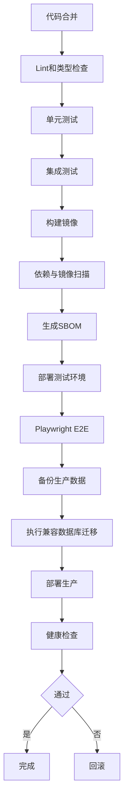

# 14_公众号智能视觉排版工具_安全部署与备份方案

> 文档版本：V1.0  
> 编制日期：2026年7月29日  
> 项目阶段：安全、部署、运维与灾难恢复设计  
> 推荐云环境：腾讯云  
> 首版部署方式：Docker Compose  
> 上游依据：  
> - `00_公众号智能视觉排版工具_项目需求说明书.md`  
> - `03_公众号智能视觉排版工具_核心业务流程设计.md`  
> - `04_公众号智能视觉排版工具_编辑器与区块模型设计.md`  
> - `06_公众号智能视觉排版工具_SVG互动组件技术规范.md`  
> - `07_公众号智能视觉排版工具_多公众号品牌系统设计.md`  
> - `08_公众号智能视觉排版工具_素材更新与版本管理设计.md`  
> - `09_公众号智能视觉排版工具_系统架构设计.md`  
> - `10_公众号智能视觉排版工具_数据库字段详细设计.md`  
> - `11_公众号智能视觉排版工具_API接口设计.md`  
> - `13_公众号智能视觉排版工具_微信复制与草稿同步方案.md`  
> 文档用途：指导服务器采购、云资源配置、网络规划、容器部署、密钥管理、日志监控、备份恢复、应用升级和正式上线。

---

# 一、总体目标

本系统属于个人私有使用的云端Web应用，核心数据包括：

- 公众号文章；
- 原始Word/WPS文件；
- 图片和SVG资源；
- 公众号Logo和二维码；
- 主题与组件；
- 微信授权信息；
- 历史版本；
- 素材包；
- 备份文件。

安全设计目标：

1. 公网只暴露HTTPS入口；
2. 数据库和Redis不直接暴露公网；
3. 微信密钥、对象存储密钥和签名密钥不进入前端；
4. 用户上传文件在隔离环境中处理；
5. 网页导入具备SSRF防护；
6. SVG不执行任意脚本；
7. 远程素材包只能声明式更新；
8. 数据库和对象存储均有版本化备份；
9. 应用部署可快速回滚；
10. 单台服务器损坏后可在新环境恢复；
11. 登录、复制、同步、删除和恢复均可审计；
12. 首版安全强度与维护成本保持平衡。

---

# 二、安全原则

# 2.1 默认拒绝

未明确允许的：

- 端口；
- 文件类型；
- SVG标签；
- HTML标签；
- URL协议；
- API来源；
- 容器权限；
- 网络访问；

默认拒绝。

# 2.2 最小权限

每个组件只获得完成任务所需权限：

- Web容器不直接访问微信密钥；
- API容器不拥有对象存储管理权限；
- Worker只访问指定Bucket和队列；
- 数据库账号只访问业务Schema；
- 备份账号只读数据库并写入备份Bucket；
- 兼容规则签名密钥与普通素材签名密钥分离。

# 2.3 纵深防御

不依赖单一措施。

例如文件上传安全由以下共同完成：

```text
扩展名检查
+ MIME检查
+ 文件头检查
+ 实际解码
+ 大小限制
+ 隔离存储
+ 异步处理
+ 恶意内容扫描
```

# 2.4 可恢复优先

高风险操作必须：

- 生成快照；
- 有审计记录；
- 可回滚；
- 延迟物理删除；
- 不静默覆盖。

# 2.5 供应链安全

应用镜像、素材包和部署文件必须：

- 固定版本；
- 有哈希；
- 可追溯；
- 可扫描；
- 可回滚；
- 不直接执行未知远程代码。

---

# 三、推荐部署阶段

# 3.1 V0.1开发验证环境

适合：

- 本地开发；
- 功能验证；
- 暂不开放公网。

配置：

```text
Mac本地Docker Compose
PostgreSQL容器
Redis容器
MinIO容器
Web/API/Worker/Scheduler容器
```

# 3.2 V0.5个人云端环境

适合：

- 个人正式使用；
- 少量文章；
- 3至10个公众号；
- 低并发。

推荐：

```text
1台腾讯云CVM
腾讯云COS
PostgreSQL本机容器或托管数据库
Redis本机容器
Docker Compose
Nginx
HTTPS
```

# 3.3 V1.0推荐正式环境

推荐：

```text
1台应用服务器
托管PostgreSQL
托管Redis
腾讯云COS
独立备份Bucket
云日志与云监控
稳定公网IP
域名和HTTPS
```

# 3.4 后续高可用环境

仅在多人或商业化后采用：

```text
负载均衡
2台以上应用服务器
独立Worker集群
高可用PostgreSQL
高可用Redis
对象存储
WAF
容器编排
```

首版不使用Kubernetes。

---

# 四、腾讯云部署拓扑



---

# 五、首版云资源建议

# 5.1 应用服务器

个人正式使用建议起步：

```text
4核CPU
8GB内存
100GB SSD云硬盘
稳定公网IP
Linux LTS系统
```

若DOCX、图片和SVG处理较多，建议：

```text
8核CPU
16GB内存
150GB以上SSD
```

原则：

- 内存优先于盲目增加CPU；
- 图片处理和Playwright容易占用内存；
- 数据库若使用托管服务，应用服务器压力明显下降。

# 5.2 PostgreSQL

## 低成本阶段

可运行在同一服务器Docker容器中。

要求：

- 数据卷独立挂载；
- 不暴露公网；
- 每日备份；
- 监控磁盘；
- 定期验证恢复。

## 正式推荐

使用托管PostgreSQL。

优势：

- 自动备份；
- 时间点恢复；
- 监控；
- 故障处理；
- 减少误操作风险。

# 5.3 Redis

首版Redis可与应用同机。

用途：

- BullMQ；
- 缓存；
- 会话状态；
- 限流；
- 分布式锁。

不得保存唯一业务数据。

正式环境可迁移托管Redis。

# 5.4 COS

建议至少划分：

```text
article-private
brand-private
material-public
backup-private
temp-private
```

也可使用一个Bucket加前缀，但多Bucket更利于权限隔离。

# 5.5 CDN

仅用于：

- 官方公开素材包；
- 主题预览图；
- 公开静态资源。

不用于：

- 私有文章图片；
- 公众号二维码；
- 微信凭据；
- 私有备份。

---

# 六、域名与HTTPS

# 6.1 域名规划

建议：

```text
app.example.com
```

可选：

```text
assets.example.com
materials.example.com
```

首版可只使用一个应用域名。

# 6.2 HTTPS

必须启用HTTPS，原因：

- 登录安全；
- Session Cookie；
- Clipboard API；
- 图片和资源访问；
- 微信回调；
- 防止内容被篡改。

# 6.3 TLS

要求：

- 禁用过旧协议；
- 使用现代密码套件；
- 自动续期；
- 证书到期告警；
- HTTP强制跳转HTTPS。

# 6.4 HSTS

确认HTTPS稳定后启用：

```http
Strict-Transport-Security
```

首次上线不建议直接使用过长时间和包含全部子域的配置，避免配置错误后难以恢复。

---

# 七、Nginx反向代理

# 7.1 路由

```text
/               → Web
/api/           → API
/health/        → API健康检查
/_next/         → Web静态资源
```

# 7.2 请求体大小

不同路径设置不同限制：

```text
普通JSON：2MB
DOCX上传：50MB
图片上传：20MB
品牌包：100MB
备份导入：按系统策略
```

对象存储直传后，Nginx不承担大文件传输。

# 7.3 超时

普通API：

```text
30秒
```

SSE：

```text
长连接
```

大型任务由异步队列处理，不通过无限延长HTTP请求超时解决。

# 7.4 安全响应头

建议：

```http
Content-Security-Policy
X-Content-Type-Options: nosniff
Referrer-Policy
Permissions-Policy
X-Frame-Options或CSP frame-ancestors
Cross-Origin-Opener-Policy按兼容测试
```

# 7.5 速率限制

Nginx提供第一层限制，API内部再做用户级限流。

---

# 八、防火墙与安全组

# 8.1 公网开放

只开放：

```text
80
443
```

80仅用于跳转HTTPS和证书验证。

# 8.2 SSH

建议：

- 不向全网开放；
- 只允许固定管理IP；
- 或通过VPN、云堡垒机；
- 使用SSH Key；
- 禁止密码登录；
- 禁止root直接登录。

# 8.3 禁止公网开放

```text
PostgreSQL 5432
Redis 6379
MinIO管理端口
Docker API
监控管理端口
内部Worker端口
```

# 8.4 出站访问

Worker按需要访问：

- COS；
- 微信接口；
- 素材仓库；
- 用户指定网页。

网页导入Worker需要单独网络策略，防止访问私网和云元数据地址。

---

# 九、操作系统安全

# 9.1 系统选择

使用长期支持Linux发行版。

要求：

- 自动安全更新或定期补丁；
- 最小化安装；
- 不安装无关桌面环境；
- 关闭无用服务；
- 时钟同步；
- 日志轮转；
- 磁盘监控。

# 9.2 管理账号

- 创建独立运维用户；
- 使用sudo；
- 禁止共享账号；
- SSH Key定期轮换；
- 删除离职或不再使用的Key。

# 9.3 自动更新

可以自动安装低风险安全补丁。

内核、Docker和数据库大版本更新：

- 先在测试环境；
- 再正式环境；
- 更新前备份；
- 准备回滚。

---

# 十、Docker安全

# 10.1 镜像

要求：

- 固定镜像版本；
- 正式部署尽量固定Digest；
- 多阶段构建；
- 使用精简基础镜像；
- 镜像扫描；
- 生成SBOM；
- 不把密钥写入镜像。

# 10.2 容器用户

所有应用容器：

```text
非root用户运行
```

# 10.3 文件系统

推荐：

- 根文件系统只读；
- 临时目录单独挂载；
- 上传文件不写入源码目录；
- 数据卷权限最小化。

# 10.4 Capabilities

删除不需要的Linux Capabilities。

禁止：

- privileged；
- 挂载Docker Socket；
- host network；
- 任意宿主机目录写权限。

# 10.5 资源限制

每个容器设置：

- CPU限制；
- 内存限制；
- 重启策略；
- 健康检查；
- 日志大小限制。

示例建议：

```text
Web：1 CPU / 1.5GB
API：1至2 CPU / 2GB
Worker：2至4 CPU / 4至8GB
Scheduler：0.5 CPU / 512MB
Redis：512MB至1GB
```

实际根据运行测试调整。

# 10.6 容器网络

划分：

```text
public_network
app_network
data_network
```

Nginx连接Web/API。

数据库和Redis只加入`data_network`。

---

# 十一、Docker Compose结构

```text
infrastructure/
├── compose/
│   ├── docker-compose.yml
│   ├── docker-compose.dev.yml
│   ├── docker-compose.test.yml
│   └── docker-compose.prod.yml
├── nginx/
├── postgres/
├── redis/
├── monitoring/
└── scripts/
```

生产Compose建议服务：

```text
nginx
web
api
worker
scheduler
redis
otel-collector
prometheus
grafana
loki
```

若数据库托管，则不在生产Compose中启动PostgreSQL。

---

# 十二、配置与密钥

# 12.1 配置分类

## 非敏感配置

- 应用名称；
- 公开域名；
- 端口；
- 功能开关；
- 日志级别；
- 文件大小上限。

## 敏感配置

- 数据库密码；
- Redis密码；
- Session密钥；
- CSRF密钥；
- 字段加密主密钥；
- COS密钥；
- 微信AppSecret；
- 微信Access Token；
- 素材发布签名密钥；
- 备份加密密钥。

# 12.2 密钥存放

优先：

- 云密钥管理；
- 云Secret管理；
- CI Secret；
- 受限权限环境变量。

不允许：

- 写入Git；
- 写入Dockerfile；
- 写入前端；
- 写入日志；
- 写入Markdown开发文档；
- 写入浏览器LocalStorage。

# 12.3 密钥分离

至少分开：

1. 应用字段加密密钥；
2. 数据库凭据；
3. COS凭据；
4. 微信凭据；
5. 素材签名密钥；
6. 备份加密密钥。

# 12.4 密钥版本

加密数据保存：

```text
key_version
```

支持轮换。

# 12.5 密钥轮换

建议：

- Session签名密钥：按安全需要；
- COS临时凭据：短期；
- 数据库密码：定期；
- 微信AppSecret：发生泄露或账号变更时；
- 应用字段加密密钥：支持双版本过渡；
- 素材根签名密钥：离线、低频轮换。

---

# 十三、微信密钥安全

# 13.1 存储

微信AppSecret和授权凭据：

- 服务端应用层加密；
- 数据库只保存密文；
- 主密钥不在数据库；
- 不返回前端。

# 13.2 调用

只有Wechat Connector模块能解密使用。

普通文章服务不直接读取明文密钥。

# 13.3 Token

Access Token：

- Redis短期缓存；
- 到期时间；
- 分布式锁刷新；
- 不写普通日志；
- 不返回前端。

# 13.4 白名单

服务器需要稳定公网出口IP。

迁移服务器或扩容Worker后，必须检查微信平台IP白名单。

# 13.5 授权撤销

撤销后：

- 立即停止同步；
- 删除或失效Token；
- 凭据密文进入清理流程；
- 保留审计；
- 不删除公众号品牌档案。

---

# 十四、素材签名密钥

# 14.1 根密钥

- 离线保存；
- 不放在服务器；
- 不放在CI；
- 使用加密移动介质或安全硬件；
- 至少保存两个安全备份；
- 明确恢复流程。

# 14.2 在线发布密钥

- 存放CI Secret或KMS；
- 权限只允许签名；
- 不允许读取根密钥；
- 泄露后可由根密钥撤销。

# 14.3 兼容规则密钥

与普通主题和组件发布密钥分离。

原因：

- 兼容规则可能影响全部输出；
- 风险更高；
- 需要独立审核。

---

# 十五、账号与会话安全

# 15.1 密码

使用：

```text
Argon2id
```

要求：

- 最少12位建议；
- 不限制只使用复杂符号；
- 支持密码管理器；
- 不明文记录；
- 不通过邮件发送密码。

# 15.2 Session Cookie

设置：

```text
HttpOnly
Secure
SameSite=Lax或Strict
Path=/
```

# 15.3 CSRF

所有写请求要求CSRF Token。

# 15.4 登录限流

- 单IP限制；
- 单账号限制；
- 连续失败临时锁定；
- 记录安全事件。

# 15.5 双因素认证

V1.0启用TOTP。

恢复码：

- 一次性；
- 只显示一次；
- 哈希保存；
- 可重新生成。

# 15.6 设备与会话

用户可查看：

- 设备；
- 浏览器；
- 登录时间；
- 最近活动；
- IP摘要。

支持：

- 撤销单个会话；
- 撤销其他全部会话；
- 修改密码后强制重新登录。

---

# 十六、权限系统

虽然首版单用户，仍保留角色：

```text
owner
editor
publisher
viewer
```

# 16.1 Owner

- 全部配置；
- 公众号；
- 密钥；
- 备份；
- 恢复；
- 删除；
- 审计。

# 16.2 Editor

- 文章；
- 主题；
- 组件；
- SVG；
- 预览。

# 16.3 Publisher

- 一键复制；
- 草稿同步；
- 发布记录。

# 16.4 Viewer

- 只读；
- 预览；
- 查看报告。

# 16.5 权限原则

前端隐藏按钮不是权限控制。

所有权限必须在API层验证。

---

# 十七、数据库安全

# 17.1 网络

数据库：

- 私网访问；
- 不开放公网；
- 只允许应用安全组；
- 运维访问通过受控通道。

# 17.2 账号

至少分：

- 应用读写账号；
- 迁移账号；
- 备份只读账号；
- 监控账号。

# 17.3 权限

应用账号只访问业务Schema。

不得授予：

- 超级用户；
- 创建扩展；
- 管理系统数据库；
- 任意文件读取。

# 17.4 连接

- 使用TLS；
- 连接池；
- 密码轮换；
- 连接数限制；
- 慢查询监控。

# 17.5 SQL安全

- 参数化查询；
- ORM和SQL迁移审查；
- 不拼接用户输入；
- 动态排序使用白名单；
- JSONPath查询受控。

# 17.6 数据静态加密

使用云硬盘和托管数据库提供的磁盘加密能力。

敏感字段再进行应用层加密。

---

# 十八、Redis安全

# 18.1 网络

- 只在私网；
- 不开放公网；
- 配置密码或ACL；
- 只允许API和Worker访问。

# 18.2 数据

Redis不保存：

- 唯一文章正文；
- 唯一快照；
- 唯一图片；
- 唯一任务结果；
- 长期微信密钥。

# 18.3 持久化

按BullMQ和缓存需求选择持久化。

即使Redis数据丢失，系统应能：

- 从PostgreSQL恢复任务记录；
- 重新创建未完成任务；
- 重新获取Token；
- 重新生成缓存。

# 18.4 限制

- maxmemory；
- 淘汰策略；
- 慢命令监控；
- 禁用危险命令；
- 定期升级安全版本。

---

# 十九、对象存储安全

# 19.1 Bucket权限

私有Bucket默认：

```text
Private
```

通过：

- 服务端代理；
- 短期签名URL；
- 临时凭据；

访问。

# 19.2 对象Key

不要使用原文件名直接作为Key。

推荐：

```text
users/{userId}/resources/{yyyy}/{mm}/{uuid}
```

# 19.3 临时URL

- 有效期短；
- 限定用途；
- 不写普通日志；
- 不用于复制到微信正文。

# 19.4 发布资源

需要微信后台访问的复制资源使用独立发布路径。

发布前：

- 用户确认；
- 去除敏感元数据；
- 生成长期稳定地址；
- 保留撤销能力。

# 19.5 版本控制

品牌资产和备份Bucket建议开启版本控制。

# 19.6 生命周期

自动清理：

- 失败上传；
- 临时文件；
- 过期预览；
- 无引用派生图。

不得自动清理：

- 快照引用；
- 品牌版本引用；
- 已发布输出；
- 备份保留期内文件。

---

# 二十、文件上传安全

# 20.1 上传流程



# 20.2 DOCX

检查：

- ZIP结构；
- OOXML关键文件；
- 解压后总大小；
- 文件数量；
- 路径穿越；
- XML实体；
- 宏文件；
- 嵌入对象。

首版只允许：

```text
.docx
```

不允许：

```text
.docm
```

# 20.3 图片

检查：

- 文件头；
- 实际解码；
- 像素尺寸；
- 文件大小；
- 色彩空间；
- EXIF；
- 超大解压炸弹；
- 异常ICC配置。

# 20.4 SVG

用户上传SVG默认：

- 作为静态资源；
- 清洗；
- 转换预览；
- 不直接执行；
- 不保留脚本；
- 禁止`foreignObject`。

# 20.5 压缩包

除系统品牌包、素材包和备份包外，不允许普通用户上传任意ZIP。

---

# 二十一、网页导入安全

# 21.1 SSRF防护

禁止访问：

```text
127.0.0.0/8
10.0.0.0/8
172.16.0.0/12
192.168.0.0/16
169.254.0.0/16
::1
fc00::/7
fe80::/10
云元数据地址
```

# 21.2 DNS重绑定

流程：

1. 解析域名；
2. 检查所有IP；
3. 建立连接前再次检查；
4. 重定向后重新检查；
5. 不信任仅字符串层面的域名验证。

# 21.3 协议

只允许：

```text
http
https
```

# 21.4 限制

- 最大重定向次数；
- 最大响应体；
- 最大页面加载时间；
- 最大图片数量；
- 最大并发下载；
- 禁止下载可执行文件。

# 21.5 浏览器隔离

Playwright导入：

- 独立容器；
- 非root；
- 临时文件系统；
- 无宿主机挂载；
- 无数据库直接访问；
- 限制网络；
- 超时后销毁。

---

# 二十二、HTML与XSS安全

# 22.1 输入

所有：

- 粘贴HTML；
- 网页HTML；
- 组件HTML；
- 预览HTML；
- 微信HTML；

均视为不可信，必须经过受控转换或清洗。

# 22.2 输出

采用：

- React默认转义；
- 受控Renderer；
- DOMPurify；
- Trusted Types；
- CSP；
- URL白名单。

# 22.3 禁止

- 任意`dangerouslySetInnerHTML`；
- 任意脚本；
- 任意事件属性；
- 未审核iframe；
- `javascript:`链接；
- 未清洗SVG。

# 22.4 预览隔离

微信HTML预览建议放入：

- 沙箱化iframe；
- 或独立受控渲染容器。

不要让预览HTML直接污染主应用DOM。

---

# 二十三、SVG安全

# 23.1 统一协议

互动SVG只能由系统协议生成。

不接受用户任意代码。

# 23.2 清洗

三层：

1. 模板白名单；
2. SVG AST校验；
3. DOM Sanitizer。

# 23.3 禁止

- script；
- foreignObject；
- iframe；
- object；
- embed；
- 外部JavaScript；
- 任意事件代码；
- 未知协议；
- 任意外链资源。

# 23.4 资源限制

限制：

- 节点数；
- 状态数；
- 图层数；
- 图片数；
- SVG大小；
- 渲染时间；
- 动画数量。

# 23.5 渲染隔离

SVG Worker：

- 无任意公网访问；
- 无数据库写权限；
- 只访问任务资源；
- 超时终止；
- 内存限制；
- 临时目录自动删除。

---

# 二十四、远程素材安全

# 24.1 声明式更新

远程素材只能包含：

- JSON；
- 图片；
- 安全SVG；
- Token；
- 预览；
- Manifest；
- 迁移映射。

不得包含可执行代码。

# 24.2 安装前验证

- 根信任；
- 签名；
- 哈希；
- 文件大小；
- 版本；
- 渠道；
- 依赖；
- 撤销状态；
- 应用兼容范围。

# 24.3 原子安装

使用暂存目录。

校验全部通过后再启用。

# 24.4 撤销

发现问题：

- 停止推荐；
- 禁止新使用；
- 强制静态降级；
- 紧急撤销；
- 提供替代版本。

---

# 二十五、日志安全

# 25.1 应记录

- 请求ID；
- 用户ID；
- 文章ID；
- 公众号ID；
- 任务ID；
- 操作；
- 耗时；
- 状态；
- 系统错误码。

# 25.2 不记录

- 密码；
- Session Cookie；
- CSRF Token；
- AppSecret；
- Access Token；
- 数据库密码；
- COS密钥；
- 签名私钥；
- 完整文章正文；
- 完整二维码内容；
- 完整签名URL。

# 25.3 脱敏

邮箱：

```text
a***@example.com
```

AppID可显示部分。

Token只显示哈希前缀。

# 25.4 日志保留

- 普通应用日志：30至90天；
- 错误日志：180天；
- 审计日志：至少1年；
- 安全事件：至少1年；
- 调试日志：7至14天。

---

# 二十六、审计

必须审计：

- 登录成功和失败；
- 修改密码；
- 撤销会话；
- 创建和删除公众号；
- 修改品牌色；
- 替换二维码；
- 修改版权；
- 修改微信连接；
- 复制文章；
- 同步草稿；
- 删除文章；
- 恢复文章；
- 创建和恢复快照；
- 安装和撤销素材；
- 备份和恢复；
- 修改安全设置。

审计日志：

- 不可普通修改；
- 不与应用日志混合删除；
- 可按时间和目标查询；
- 具备导出能力。

---

# 二十七、监控体系

# 27.1 基础设施

监控：

- CPU；
- 内存；
- 磁盘；
- 容器状态；
- 网络；
- 数据库连接；
- Redis内存；
- COS错误；
- SSL证书到期。

# 27.2 应用

监控：

- API P95；
- 5xx；
- 登录失败；
- 保存失败；
- 文档冲突；
- 导入失败；
- SVG失败；
- 微信HTML失败；
- 兼容检查失败；
- 复制失败；
- 微信同步失败。

# 27.3 队列

监控：

- 等待任务；
- 运行任务；
- 失败任务；
- 重试；
- 最老等待时间；
- Worker心跳；
- 每类任务平均耗时。

# 27.4 数据

监控：

- 数据库大小；
- 表增长；
- 慢查询；
- 锁等待；
- 备份状态；
- 对象存储用量；
- 无引用资源；
- 回收站待清理数据。

---

# 二十八、告警

# 28.1 一级告警

立即处理：

- 数据库不可用；
- 备份连续失败；
- 磁盘超过90%；
- 应用无法启动；
- 素材签名验证失败；
- 微信凭据疑似泄露；
- 数据库恢复失败；
- 兼容规则错误导致批量输出异常。

# 28.2 二级告警

尽快处理：

- Worker离线；
- 队列持续堆积；
- 自动保存失败率升高；
- 草稿同步失败率升高；
- SSL证书临近到期；
- COS访问异常；
- Redis内存高。

# 28.3 三级提醒

- 新安全补丁；
- 素材包更新；
- 数据库存储增长；
- 临时文件积累；
- 公众号授权即将到期或异常。

---

# 二十九、数据库备份

# 29.1 备份层级

## 每日逻辑备份

```text
pg_dump
```

适合：

- 表级恢复；
- 人工检查；
- 跨环境恢复。

## 托管数据库自动备份

适合：

- 整体恢复；
- 时间点恢复；
- 故障恢复。

## 应用级导出

适合：

- 单篇文章；
- 单个公众号；
- 品牌包；
- 素材包。

# 29.2 频率

V0.5建议：

```text
每日1次数据库备份
保留30天
每周1次长期备份
每月1次归档备份
```

V1.0建议：

```text
托管数据库自动备份
时间点恢复
每日逻辑备份
```

# 29.3 加密

备份文件：

- 加密；
- 存入独立私有Bucket；
- 密钥与Bucket权限分离；
- 下载使用短期签名URL。

# 29.4 完整性

每个备份保存：

- SHA-256；
- 数据库版本；
- 应用版本；
- 文档Schema版本；
- 备份时间；
- 表清单；
- 文件大小；
- 加密密钥版本。

---

# 三十、对象存储备份

# 30.1 版本控制

对以下Bucket开启版本控制：

- 品牌资产；
- 文章原始资源；
- 备份；
- 素材仓库。

# 30.2 生命周期

建议：

```text
临时文件：1至7天
失败上传：1天
预览缓存：7至30天
普通旧版本：按引用保留
备份：30天至长期
```

# 30.3 跨区域

个人系统首版可不做跨区域复制。

重要正式环境可将：

- 数据库备份；
- 品牌资源；
- 文章原文件；

复制到第二地域或第二云存储。

# 30.4 防误删

- Bucket版本控制；
- 删除标记；
- 多因素删除按云能力；
- 独立备份账号；
- 延迟清理。

---

# 三十一、Redis恢复

Redis丢失后：

1. 重启Redis；
2. API重新建立缓存；
3. Session按数据库记录恢复或要求重新登录；
4. 从PostgreSQL查询未完成Job；
5. 重新投递可恢复任务；
6. 微信Token重新获取；
7. 不影响文章JSON和历史快照。

Redis故障不应造成文章永久丢失。

---

# 三十二、文章级备份

支持导出文章包：

```text
manifest.json
document.json
source/
resources/
svg/
theme-references.json
brand-snapshot.json
render/
compatibility-report.json
```

用途：

- 单篇迁移；
- 归档；
- 技术支持；
- 灾难恢复；
- 跨环境测试。

文章包不包含：

- 微信AppSecret；
- Access Token；
- 用户Session；
- 数据库密码。

---

# 三十三、系统级备份

系统全量备份包括：

```text
PostgreSQL逻辑备份
对象存储Manifest
关键配置模板
素材包索引
兼容规则
品牌资源
文章资源
备份元数据
应用版本信息
```

不将明文Secret直接打包。

恢复时从Secret Manager重新注入。

---

# 三十四、恢复流程

# 34.1 单篇文章恢复

```text
选择文章备份
→ 校验Manifest和哈希
→ 检查Schema版本
→ 导入资源
→ 重建文章
→ 重建版本和品牌引用
→ 生成预览
→ 兼容检查
```

# 34.2 数据库整体恢复



# 34.3 服务器损坏恢复

1. 创建新CVM；
2. 安装Docker和Compose；
3. 拉取固定版本镜像；
4. 恢复配置；
5. 连接托管数据库或恢复数据库；
6. 连接COS；
7. 启动Redis；
8. 启动应用；
9. 验证文章；
10. 更新DNS或公网IP；
11. 检查微信IP白名单；
12. 检查证书和回调地址。

---

# 三十五、恢复目标

# 35.1 V0.5

```text
RPO：24小时以内
RTO：4小时以内
```

# 35.2 V1.0

```text
RPO：1小时以内
RTO：2小时以内
```

# 35.3 关键操作

一键复制、主题应用、品牌切换和草稿同步前会生成快照，因此单篇文章误操作恢复点应明显优于系统级RPO。

---

# 三十六、恢复演练

至少每季度执行一次。

演练内容：

1. 恢复到新数据库；
2. 打开5篇不同文章；
3. 验证图片；
4. 验证SVG；
5. 验证品牌；
6. 生成微信HTML；
7. 验证历史快照；
8. 验证素材版本；
9. 记录恢复时间；
10. 更新恢复文档。

没有恢复演练的备份不能视为可靠备份。

---

# 三十七、应用发布

# 37.1 发布流程



# 37.2 发布窗口

个人系统可随时发布，但涉及：

- 数据库迁移；
- 微信连接器；
- 渲染器；
- 兼容规则；

时应选择用户不编辑文章的时间。

# 37.3 发布前

- 确认无进行中编辑；
- 完成备份；
- 检查磁盘；
- 检查数据库；
- 检查Worker；
- 记录当前镜像版本。

---

# 三十八、数据库迁移安全

# 38.1 原则

迁移采用向后兼容方式。

例如删除字段：

1. 新版本停止使用；
2. 保留旧字段；
3. 部署应用；
4. 验证稳定；
5. 后续版本再删除。

# 38.2 禁止

- 启动应用自动执行不可逆迁移；
- 无备份修改大表；
- 在生产直接手工修改Schema；
- 未测试JSON迁移；
- 一次同时升级数据库和文档Schema多个大版本。

# 38.3 大表

建立索引时使用低锁或并发方式。

---

# 三十九、应用回滚

# 39.1 镜像保留

至少保留：

- 当前版本；
- 上一稳定版本；
- 最近3个发布版本。

# 39.2 回滚条件

- 应用无法启动；
- 自动保存异常；
- 文档Schema错误；
- 微信HTML明显错误；
- 同步重复创建；
- SVG批量失败；
- 素材安装异常。

# 39.3 回滚流程

1. 停止新任务；
2. 保留失败日志；
3. 切换旧镜像；
4. 恢复兼容配置；
5. 必要时恢复数据库；
6. 启动；
7. 健康检查；
8. 验证文章和复制。

# 39.4 数据库兼容

应用回滚依赖数据库迁移向后兼容。

若迁移不可逆，只能恢复备份，因此必须严格避免。

---

# 四十、素材回滚

素材更新独立于应用发布。

问题版本：

- 禁用；
- 回退上一版本；
- 发布撤销清单；
- 标记受影响文章；
- 提供静态降级；
- 不删除历史数据。

---

# 四十一、应急响应

# 41.1 密钥泄露

1. 立即撤销或轮换；
2. 终止相关Session；
3. 禁用微信连接；
4. 检查审计日志；
5. 更新服务器配置；
6. 重新加密必要数据；
7. 记录安全事件。

# 41.2 数据库泄露

1. 隔离数据库；
2. 轮换全部凭据；
3. 检查访问日志；
4. 判断数据范围；
5. 恢复到安全环境；
6. 检查应用漏洞；
7. 必要时通知相关主体。

# 41.3 恶意上传

1. 隔离文件；
2. 停止相关任务；
3. 禁用资源；
4. 检查Worker；
5. 清理临时目录；
6. 更新规则；
7. 记录安全事件。

# 41.4 素材供应链异常

1. 停止更新；
2. 撤销签名密钥；
3. 发布撤销元数据；
4. 禁用问题包；
5. 检查已安装实例；
6. 回滚；
7. 重新建立信任根。

# 41.5 微信同步异常

1. 暂停目标公众号同步；
2. 保留复制能力；
3. 检查Token和白名单；
4. 检查是否重复草稿；
5. 执行对账；
6. 恢复后逐篇重试。

---

# 四十二、环境隔离

# 42.1 开发环境

- 本地数据库；
- 本地MinIO；
- 测试数据；
- 禁止真实微信Secret默认加载；
- 调试日志可较详细。

# 42.2 测试环境

- 独立数据库；
- 独立Bucket；
- 独立Redis；
- 独立子域；
- 微信测试公众号；
- Beta素材渠道。

# 42.3 生产环境

- 正式数据；
- Stable素材；
- 正式微信连接；
- 最小日志；
- 严格权限；
- 自动备份。

# 42.4 禁止混用

- 测试环境不得读取生产数据库；
- 测试Worker不得访问生产微信连接；
- 生产密钥不得进入本地；
- 生产备份恢复到测试环境前应脱敏。

---

# 四十三、隐私与数据边界

当前用户说明暂无敏感内容，但系统仍按私有数据处理。

# 43.1 默认私有

以下默认私有：

- 文章；
- 原始Word；
- 图片；
- 公众号二维码；
- Logo；
- 微信连接；
- 草稿映射；
- 备份。

# 43.2 公开资源

仅以下可公开：

- 用户明确发布的复制图片；
- 官方主题预览；
- 官方素材包；
- 公开帮助文档。

# 43.3 第三方处理

若未来接入AI结构识别：

- 必须可关闭；
- 明确模型提供方；
- 不默认上传全部文章；
- 不用于写作；
- 记录数据发送范围；
- 提供本地规则兜底。

---

# 四十四、上线前安全测试

# 44.1 自动测试

- 依赖漏洞扫描；
- 容器扫描；
- Secret扫描；
- SAST；
- API测试；
- 权限测试；
- 文件上传测试；
- SSRF测试；
- XSS测试；
- SVG恶意样本测试；
- SQL注入测试；
- CSRF测试；
- Session测试。

# 44.2 人工测试

- 登录失败限流；
- 多标签页冲突；
- 删除恢复；
- 备份恢复；
- 微信Token失效；
- 公众号串号；
- 图片映射；
- 草稿超时；
- 素材包签名失败；
- 应用回滚。

# 44.3 渗透测试

公开SaaS前建议进行第三方渗透测试。

个人私有版至少使用自动安全扫描和人工攻击用例。

---

# 四十五、上线检查清单

# 45.1 域名与网络

- [ ] 域名解析正确；
- [ ] HTTPS有效；
- [ ] HTTP强制跳转HTTPS；
- [ ] 证书到期告警；
- [ ] 公网只开放80和443；
- [ ] SSH限制来源；
- [ ] 数据库不开放公网；
- [ ] Redis不开放公网；
- [ ] Docker API不开放。

# 45.2 服务器

- [ ] 系统补丁已更新；
- [ ] root登录已禁用；
- [ ] SSH密码登录已禁用；
- [ ] 运维用户已创建；
- [ ] 磁盘监控已启用；
- [ ] 时钟同步正常；
- [ ] 日志轮转正常。

# 45.3 容器

- [ ] 非root运行；
- [ ] 无privileged容器；
- [ ] 未挂载Docker Socket；
- [ ] 镜像版本固定；
- [ ] 镜像已扫描；
- [ ] 资源限制已配置；
- [ ] 健康检查已配置；
- [ ] 日志大小受限。

# 45.4 数据库

- [ ] 独立账号；
- [ ] 密码已轮换；
- [ ] TLS启用；
- [ ] 备份已完成；
- [ ] 恢复已验证；
- [ ] 慢查询监控；
- [ ] 连接数限制；
- [ ] 迁移版本正确。

# 45.5 Redis

- [ ] 私网访问；
- [ ] 密码或ACL；
- [ ] 内存限制；
- [ ] Worker正常；
- [ ] 丢失恢复方案已验证。

# 45.6 COS

- [ ] 私有Bucket；
- [ ] 权限最小；
- [ ] 版本控制；
- [ ] 生命周期；
- [ ] CORS限制；
- [ ] 临时URL有效期合理；
- [ ] 备份Bucket独立。

# 45.7 应用

- [ ] 登录和CSRF正常；
- [ ] Session Cookie安全；
- [ ] 上传限制有效；
- [ ] 网页导入SSRF防护有效；
- [ ] HTML清洗有效；
- [ ] SVG恶意内容被拒绝；
- [ ] 原文锁定有效；
- [ ] 自动保存正常；
- [ ] 多公众号不串号；
- [ ] 审计日志正常。

# 45.8 微信

- [ ] AppID正确；
- [ ] AppSecret加密；
- [ ] 出口IP白名单；
- [ ] Token刷新锁；
- [ ] 能力检测；
- [ ] 正文图片上传；
- [ ] 封面上传；
- [ ] 草稿创建；
- [ ] 草稿更新确认；
- [ ] 失败降级复制。

# 45.9 备份

- [ ] 每日数据库备份；
- [ ] 对象存储版本控制；
- [ ] 备份加密；
- [ ] 备份哈希；
- [ ] 恢复演练；
- [ ] RPO和RTO记录；
- [ ] 删除保留期设置。

# 45.10 监控

- [ ] API健康；
- [ ] Worker心跳；
- [ ] 队列长度；
- [ ] 保存失败；
- [ ] 数据库备份失败；
- [ ] 磁盘告警；
- [ ] SSL证书告警；
- [ ] 微信同步失败；
- [ ] 素材签名失败。

---

# 四十六、上线后日常运维

# 46.1 每日

- 检查备份；
- 检查失败任务；
- 检查磁盘；
- 检查微信连接；
- 检查严重告警。

# 46.2 每周

- 更新安全补丁；
- 检查依赖告警；
- 清理临时文件；
- 检查队列；
- 检查日志异常；
- 验证随机备份文件哈希。

# 46.3 每月

- 恢复一篇文章；
- 检查数据库增长；
- 检查无引用资源；
- 检查账号和会话；
- 检查密钥使用；
- 检查素材包版本；
- 检查微信兼容规则。

# 46.4 每季度

- 完整恢复演练；
- 审查安全组；
- 审查权限；
- 审查Secret；
- 更新应急预案；
- 检查长期备份；
- 检查旧版本淘汰。

---

# 四十七、首版实施顺序

# 47.1 第一阶段：基础上线

1. CVM；
2. 域名；
3. HTTPS；
4. Docker Compose；
5. PostgreSQL；
6. Redis；
7. COS；
8. Nginx；
9. 健康检查。

# 47.2 第二阶段：应用安全

1. Session；
2. CSRF；
3. 限流；
4. 文件上传；
5. HTML清洗；
6. SVG安全；
7. SSRF防护；
8. 审计。

# 47.3 第三阶段：备份监控

1. 数据库备份；
2. COS版本；
3. 日志；
4. 指标；
5. 告警；
6. 恢复演练。

# 47.4 第四阶段：微信与素材

1. 微信密钥；
2. Token缓存；
3. IP白名单；
4. 草稿同步；
5. 素材签名；
6. 撤销；
7. 供应链检查。

---

# 四十八、验收标准

# 48.1 网络

- 公网只暴露HTTPS；
- 数据库和Redis不可公网访问；
- SSH受到限制；
- HTTPS配置有效。

# 48.2 身份

- 密码安全哈希；
- Session安全；
- CSRF有效；
- 登录限流有效；
- 会话可撤销。

# 48.3 数据

- 数据库备份成功；
- 对象存储有版本；
- 恢复演练成功；
- 资源删除不破坏快照；
- Secret不进入前端。

# 48.4 应用

- 文件上传拦截异常文件；
- 网页导入无法访问私网；
- 恶意HTML和SVG被清洗；
- 原文锁定有效；
- 微信公众号不串号。

# 48.5 运维

- 日志可查询；
- 告警可触发；
- Worker失败可重试；
- 发布可回滚；
- 旧版本镜像可恢复；
- 素材包可撤销。

---

# 四十九、风险与控制

| 风险 | 控制措施 |
|---|---|
| 单机故障 | 数据库备份、COS、可重建镜像 |
| 数据库公网暴露 | 私网、安全组、TLS |
| Redis丢失 | 不保存唯一数据、任务可重建 |
| 微信Secret泄露 | 服务端加密、权限隔离、轮换 |
| 上传恶意文件 | 隔离、文件头、解码、安全扫描 |
| SSRF | IP校验、重定向复检、隔离浏览器 |
| SVG XSS | 协议化、白名单、清洗、静态降级 |
| 远程素材投毒 | 签名、哈希、声明式包、撤销 |
| 数据误删 | 软删除、版本控制、延迟清理 |
| 备份不可用 | 定期恢复演练 |
| 更新破坏生产 | 测试环境、备份、镜像回滚 |
| 数据库迁移不可逆 | 分阶段迁移、兼容部署 |
| 多公众号串号 | accountId和connectionId双重校验 |
| 剪贴板内容污染 | 服务端受控渲染和清洗 |
| 监控泄露正文 | 结构化摘要和日志脱敏 |
| 云厂商锁定 | S3适配、标准数据库、容器部署 |

---

# 五十、安全部署决策冻结

本文件正式冻结以下规则：

1. 首版正式部署采用腾讯云CVM＋Docker Compose；
2. 生产环境公网只开放80和443；
3. 数据库和Redis不得直接暴露公网；
4. SSH只允许受控来源并使用密钥；
5. 所有应用容器使用非root用户；
6. 禁止privileged容器和Docker Socket挂载；
7. 正式镜像必须固定版本并经过扫描；
8. 对象存储默认私有；
9. 复制用公开资源与私有编辑资源分离；
10. 微信凭据只在服务端加密保存；
11. Access Token只存Redis短期缓存；
12. 素材根签名密钥离线保存；
13. 用户上传SVG默认作为静态资源处理；
14. 网页导入必须具备SSRF防护；
15. HTML和SVG必须经过白名单清洗；
16. 数据库每日备份；
17. 对象存储品牌和备份资源开启版本控制；
18. Redis不承担唯一数据；
19. 发布前必须完成数据库备份；
20. 应用至少保留上一稳定镜像；
21. 数据库迁移必须向后兼容；
22. 至少每季度进行恢复演练；
23. V0.5目标RPO不超过24小时、RTO不超过4小时；
24. V1.0目标RPO不超过1小时、RTO不超过2小时；
25. 首版不使用Kubernetes；
26. 正式公开SaaS前必须增加WAF、多用户权限和第三方安全测试；
27. 后续开发任务拆分、测试和验收均以本方案为准。

---

# 五十一、下一份开发文件

下一步进入：

> `15_公众号智能视觉排版工具_开发任务拆分清单.md`

该文件应详细明确：

- 项目阶段；
- Monorepo初始化；
- 前端、后端、Worker和Python导入服务；
- 数据库迁移；
- 编辑器核心；
- 主题、组件和SVG；
- 多公众号品牌；
- 微信复制和同步；
- 素材更新；
- 安全部署；
- 每项任务的依赖、优先级、工作量、验收条件；
- V0.1、V0.5和V1.0里程碑；
- Claude/Codex执行顺序；
- 不应并行修改的核心文件。
